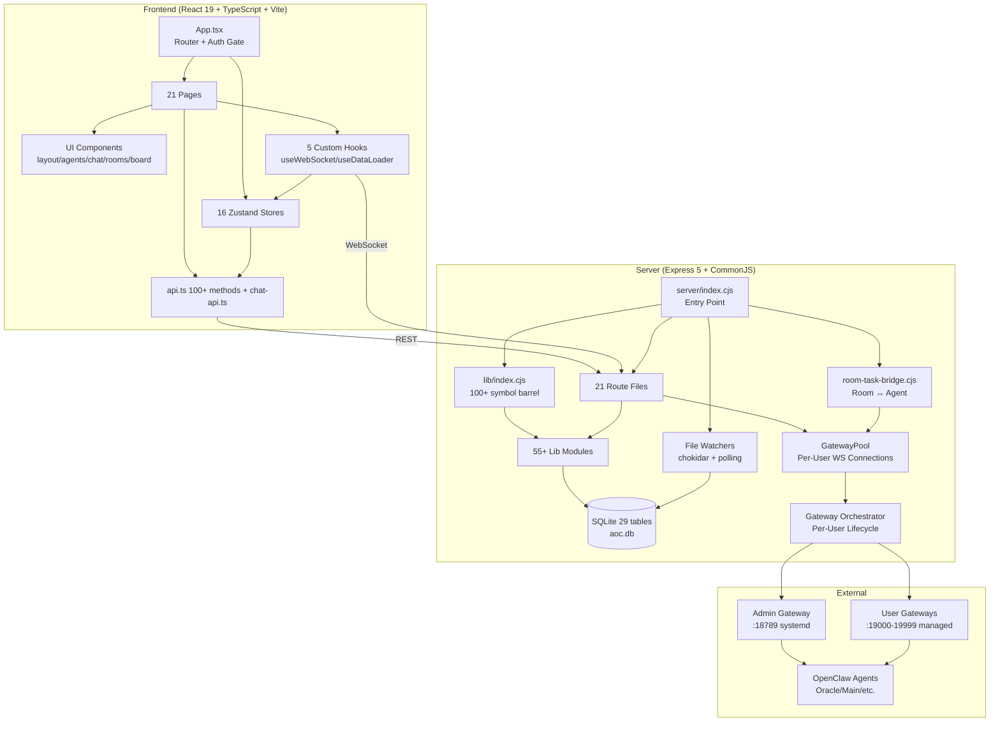
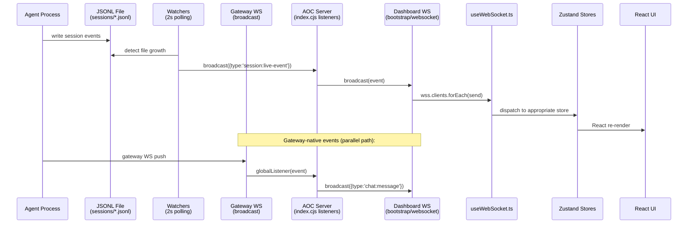

# AOC Dashboard — Code Review Dependency Graph

## Project Stats

| Metric | Count |
|--------|-------|
| Server modules | 55+ files in `lib/` |
| Route files | 21 files in `routes/` |
| Frontend pages | 21 pages in `pages/` |
| Zustand stores | 16 stores in `stores/` |
| Custom hooks | 5 hooks in `hooks/` |
| API endpoints | 100+ methods in `lib/api.ts` |
| WebSocket event types | 30+ distinct event types |
| DB tables | 29 tables in SQLite |
| Files touched this session | 10 files |

---

## Architecture Overview



---

## Server index.cjs — `require()` Graph

```
server/index.cjs (ENTRY)
│
├──→ bootstrap/middleware.cjs    [applyMiddleware]
├──→ bootstrap/websocket.cjs     [init, broadcast, broadcastTasksUpdate, emitRoomMessage]
├──→ helpers/access-control.cjs  [canAccessAgent, parseScopeUserId, validateAccessibleAgentIds, ...]
├──→ helpers/agent-context.cjs    [getEnrichedAgents, readAgentVibe, roomAgents, resolveMentions]
├──→ helpers/gateway-context.cjs  [gatewayForReq → gatewayPool.forUser(userId)]
├──→ helpers/versioning-helper.cjs [createVSave]
├──→ helpers/task-jsonl.cjs       [loadAllJSONLMessagesForTask]
├──→ hooks/task-dispatch.cjs      [dispatchTaskToAgent, analyzeTaskForAgent]
├──→ hooks/room-task-bridge.cjs   [forwardRoomMentionToAgent, forwardAgentMentionChain]
│
├──→ lib/db.cjs ─── (see below)
├──→ lib/gateway-ws.cjs ─── GatewayPool + GatewayConnection
├──→ lib/gateway-orchestrator.cjs ─── spawn/stop/restart/cleanupOrphans
├──→ lib/watchers.cjs ─── LiveFeedWatcher + WatcherPool
│
├──→ lib/index.cjs (master barrel) ───
│   ├── lib/agents/*      (detail, files, skills, tools, skillScripts, provision)
│   ├── lib/sessions/*    (opencode, gateway, claude-cli)
│   ├── lib/automation/cron.cjs
│   ├── lib/scripts.cjs, pairing.cjs, routing.cjs, models.cjs
│   ├── lib/ai.cjs, versioning.cjs, attachments.cjs, outputs.cjs, metrics.cjs
│   ├── lib/terminal.cjs, workspace-browser.cjs, hooks.cjs
│   ├── lib/hq-room.cjs, room-artifacts.cjs, room-context.cjs
│   ├── lib/aoc-master/*, aoc-tasks/*, aoc-connections/*, aoc-room/*
│   ├── lib/mission-orchestrator/*, browser-harness/*
│   ├── lib/skill-catalog.cjs, role-templates.cjs
│   ├── lib/connections/google-workspace.cjs, oauth/google.cjs
│   └── lib/integrations/index.cjs + google-sheets.cjs + base.cjs
│
└──→ app.use('/api', ...) ─── 18 route registrations (see below)
```

### Route Registrations

| # | Path | Module | Key Deps |
|---|------|--------|----------|
| 1 | `/api` (auth) | `routes/auth.cjs` | db |
| 2 | `/api` (health) | `routes/health.cjs` | db, parsers |
| 3 | `/api` (gateway) | `routes/gateway.cjs` | db, parsers, aiLib, metrics |
| 4 | `/api` (onboarding) | `routes/onboarding.cjs` | db, restartGateway |
| 5 | `/api` (master) | `routes/master.cjs` | db, gatewayPool |
| 6 | `/api` (rooms) | `routes/rooms.cjs` | db, parsers, broadcast, emitRoomMessage, forwardRoomMentionToAgent |
| 7 | `/api` (agents) | `routes/agents.cjs` | db, parsers, vSave |
| 8 | `/api` (browser) | `routes/browser-harness.cjs` | db, parsers |
| 9 | `/api` (skills) | `routes/skills.cjs` | db, parsers, broadcast, vSave |
| 10 | `/api` (tasks) | `routes/tasks.cjs` | db, parsers, broadcast, outputsLib, attachmentsLib, integrations |
| 11 | `/api` (connections) | `routes/connections.cjs` | db, parsers, broadcast, mcpOauth, composio |
| 12 | `/api` (composio) | `routes/composio.cjs` | db, parsers, broadcast, composio, mcpPool, mcpOauth |
| 13 | `/api` (mcp) | `routes/mcp-agents.cjs` | db, parsers, mcpPool, composio |
| 14 | `/api` (projects) | `routes/projects.cjs` | db, parsers, projectGit, projectWs, vSave, integrations |
| 15 | `/api` (config) | `routes/config.cjs` | db, parsers, versioning, vSave |
| 16 | `/api` (chat) | `routes/chat.cjs` | db, parsers, gatewayProxy |
| 17 | `/api` (roles) | `routes/role-templates.cjs` | db, parsers |

---

## Critical Module: lib/db.cjs

**110+ exported functions** in the module.exports block. Key categories:

| Category | Functions |
|----------|-----------|
| **Users** | `hasAnyUsers`, `createUser`, `getUserByUsername`, `getUserById`, `getAllUsers`, `deleteUser`, `purgeUserData`, `updateUser` |
| **Auth** | `hashPassword`, `verifyPassword`, `generateToken`, `verifyToken`, `authMiddleware` |
| **RBAC** | `requireAdmin`, `requireAgentOwnership`, `requireConnectionOwnership`, `scopeByOwner` |
| **Agents** | `getAgentProfile`, `upsertAgentProfile`, `renameAgentProfile`, `getAllAgentProfiles`, `deleteAgentProfile`, `setUserMasterAgent`, `getUserMasterAgentId`, `markAgentProfileMaster` |
| **Projects** | `getAllProjects`, `getProject`, `createProject`, `updateProject`, `deleteProject`, `getProjectOwner`, `userOwnsProject` |
| **Tasks** | `getAllTasks`, `getTask`, `createTask`, `updateTask`, `deleteTask` (full CRUD + activity + comments) |
| **Rooms** | `listMissionRooms`, `listMissionRoomsForUser`, `getMissionRoom`, `createMissionRoom`, `updateMissionRoomMembers`, `deleteMissionRoom`, `listMissionMessages`, `createMissionMessage` |
| **Room Sessions** | `markSessionAsRoomTriggered`, `getRoomSessionKeys`, `getRoomAgentSession`, `getRoomForSession` |
| **Gateway** | `setGatewayState`, `getGatewayState`, `getGatewayToken`, `listGatewayStates`, `clearAllGatewayStates` |
| **Epics/Deps** | `listEpics`, `createEpic`, `updateEpic`, `deleteEpic`, `addTaskDependency`, `getUnmetBlockers`, `wouldCreateDependencyCycle` |
| **Memory** | `listProjectMemory`, `createProjectMemory`, `buildProjectMemorySnapshot` |
| **Connections** | Full CRUD for connections + agent↔connection assignments |
| **Pipelines** | `getAllPipelines`, `createPipeline`, `updatePipeline`, `deletePipeline` |
| **Integrations** | Full CRUD + sync state management |
| **Invitations** | `createInvitation`, `getAllInvitations`, `getInvitationByToken`, `revokeInvitation` |

---

## WebSocket Event Flow

### Complete Chain: Agent Response → Dashboard UI



### Event Type Registry (30+ types)

**From gateway-ws (`GatewayConnection.broadcast`):**
`gateway:connected`, `gateway:disconnected`, `gateway:event`, `gateway:log`, `chat:message`, `chat:tool`, `chat:done`, `chat:progress`, `chat:sessions-changed`

**From watchers (`LiveFeedWatcher.broadcast`):**
`session:update` (processing_start/end/message), `session:live-event`, `progress:update`, `progress:step`, `cron:update`, `opencode:event`, `subagent:update`, `task:output_added/removed`, `skills:updated`

**From routes (via `broadcast`):**
`task:comment_added/edited/deleted`, `project:sync_start/complete/error`, `workflow:step_start/complete/failed`, `room:message`, `room:created/deleted`

**From bootstrap/websocket:**
`tasks:updated`

---

## Frontend Dependency Matrix

### Heaviest Dependencies

| File | Fan-Out | Fan-In | Risk |
|------|---------|--------|------|
| `src/lib/api.ts` | 0 | 21 pages + 6 hooks + 10 stores | 🔴 **HIGH** |
| `src/hooks/useWebSocket.ts` | 16 stores | App.tsx | 🔴 **HIGH** |
| `src/stores/index.ts` (barrel) | 16 stores | All pages + hooks | 🔴 **HIGH** |
| `src/hooks/useDataLoader.ts` | 10 stores | App.tsx | 🟡 MED |
| `src/lib/permissions.ts` | `useAuthStore` | 6 pages | 🟡 MED |
| `useChatStore` | zustand | ChatPage, useWebSocket | 🟡 MED |

### Store → Consumer Map

| Store | Primary Consumers |
|-------|-------------------|
| `useAuthStore` | App.tsx, ALL pages, api.ts, useWebSocket, useDataLoader, permissions |
| `useAgentStore` | OverviewPage, AgentsPage, SessionsPage, BoardPage, ChatPage, useWebSocket, useDataLoader |
| `useSessionStore` | OverviewPage, AgentsPage, SessionsPage, useWebSocket, useDataLoader |
| `useTaskStore` | BoardPage, useWebSocket, useDataLoader |
| `useProjectStore` | ProjectsPage, BoardPage, ChatPage, useWebSocket, useDataLoader |
| `useChatStore` | ChatPage, AgentDetailPage, useWebSocket |
| `useProcessingStore` | OverviewPage, AgentDetailPage, ChatPage, useWebSocket |
| `useLiveFeedStore` | OverviewPage, useWebSocket |
| `useRoomStore` | ChatPage, useWebSocket |
| `useConnectionsStore` | ConnectionsPage, useWebSocket |

### Page → Dependency Graph

```
App.tsx ──uses──> useAuthStore, useWebSocket, useDataLoader
  ├── OverviewPage ──uses──> useAgentStore, useSessionStore, useOverviewStore, useWsStore, useProcessingStore
  ├── AgentsPage ──uses──> useAgentStore, useSessionStore, useMasterStatus, getTemplateById
  │   └── AgentDetailPage ──uses──> api, chatApi, useChatStore, useProcessingStore, useAgentStore
  ├── SessionsPage ──uses──> useSessionStore, useAgentStore
  ├── ChatPage ──uses──> useChatStore, useAgentStore, useRoomStore, chatApi, api
  ├── ProjectsPage ──uses──> useProjectStore, useAuthStore
  │   └── ProjectDetailPage ──embeds──> BoardPage
  ├── BoardPage ──uses──> useTaskStore, useAgentStore, useProjectStore, api
  ├── SettingsPage ──uses──> useAuthStore, api
  ├── CronPage ──uses──> useCronStore, api
  ├── MetricsPage ──uses──> api
  ├── SkillsPage ──uses──> api
  ├── ConnectionsPage ──uses──> api, useConnectionsStore
  ├── RoleTemplatesPage ──uses──> api, useRoleTemplateStore
  ├── RoutingPage ──uses──> useRoutingStore, api
  ├── HooksPage ──uses──> api
  ├── UserManagementPage ──uses──> api (admin only)
  ├── OnboardingPage ──uses──> self-contained wizard
  └── RegisterPage ──uses──> api, Galaxy (no store deps)
```

---

## DB Schema (Key Tables)

```mermaid
erDiagram
    USERS ||--o| AGENT_PROFILES : "master_agent_id"
    USERS ||--o{ PROJECTS : "created_by"
    USERS ||--o{ MISSION_ROOMS : "created_by"
    USERS ||--o{ CONNECTIONS : "created_by"
    USERS ||--o{ INVITATIONS : "created_by"
    
    AGENT_PROFILES ||--o{ ROOM_SESSIONS : "agent_id"
    AGENT_PROFILES ||--o{ TASKS : "agentId"
    
    PROJECTS ||--o{ MISSION_ROOMS : "project_id"
    PROJECTS ||--o{ TASKS : "projectId"
    PROJECTS ||--o{ EPICS : "project_id"
    PROJECTS ||--o{ PROJECT_MEMORY : "project_id"
    
    MISSION_ROOMS ||--o{ MISSION_MESSAGES : "roomId"
    MISSION_ROOMS ||--o{ ROOM_ARTIFACTS : "room_id"
    MISSION_ROOMS ||--o{ ROOM_SESSIONS : "room_id"
    
    USERS {
        int id PK "1=admin"
        string username
        string password_hash
        string role "admin|user|agent"
        string displayName
        int master_agent_id FK "per-user master"
        int gateway_port "managed port"
        int gateway_pid "managed PID"
        string gateway_state "running|stopped|stale"
        string gateway_token "passphrase for WS auth"
    }
    
    AGENT_PROFILES {
        string agent_id PK "globally unique"
        int provisioned_by FK "owner user"
        int is_master "partial unique per user"
        string role "ADLC role label"
        string avatar_preset_id
        text meta "JSON: roomState per roomId"
    }
    
    MISSION_ROOMS {
        string id PK UUID
        string kind "global|project|direct"
        string project_id FK
        string name
        string member_agent_ids "JSON array"
        int created_by FK "owner user"
        int is_hq "owner-scoped system room"
        int is_system "protected from delete"
        int owner_user_id "for HQ rooms"
        int supports_collab "Phase 2 flag"
    }
    
    TASKS {
        string id PK UUID
        string title
        string status "open|in_progress|review|done|cancelled"
        string priority "urgent|high|medium|low"
        string agentId FK "assigned agent"
        string sessionId "dispatch session"
        string projectId FK
        string stage "ADLC stage"
        string role "ADLC role"
    }
```

---

## Critical Review Paths

| # | Area | Key Files | Risk |
|---|------|-----------|------|
| 1 | **Multi-Tenant Isolation** | `rooms.cjs:28-49`, `db.cjs:1028-1041`, `access-control.cjs:parseScopeUserId` | 🔴 |
| 2 | **Gateway Lifecycle** | `gateway-orchestrator.cjs`, `gateway-ws.cjs:870-894` | 🔴 |
| 3 | **Room Chat Pipeline** | `room-task-bridge.cjs`, `index.cjs:324-410` | 🔴 |
| 4 | **Auth & Onboarding** | `auth.cjs`, `onboarding.cjs`, `master.cjs` | 🟡 |
| 5 | **WebSocket Dispatch** | `useWebSocket.ts`, `gateway-ws.cjs broadcast`, `bootstrap/websocket.cjs` | 🟡 |
| 6 | **DB Column Null Safety** | `db.cjs` migrations (ALTER TABLE ADD COLUMN) | 🟡 |

---

## Touch Map (This Session)

```
Changed files this session:
├── server/lib/gateway-ws.cjs ⚡ (addGlobalListener, error retry, spawned fix)
├── server/lib/db.cjs ⚡ (listMissionRoomsForUser fix)
├── server/index.cjs ⚡ (globalListener, room owner gw, auto-reply fix)
├── server/hooks/room-task-bridge.cjs ⚡ (userId, lazy-connect, stale restart, spawn, remove env)
├── server/routes/rooms.cjs ⚡ (visibility fix, logging)
├── server/routes/chat.cjs ⚡ (remove env from sessionsCreate)
├── src/hooks/useWebSocket.ts ⚡ (WS close guard)
├── src/pages/RegisterPage.tsx ⚡ (Galaxy bg, confirm pw, hide role)
├── src/components/ui/Galaxy.tsx ⚡ (new: single-hue shader)
└── src/components/ui/Galaxy.css ⚡ (new)
```

---

## Review Checklist

- [ ] **CRIT-1**: All room visibility paths use `createdBy` scoping (not `kind === 'global'` bypass)
- [ ] **CRIT-2**: `cleanupOrphans()` preserves running gateways; `spawned` handler creates pool connections
- [ ] **CRIT-3**: `agent:${agentId}:room:${roomId}` sessions created for correct user's gateway
- [ ] **CRIT-4**: `chat:done` auto-reply uses global listener + room owner's gateway for history
- [ ] **CRIT-5**: Confirm password validation on register form prevents submit
- [ ] **DB**: `gateway_state` columns (on `users` table) not `gateway_state` table
- [ ] **DB**: `agent_profiles.agent_id` is globally unique (cross-user collision risk)
- [ ] **WS**: `on('error')` handler resets state and schedules reconnect (was missing)
- [ ] **WS**: `useWebSocket` disconnect guards against React strict mode double-close
- [ ] **CLIENT**: Galaxy shader uses single hue for theme-matching
