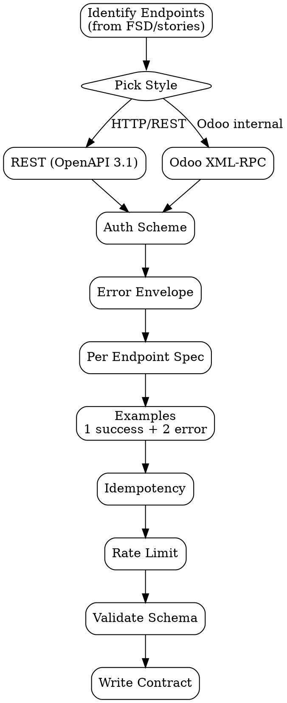

# API Contract

Strict API specification — OpenAPI 3.1 untuk REST/HTTP, Odoo XML-RPC method signature untuk Odoo internal calls. Tujuan: **bridge yang gak ambigu antara producer dan consumer**.

<HARD-GATE>
Setiap endpoint WAJIB punya: method + path + auth + request schema + response success schema + ≥1 error schema (4xx).
Setiap field WAJIB punya type + required/optional + description + example (kecuali sensitif).
Auth scheme WAJIB declared explicit di security section, bukan asumsi.
Breaking change ke existing endpoint WAJIB punya version bump (path /v2/ atau header), TIDAK reuse v1.
Idempotency WAJIB declared untuk POST/PUT/DELETE — pakai header `Idempotency-Key` atau jelaskan kenapa tidak perlu.
Rate limit WAJIB declared kalau endpoint public-facing.
</HARD-GATE>

## When to use

- Bagian dari FSD (`fsd-generator` step 5) — API contracts section
- Sebelum frontend mulai consume backend yang masih dibangun
- Backend service expose endpoint baru ke service lain
- Migration / replatform API — capture target contract before code

## When NOT to use

- 1-time internal SQL query — gunakan inline doc
- Pure UI component prop — itu component spec, bukan API
- Event-driven message schema (Kafka/Pub-Sub) — pakai Avro/Proto schema, bukan OpenAPI

## Two Styles

### REST (default)

Output: OpenAPI 3.1 YAML. Standard tool ecosystem (Swagger UI, mock server, client codegen).

### Odoo XML-RPC

Output: Markdown spec dengan method signature + decorator + return types. Odoo internal API atau external consumers (mobile app) yang call via XML-RPC/JSON-RPC.

Both share:
- Auth declaration
- Error response shape (uniform error envelope)
- Versioning rule
- Idempotency guarantee (where applicable)
- Rate limit (where applicable)

## Checklist

You MUST create a TodoWrite task for each item and complete them in order:

1. **Identify Endpoints** — list semua dari user stories / FSD §1
2. **Pick Style** — REST (OpenAPI) atau Odoo XML-RPC
3. **Define Auth Scheme** — Bearer JWT, OAuth2, API key, session cookie, RPC password
4. **Define Error Envelope** — uniform error shape (code, message, details)
5. **Per Endpoint** — method, path, request, success response, error responses
6. **Add Examples** — minimum 1 success example + 2 error examples per endpoint
7. **Declare Idempotency** — for mutations, header or rationale
8. **Declare Rate Limits** — for public endpoints
9. **Validate Schema** — pakai swagger validator atau equivalent
10. **Output Document** — `outputs/YYYY-MM-DD-api-contract-{feature}.md` (atau `.yaml`)

## Process Flow



## Detailed Instructions

### Step 1 — Identify Endpoints

Dari FSD §1 (architecture) atau PRD user stories — list endpoints + method.

```
GET    /v1/discounts/{id}            # read one
GET    /v1/discounts                 # list
POST   /v1/discounts                 # create
PATCH  /v1/discounts/{id}            # update partial
DELETE /v1/discounts/{id}            # delete
POST   /v1/discounts/{id}/apply      # action: apply to order
```

### Step 2 — Pick Style

| Context | Style |
|---|---|
| Standalone web/mobile app ↔ backend | REST (OpenAPI) |
| Public API (3rd-party developers) | REST (OpenAPI) |
| Odoo internal RPC calls | Odoo XML-RPC spec |
| Mobile app ↔ Odoo | Odoo XML-RPC spec |
| Service ↔ service async | NOT this skill — gunakan event schema (Avro/Proto) |

### Step 3 — Define Auth Scheme

OpenAPI security section, declared once:

```yaml
components:
  securitySchemes:
    bearerAuth:
      type: http
      scheme: bearer
      bearerFormat: JWT
    apiKey:
      type: apiKey
      in: header
      name: X-API-Key

security:
  - bearerAuth: []
```

Atau Odoo XML-RPC:
```
Authentication: session_authenticate(db, login, password) → uid
Subsequent calls: execute_kw(db, uid, password, model, method, args)
```

### Step 4 — Define Error Envelope

Uniform error shape across all endpoints:

```yaml
components:
  schemas:
    Error:
      type: object
      required: [code, message]
      properties:
        code:
          type: string
          example: VALIDATION_FAILED
          description: Machine-readable error code (SCREAMING_SNAKE_CASE)
        message:
          type: string
          example: "Discount value must be positive"
          description: Human-readable, may be shown to user
        details:
          type: array
          items:
            type: object
            properties:
              field: { type: string }
              issue: { type: string }
        request_id:
          type: string
          example: req_abc123
```

### Step 5 — Per Endpoint Spec

Full OpenAPI shape per endpoint:

```yaml
paths:
  /v1/discounts:
    post:
      operationId: createDiscount
      summary: Create a new discount line on an order
      tags: [discounts]
      security:
        - bearerAuth: []
      parameters:
        - name: Idempotency-Key
          in: header
          schema: { type: string, format: uuid }
          required: false
          description: Required for retry-safe creation
      requestBody:
        required: true
        content:
          application/json:
            schema: { $ref: '#/components/schemas/CreateDiscountRequest' }
      responses:
        '201':
          description: Created
          content:
            application/json:
              schema: { $ref: '#/components/schemas/Discount' }
        '400':
          description: Validation error
          content:
            application/json:
              schema: { $ref: '#/components/schemas/Error' }
              example:
                code: VALIDATION_FAILED
                message: "Discount value must be positive"
        '403':
          description: Forbidden
          content:
            application/json:
              schema: { $ref: '#/components/schemas/Error' }
        '409':
          description: Idempotency conflict (duplicate request)
          content:
            application/json:
              schema: { $ref: '#/components/schemas/Error' }
```

Per schema:

```yaml
components:
  schemas:
    CreateDiscountRequest:
      type: object
      required: [order_id, type, value]
      properties:
        order_id:
          type: integer
          example: 12345
          description: Target order id
        type:
          type: string
          enum: [percent, fixed]
        value:
          type: number
          format: double
          minimum: 0
          example: 15.0
    Discount:
      allOf:
        - $ref: '#/components/schemas/CreateDiscountRequest'
        - type: object
          required: [id, created_at]
          properties:
            id:
              type: integer
              example: 42
            created_at:
              type: string
              format: date-time
            amount:
              type: number
              format: double
              description: Computed final discount amount
              readOnly: true
```

### Step 6 — Add Examples

Per endpoint, minimum:
- 1 success example (200/201)
- 2 error examples (e.g. 400 validation + 403 forbidden + 409 conflict)

Examples bantu frontend developer + tester memahami expected behavior.

### Step 7 — Declare Idempotency

Untuk POST/PUT/DELETE, jelaskan apakah retry-safe:

| Method | Default behavior | Idempotency declaration |
|---|---|---|
| GET | Idempotent by definition | None needed |
| PUT | Idempotent (replace) | None needed (PUT = full replace) |
| PATCH | Not idempotent by default | Header `Idempotency-Key` required for retry safety |
| POST | Not idempotent | Header `Idempotency-Key` required for retry safety |
| DELETE | Idempotent semantically | OK (deleting deleted = no-op) |

### Step 8 — Declare Rate Limits

For public endpoints:

```yaml
x-rate-limit:
  per-user: 100/minute
  per-ip: 200/minute
  burst: 20
  headers:
    - X-RateLimit-Limit
    - X-RateLimit-Remaining
    - X-RateLimit-Reset
```

### Step 9 — Validate Schema

Use swagger validator:
```bash
./scripts/validate.sh outputs/api-contract-discount.yaml
```

Or online: https://editor.swagger.io/

### Step 10 — Output Document

```bash
./scripts/contract.sh --feature "discount-line" --style openapi
```

Untuk Odoo XML-RPC:
```bash
./scripts/contract.sh --feature "discount-line" --style odoo-rpc
```

## Output Format

OpenAPI 3.1 YAML (REST) atau structured Markdown (Odoo XML-RPC). See `references/openapi-template.yaml` and `references/odoo-rpc-template.md`.

## Inter-Agent Handoff

| Direction | Trigger | Skill / Tool |
|---|---|---|
| **EM** → **SWE** | After FSD peer review | Embedded in FSD §3, SWE uses for code generation |
| **EM** → **QA** | Parallel to dev | QA generates test cases from contract examples |
| **EM** → **Frontend SWE** | Mock server | OpenAPI → Prism mock server, FE develops against mock |
| **SWE** → **EM** | Implementation finds gap | Update contract + bump version, change log entry |

## Anti-Pattern

- ❌ Endpoint tanpa error response variants — frontend gak tahu gimana handle errors
- ❌ Field tanpa example — codegen client + tester struggle
- ❌ Breaking change tanpa version bump — break existing consumers
- ❌ POST/PATCH tanpa idempotency declaration — retry causes duplicate
- ❌ Auth scheme assumed (e.g. "implied JWT") — explicit di security section
- ❌ Free-form prose error messages tanpa code field — frontend can't switch on type
- ❌ Inline schema repeating in tiap endpoint — gunakan `$ref` ke `components/schemas`
