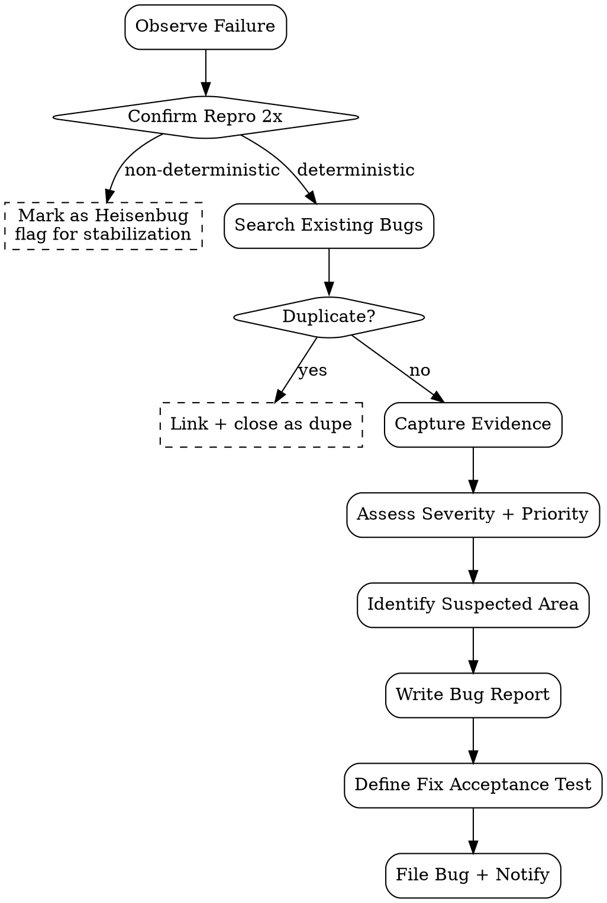

# Bug Report Writer

Standardize bug filing — capture deterministic repro + severity/priority + evidence. Tujuan: SWE intake langsung actionable, gak butuh follow-up clarification.

<HARD-GATE>
Setiap bug WAJIB punya: title, severity (S1-S4), priority (P0-P3), repro steps, actual, expected, env, evidence.
Repro steps WAJIB deterministic — kalau random "kadang muncul" → flag as Heisenbug, jangan close.
Severity vs Priority WAJIB distinct — severity = impact, priority = fix urgency (orthogonal).
Evidence WAJIB attached: screenshot (UI), log excerpt (backend), video (state transition complex).
JANGAN dedupe-skip — search existing bugs dulu, link kalau related/duplicate.
JANGAN combine 2 issue dalam 1 bug — file separately untuk traceability.
JANGAN propose fix di bug body — itu SWE domain (bisa hint di "Suspected" section).
Reporter WAJIB self-confirm repro 2x sebelum file — anti false-positive.
</HARD-GATE>

## When to use

- Test execution menemukan failure (deterministic atau suspected flaky)
- Production observation (PA agent dispatch ke QA)
- Stakeholder report ke QA via support channel
- UAT session menemukan deviation dari acceptance criteria

## When NOT to use

- Feature request — itu PM domain, bukan bug
- Performance complaint tanpa metric — butuh PA investigation dulu
- "Doesn't work as expected" tanpa repro — clarification dulu, jangan file bare-bones bug

## Required Inputs

- **Failure context** — test case ID atau prod observation
- **Build** — commit SHA / version
- **Environment** — staging URL / prod / local
- **Reporter** — agent ID / human

## Output

`outputs/bugs/BUG-{id}.md` — single file per bug.

Optional dispatch ke external tracker (Jira/Linear/GitHub Issues) via `gh issue create` atau API.

## Severity Matrix

| Severity | Definition | Examples |
|---|---|---|
| **S1 (Critical)** | System down, data loss, security breach | Login broken, data corruption, unauth access |
| **S2 (High)** | Major feature broken, no workaround | Cannot create order, payment fails |
| **S3 (Medium)** | Feature works partially, workaround exists | Validation message wrong, cosmetic but confusing |
| **S4 (Low)** | Minor cosmetic, no functional impact | Typo, alignment, color mismatch |

## Priority Matrix

| Priority | Definition | When |
|---|---|---|
| **P0 (Immediate)** | Drop everything, fix now | S1 in prod |
| **P1 (High)** | Fix this sprint | S1/S2 pre-release, S2 in prod |
| **P2 (Medium)** | Fix next sprint | S3 in prod, S2 with workaround |
| **P3 (Low)** | Backlog | S4, S3 low traffic |

## Bug Template

```markdown
# BUG-${ID}: ${SHORT_TITLE}

**Severity:** S2 (High)
**Priority:** P1 (Fix this sprint)
**Status:** Open
**Reporter:** ${AGENT_ID}
**Reported:** ${DATE}
**Build:** ${COMMIT_SHA} (branch: ${BRANCH})
**Environment:** Staging (${ENV_URL})
**Test case ref:** TC-DSC-003
**Related FSD:** outputs/${DATE}-fsd-${FEATURE}.md

## Summary

> 1-2 sentences plain-language description.

User cannot block discount line addition on confirmed sale order — system allows mutation contradicting acceptance criterion AC-DSC-4.

## Steps to reproduce

1. Login as user `sales_demo` (group: Sales / User)
2. Open existing sale order in state `sale` (ID: SO-2026-0042)
3. Click "Add discount line" button on order line tree
4. Enter percent=10, save

## Actual behavior

- Discount line is added successfully
- Order total recalculated to subtract discount
- No validation error shown
- Audit log shows "modified by sales_demo"

## Expected behavior

Per AC-DSC-4 (FSD § 3.2): confirmed orders must reject mutation. Expected error message:
> "Cannot modify confirmed order. Cancel order first to apply discount."

## Evidence

- Screenshot: `evidence/BUG-${ID}/before.png`, `evidence/BUG-${ID}/after.png`
- Server log excerpt: `evidence/BUG-${ID}/server.log` (relevant lines: 142-189)
- Reproduction confirmed: 3/3 attempts (deterministic)

## Environment details

| Component | Version |
|---|---|
| Odoo / Framework | 17.0+e |
| Browser | Chrome 132 |
| OS | macOS 24.6 |
| DB | postgres 15 |
| Module | sale_discount @ commit ${SHA} |

## Suspected area (hint, not fix)

- `models/sale_order_line.py` `_compute_discount` decorator may not check parent state
- Possibly missing `@api.constrains` on parent state transition

## Workaround

User can cancel + redraft order to apply discount before confirm. Acceptable for low-volume but not for prod.

## Related bugs / dupe check

- Searched existing: BUG-138 (similar AC, but on quotation level) — NOT duplicate
- BUG-91 (closed): same module, different field

## Acceptance test for fix

- [ ] TC-DSC-003 passes
- [ ] No regression in TC-DSC-001 (happy path)
- [ ] New test added for `state in ('sale', 'done', 'cancel')` boundary
```

## Checklist

You MUST create a TodoWrite task for each item and complete them in order:

1. **Confirm Repro** — execute steps 2x, capture deterministic vs flaky
2. **Search Existing Bugs** — grep `outputs/bugs/` + tracker via `gh issue list`
3. **Capture Evidence** — screenshot/log/video → `evidence/BUG-{id}/`
4. **Assess Severity** — match Severity Matrix
5. **Assess Priority** — match Priority Matrix (consider sprint capacity context)
6. **Identify Suspected Area** — hint only, no proposed fix
7. **Write Bug Report** — fill template
8. **Define Fix Acceptance Test** — what proves it's fixed
9. **File** — write `outputs/bugs/BUG-{id}.md` + optional `gh issue create`
10. **Notify** — task tag `triage` for EM intake

## Process Flow



## Anti-Pattern

- ❌ Bug "doesn't work" tanpa repro — non-actionable
- ❌ Severity = Priority — orthogonal axes
- ❌ Combine 2 issue jadi 1 bug — hard to track resolution
- ❌ Propose fix code di body — overstep ke SWE
- ❌ Skip dupe search — bloat tracker
- ❌ No evidence — SWE has to re-reproduce
- ❌ "It worked yesterday" — useless, capture diff dari commit
- ❌ S1 + P3 — contradiction, escalate
- ❌ Auto-close flaky — file with Heisenbug label, investigate

## Inter-Agent Handoff

| Direction | Trigger | Skill / Tool |
|---|---|---|
| **QA** ← `test-execution` | Test fail | dispatch bug-report per failure |
| **QA** ← **PA** | Prod alert | dispatch bug-report from observation |
| **QA** → **EM** | Bug filed | task tag `triage` |
| **QA** → **SWE** | EM-prioritized | task tag `ready-to-fix` |
| **QA** ← **SWE** | Fix shipped | dispatch test-execution untuk verify fix |
