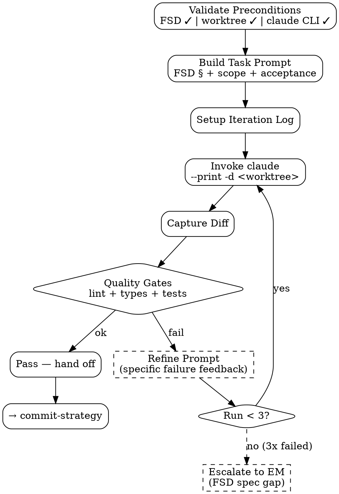

# Claude Code Orchestrator

SWE agent **bukan** code generator sendiri. SWE agent **orchestrate** Claude Code CLI untuk lakukan kerja coding. Skill ini:
1. Build structured prompt dari FSD/spec + scope + acceptance criteria
2. Invoke `claude` CLI di worktree yang sudah disiapkan
3. Capture output, run lint + tests, validate
4. Retry dengan refined prompt kalau validation gagal
5. Hand off ke `commit-strategy` saat kerja claude lolos quality gates

<HARD-GATE>
SWE agent JANGAN write code langsung dengan tools FS — selalu via Claude Code CLI invocation.
Worktree WAJIB disiapkan dulu via `git-worktree` skill sebelum orchestrator dispatch.
FSD WAJIB di-validate via `fsd-reader` (status `approved` + no hard errors) sebelum orchestrator start.
Per-task scope WAJIB explicit: file paths target, FSD section yang di-implement, acceptance criteria.
Iteration limit 3x — kalau setelah 3 retry masih gagal lint/test, STOP & escalate ke EM (FSD ambiguous atau spec gap).
JANGAN orchestrate untuk task >500 LoC sekali jalan — split per FSD section atau per logical unit.
Setiap invocation WAJIB log prompt + output ke `outputs/codework/{date}-{feature}/run-{N}.log` — auditable.
Claude CLI binary path WAJIB `/opt/homebrew/bin/claude` (atau via `CLAUDE_BIN` env var override).
</HARD-GATE>

## When to use

- FSD approved, ready untuk implementation
- Bug fix dengan clear repro + spec
- Refactor dengan clear scope dan acceptance
- Test writing (delegated dari `unit-test-writer` Option C — coverage gap fill)
- Doc update yang touches code (e.g. update API docs in source comments)

## When NOT to use

- Discovery / spec writing — itu PM/EM territory
- Pure git operations — itu `git-worktree` / `commit-strategy` / `rebase-strategy`
- Production debugging dengan customer data — needs human SRE, gak bisa di-claude
- "Just figure it out" tanpa spec — orchestrator butuh scope, bukan vibe

## Architecture

```
SWE agent
   │
   ├─→ fsd-reader (validate spec)
   ├─→ git-worktree (prepare isolated workspace)
   │
   └─→ claude-code-orchestrator
          │
          ├─→ Build prompt:
          │     - FSD section reference
          │     - Target file paths
          │     - Acceptance criteria
          │     - Constraints (style, deps, no breaking changes)
          │
          ├─→ Invoke: claude --print -d "<worktree>" "<prompt>"
          │
          ├─→ Capture: stdout + files written
          │
          ├─→ Validate:
          │     - Lint pass
          │     - Type check pass
          │     - Tests pass (if test-writing task)
          │     - Acceptance criteria met
          │
          ├─→ If fail: refine prompt, retry (max 3x)
          │
          └─→ Output: ready-for-commit changes in worktree
```

## Required Inputs

- **Worktree path** — already created via `git-worktree`
- **FSD path** — for context (FSD already validated)
- **Task scope** — explicit:
  - Mode: `implement` | `refactor` | `fix` | `write-tests` | `update-docs`
  - Target files: list of paths to write/modify (relative to repo root)
  - FSD section(s): which §
  - Acceptance criteria: testable conditions
- **Optional:** previous attempts (untuk iterative refinement)

## Output

```
outputs/codework/{date}-{feature}/
├── run-1.log               # full prompt + claude output for run 1
├── run-2.log               # if retry needed
├── manifest.json           # task scope + iteration count + final status
└── changes-summary.md      # human-readable summary of what claude changed
```

Plus: actual code changes in `<worktree>` (committed by `commit-strategy` later).

## Checklist

You MUST create a TodoWrite task for each item and complete them in order:

1. **Validate Preconditions** — FSD approved, worktree exists, claude CLI accessible
2. **Build Task Prompt** — structured, including FSD context + scope + constraints + acceptance
3. **Setup Iteration Log** — `outputs/codework/{date}-{feature}/`
4. **Invoke Claude (Run 1)** — via `claude --print` di worktree
5. **Capture Diff** — `git status` + `git diff` to see what changed
6. **Run Quality Gates** — lint + type check + tests (per stack)
7. **Evaluate Results** — pass / refine / fail
8. **If Refine:** Build refined prompt with specific failure feedback, increment run counter, repeat (max 3 total)
9. **Output Summary** — manifest.json + changes-summary.md
10. **Hand Off** — to `commit-strategy` for commit authoring

## Process Flow



## Detailed Instructions

### Step 1 — Validate Preconditions

```bash
# Claude CLI accessible
[ -x "${CLAUDE_BIN:-/opt/homebrew/bin/claude}" ] || {
  echo "ERROR: claude CLI not found"; exit 1;
}

# Worktree exists
[ -d "$WORKTREE" ] || { echo "ERROR: worktree not found: $WORKTREE"; exit 1; }

# FSD validation
./skills/fsd-reader/scripts/parse.sh --fsd "$FSD" --output /tmp/fsd-parsed.json
[ $? -eq 0 ] || { echo "ERROR: FSD validation failed"; exit 1; }
```

### Step 2 — Build Task Prompt

Template (per task mode):

```
You are working in {worktree}. Implement the following task.

## Task
Mode: {implement | refactor | fix | write-tests}
Feature: {feature-slug}
FSD: {fsd-path}
FSD Section(s): {§N, §N}

## Target Files
- {file-1-path}
- {file-2-path}

## Acceptance Criteria
1. {criterion 1, testable}
2. {criterion 2, testable}

## Constraints
- Stack: {odoo-17 | react-18 | etc.}
- Dependency policy: {use existing deps; new deps require approval}
- Style: follow existing repo conventions (run lint to verify)
- No breaking changes to public API
- {stack-specific constraints from FSD §}

## Quality Gates (you must verify)
- Lint pass: {lint command}
- Type check pass: {type check command}
- Tests pass: {test command}

## Conventions
- File header comment cites FSD section: e.g. "# Implements FSD §2 (Data Model)"
- Each function/class has docstring + type hints
- No suppressions (`# noqa`, `// eslint-disable`) — fix root cause
- Commit later (don't commit; SWE will handle via commit-strategy)

## On Ambiguity
If spec is unclear, STOP and write your question to `outputs/codework/{date}-{feature}/question-{run}.md` instead of guessing. Do not invent business logic.

Begin implementation now. Write files, run quality gates, report results.
```

Template ada di `references/prompts.md` per task mode.

### Step 3 — Setup Iteration Log

```bash
mkdir -p "outputs/codework/${DATE}-${FEATURE}/"
RUN=1
```

### Step 4 — Invoke Claude

```bash
PROMPT="$(cat .prompt-current.md)"

claude --print --dangerously-skip-permissions \
  -d "$WORKTREE" \
  <<< "$PROMPT" \
  > "outputs/codework/${DATE}-${FEATURE}/run-${RUN}.log" 2>&1
```

Flags:
- `--print` — non-interactive mode
- `-d <dir>` — set working directory (worktree)
- `--dangerously-skip-permissions` — needed for headless agent invocation (claude won't prompt for tool approval)

### Step 5 — Capture Diff

```bash
cd "$WORKTREE"
git status --short > /tmp/changed.txt
git diff > /tmp/diff.patch
```

### Step 6 — Run Quality Gates

Per stack (auto-detected — see `claude-code-orchestrator/references/quality-gates.md`):

| Stack | Gates |
|---|---|
| Odoo | `pylint --rcfile=.pylintrc-odoo` + `odoo-bin --test-tags=/{module} --stop-after-init` |
| React | `eslint .` + `tsc --noEmit` + `vitest run` |
| Vue | `eslint .` + `vue-tsc --noEmit` + `vitest run` |
| Express | `eslint .` + `tsc --noEmit` + `vitest run` |
| FastAPI | `ruff check .` + `mypy .` + `pytest` |

Capture exit codes; aggregate jadi pass/fail.

### Step 7 — Evaluate Results

| Result | Action |
|---|---|
| All gates pass + acceptance met | Hand off ke `commit-strategy` |
| 1+ gate fail | Refine prompt with specific error output, retry |
| Question file exists (`question-{run}.md`) | Read + answer (kalau bisa) atau escalate ke EM |
| 3x retry exhausted | Escalate ke EM dengan `task tag fsd-clarification` |

### Step 8 — Refine Prompt (kalau fail)

```
[Previous run output excerpt]
{last 30 lines of run-{N-1}.log + relevant errors}

The following gates failed:
- Lint: {N errors at lines ...}
- Type check: {error 1, error 2}
- Tests: {failing test name + assertion}

Refine your implementation to address these specific failures. Do not introduce new files unless necessary; focus on fixing the existing changes.
```

Append refinement instructions to original prompt, send to claude again. Increment run counter.

### Step 9 — Output Summary

`outputs/codework/{date}-{feature}/manifest.json`:
```json
{
  "feature": "discount-line",
  "fsd": "outputs/2026-04-25-fsd-discount-line.md",
  "worktree": "/path/to/repo/.worktrees/discount-line",
  "task_mode": "implement",
  "fsd_sections": ["§2", "§4", "§5"],
  "iterations": 2,
  "final_status": "pass",
  "files_changed": [
    {"path": "models/discount_line.py", "lines_added": 87, "lines_removed": 0},
    {"path": "views/discount_line_views.xml", "lines_added": 124, "lines_removed": 0}
  ],
  "gates": {
    "lint": "pass",
    "type_check": "pass",
    "tests": "pass"
  },
  "ready_for_commit": true
}
```

### Step 10 — Hand Off

```bash
./skills/commit-strategy/scripts/author-commits.sh \
  --worktree "$WORKTREE" \
  --fsd "$FSD" \
  --feature "$FEATURE"
```

## Output Format

See `references/format.md`.

## Inter-Agent Handoff

| Direction | Trigger | Skill / Tool |
|---|---|---|
| **SWE** ← `git-worktree` | Worktree ready | orchestrator dispatched |
| **SWE** ← `fsd-reader` | FSD validated | orchestrator gets parsed JSON for context |
| **SWE** → `commit-strategy` | All gates pass | commit-strategy reviews + authors commits |
| **SWE** → `unit-test-writer` | Code written, coverage check needed | unit-test-writer validates, may re-dispatch claude |
| **SWE** → **EM** | 3x iteration fail | task tag `fsd-clarification` with run logs |
| **SWE** → **PM** | Acceptance criteria untestable | task tag `prd-needs-acceptance-clarity` |

## Anti-Pattern

- ❌ SWE agent writes code via FS tools directly — bypasses claude expertise
- ❌ Orchestrate tanpa worktree — pollutes main checkout, hard to abandon
- ❌ Orchestrate tanpa FSD validation — claude works on broken spec
- ❌ Vague task scope ("implement the feature") — claude tebak, drift
- ❌ Skip quality gates — silent breakage di future
- ❌ >3 retry — pattern indicates spec gap, escalate
- ❌ >500 LoC single task — break into sections per FSD §
- ❌ Skip iteration log — gak audit-able, debug claude behavior susah
- ❌ Hardcode `/usr/local/bin/claude` (atau path lain selain default) — pakai `CLAUDE_BIN` env var
- ❌ Commit dari claude langsung — orchestrator hand off ke commit-strategy untuk authored commits
