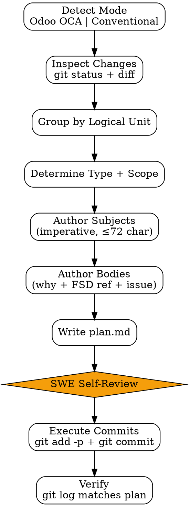

# Commit Strategy

Author git commits dari changes di worktree dengan **convention enforcement** + **atomic split**. Stack-aware: detect Odoo project → use OCA format, else fallback ke Conventional Commits.

<HARD-GATE>
Setiap commit WAJIB punya scope/module reference — JANGAN commit "update files" tanpa context.
Atomic per logical unit — JANGAN big-bang commit semua changes sekaligus.
FSD § citation WAJIB di body kalau ada FSD link — audit trail.
Convention enforcement (strict):
  - Odoo project: `[add/imp/ref/fix][module1,module2] short subject` ≤72 char + body
  - Non-Odoo: `type(scope): subject` ≤72 char + body
JANGAN commit `WIP`, `temp`, `xxx` — squash dulu via rebase-strategy.
JANGAN amend commit yang sudah di-push ke shared branch — bikin commit baru.
JANGAN bypass pre-commit hooks (`--no-verify`) tanpa explicit user approval — fix root cause.
JANGAN commit secrets / credentials / `.env` — pre-commit gitleaks scan recommended.
</HARD-GATE>

## When to use

- Setelah claude-code-orchestrator selesai work — review + author commits
- Manual commit pas SWE inspect changes
- Reorganize uncommitted work into atomic commits
- Pre-PR cleanup (sebelum rebase-strategy)

## When NOT to use

- Hotfix emergency dengan time-pressure ekstrem — minimum convention masih wajib, tapi review ringan
- Documentation-only commit (typo fix) — single commit OK, convention tetap

## Two convention modes

### Mode 1: Odoo OCA (auto-detected)

**Detection:** `__manifest__.py` ditemukan di repo path.

**Format:**
```
[<type>][<module1>,<module2>] <short subject>

<body>

<FSD reference>
<Closes/Refs>
```

**Type prefixes:**

| Prefix | Meaning | Example use |
|---|---|---|
| `[add]` | Add new module / model / file / feature | `[add][sale_discount] add discount_line model` |
| `[imp]` | Improve existing functionality | `[imp][sale,account] improve invoice generation logic` |
| `[ref]` | Refactor without behavior change | `[ref][hr_payroll] refactor payslip computation methods` |
| `[fix]` | Bug fix | `[fix][stock] fix incorrect quantity validation` |

**Module list rules:**
- 1-3 modules typical; >3 = consider splitting commit
- Comma-separated, no spaces: `[module1,module2]` (not `[module1, module2]`)
- Module = directory name di Odoo addons (e.g. `sale`, `hr_payroll`, `dke_discount`)
- Cross-module changes (e.g. dependency tweaks) → list both modules touched

**Subject rules:**
- Lowercase, imperative ("add", "fix" — not "added", "fixed")
- ≤72 chars total (including prefix)
- No period at end

**Body rules:**
- Wrap at 72 chars
- Explain *why*, not *what* (diff shows what)
- Reference FSD/PRD: `FSD: outputs/2026-04-25-fsd-discount-line.md §2`
- Issue link: `Closes #142` or `Refs #142`

### Mode 2: Conventional Commits (fallback)

**Detection:** No `__manifest__.py`; standard JS/Python/Go/etc. project.

**Format:**
```
<type>(<scope>): <short subject>

<body>

<footer>
```

**Types:** `feat | fix | refactor | test | chore | docs | style | perf | ci | build`

**Examples:**
```
feat(checkout): add discount line section

Implement discount input field with validation.

FSD: outputs/2026-04-25-fsd-discount-line.md §4
Closes #142
```

```
fix(api): handle race condition in retry handler

Refs #199
```

## Required Inputs

- **Worktree path** — where changes live
- **FSD link** (optional but recommended) — for §citation
- **Issue links** (optional) — `Closes #N` etc.

## Output

`outputs/commits/{date}-{branch}/`:
- `plan.md` — commit plan (per-commit message + files)
- `execution-log.txt` — actual git commit output

Plus actual commits in worktree's git history.

## Checklist

You MUST create a TodoWrite task for each item and complete them in order:

1. **Detect Mode** — `__manifest__.py` check → Odoo OCA atau Conventional
2. **Inspect Changes** — `git status --short` + `git diff --stat`
3. **Group by Logical Unit** — files yang related → 1 commit
4. **Identify Module(s) per Commit** (Odoo) atau Scope (Conventional)
5. **Determine Type per Commit** — add/imp/ref/fix atau feat/fix/refactor/etc.
6. **Author Subject Lines** — imperative, ≤72 chars
7. **Author Bodies** — explain *why*, FSD ref, issue link
8. **Plan Document** — `plan.md` for review before execution
9. **[HUMAN GATE — SWE Self-Review]** — inspect plan, adjust if needed
10. **Execute Commits** — `git add -p` (selective stage) + `git commit -m`
11. **Verify** — `git log --oneline` matches plan

## Process Flow



## Detailed Instructions

### Step 1 — Detect Mode

```bash
if find "$WORKTREE" -name "__manifest__.py" -not -path "*/node_modules/*" | head -1 > /dev/null 2>&1; then
  MODE="odoo"
else
  MODE="conventional"
fi
```

### Step 2 — Inspect Changes

```bash
cd "$WORKTREE"
git status --short
git diff --stat
git diff --name-only | sort
```

### Step 3 — Group by Logical Unit

Grouping heuristic:
- Same module (Odoo) → likely 1 commit (atau split kalau besar)
- Same FSD § → 1 commit
- Schema change → separate commit (so migration is isolated, easy to revert)
- Tests → separate commit dari implementation (pasangan commit-test)
- Dependencies update (manifest, package.json) → separate commit

Per logical unit:
- Files yang co-changed
- Single FSD § (atau small group)
- ~50-300 LoC typical, ≤500 max

### Step 4 — Identify Modules / Scope

#### Odoo (modules):
```bash
git diff --name-only | sed -E 's|^addons/||;s|^modules/||' | awk -F/ '{print $1}' | sort -u
```

Per commit: list modules touched. Ideally 1-2 modules per commit.

#### Conventional (scope):
Map to logical area:
- API endpoint → scope = endpoint group (e.g. `auth`, `checkout`)
- Component → scope = component family (e.g. `cart`, `nav`)
- Cross-cutting → omit scope: `chore: ...`

### Step 5 — Determine Type

#### Odoo:
| Type | When |
|---|---|
| `[add]` | New file (model, view, security, controller) |
| `[imp]` | Modified existing functionality, behavior change |
| `[ref]` | Internal refactor, no public behavior change |
| `[fix]` | Bug fix; cite issue |

#### Conventional:
| Type | When |
|---|---|
| `feat` | New user-facing feature |
| `fix` | Bug fix |
| `refactor` | Internal restructure, no behavior change |
| `test` | Add/modify tests only |
| `chore` | Build, deps, tooling |
| `docs` | Documentation |
| `style` | Formatting only (rare; usually auto-formatted) |
| `perf` | Performance improvement |
| `ci` | CI config |

### Step 6 — Subject Lines

Rules:
- **Imperative** mood: "add", "fix" — bukan "added", "fixed"
- **Lowercase** kecuali proper noun
- **≤72 chars total** (prefix counted)
- **No period** at end
- **Specific** — "fix payment retry" lebih baik dari "fix bug"

### Step 7 — Bodies

Template Odoo:
```
[imp][sale,account] improve invoice generation for partial deliveries

When a sale order is partially delivered, the invoice was generated for the
full amount instead of just the delivered quantity. This caused billing
discrepancies in cases where customers paid for partial deliveries.

This fix tracks delivered_qty per line and invoices accordingly. Existing
fully-delivered orders are unaffected.

FSD: outputs/2026-04-25-fsd-partial-invoicing.md §3
Closes #199
```

Template Conventional:
```
fix(checkout): handle race in discount apply retry

Two simultaneous retries could double-apply the discount due to missing
mutex. Add idempotency key check before applying.

FSD: outputs/2026-04-22-fsd-checkout-discount.md §6
Refs #142
```

### Step 8 — Plan Document

`outputs/commits/{date}-{branch}/plan.md`:

```markdown
# Commit Plan: feature/discount-line

**Mode:** Odoo OCA
**Worktree:** /path/to/repo/.worktrees/discount-line
**FSD:** outputs/2026-04-25-fsd-discount-line.md
**Total commits:** 4

## Commit 1
**Subject:** `[add][dke_discount] scaffold module structure`
**Files:**
- `dke_discount/__init__.py`
- `dke_discount/__manifest__.py`
- `dke_discount/models/__init__.py`

**Body:**
```
Initial scaffold for discount-line feature module.

FSD: outputs/2026-04-25-fsd-discount-line.md (scaffold)
```

## Commit 2
**Subject:** `[add][dke_discount] add discount_line model`
**Files:**
- `dke_discount/models/discount_line.py`

**Body:**
```
Define sale.order.discount.line model with type/value fields and
auto-computed amount.

FSD: outputs/2026-04-25-fsd-discount-line.md §2
```

(... commits 3-4 ...)
```

### Step 9 — SWE Self-Review

Inspect plan. Common adjustments:
- Split too-big commits
- Merge too-small commits (e.g. typo fixes)
- Reorder for narrative flow (scaffold → models → views → tests)
- Verify FSD § references actual section yang relevan

### Step 10 — Execute

```bash
cd "$WORKTREE"

# Per commit di plan
git add path/to/file1 path/to/file2  # selective; or git add -p untuk hunk-level
git commit -m "$SUBJECT" -m "$BODY"

# Or via heredoc untuk multiline body:
git commit -F - <<EOF
$SUBJECT

$BODY
EOF
```

### Step 11 — Verify

```bash
git log --oneline -n $COMMIT_COUNT
```

Match plan? Done. Mismatch → use `rebase-strategy` to fix.

## Output Format

See `references/format.md` for plan schema + execution log.

## Inter-Agent Handoff

| Direction | Trigger | Skill / Tool |
|---|---|---|
| **SWE** ← `claude-code-orchestrator` | Code work pass quality gates | commit-strategy reviews + authors |
| **SWE** → `rebase-strategy` | Need history cleanup | rebase to squash fixups, reorder |
| **SWE** → `pr-description-writer` | All commits authored | PR body summary |

## Anti-Pattern

- ❌ "Update files" / "fix" / "wip" subject — context-free
- ❌ Big-bang commit (50 files, 1 message) — un-reviewable, un-revertable
- ❌ Skip FSD § citation when FSD exists — audit trail incomplete
- ❌ Commit `WIP` / `xxx` — clean up via `rebase-strategy` before push
- ❌ Mix unrelated changes in 1 commit — bisect-unfriendly
- ❌ Amend pushed commit ke shared branch — breaks others' rebases
- ❌ `--no-verify` bypass tanpa user approval — pre-commit gates exist for reason
- ❌ Module list `[module1, module2]` (with space) — strict no-space format
- ❌ Subject > 72 chars — wraps badly in `git log`, GitHub
- ❌ Past tense ("added", "fixed") — convention is imperative
