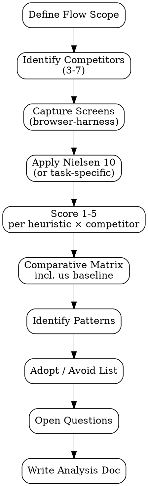

# Competitor UX Analysis

Comparative UX evaluation menggunakan **screenshot capture + Nielsen heuristics + comparative matrix**. Tujuan: identifikasi pattern yang bekerja vs gagal di market, derive actionable design decisions.

<HARD-GATE>
Setiap kompetitor WAJIB punya minimal 3 captured screens (entry point + key flow + edge case).
Setiap heuristic violation WAJIB punya screenshot citation, bukan klaim verbal.
Comparative matrix WAJIB include produk kita sendiri sebagai baseline — gak boleh hanya kompetitor.
Minimum 3 kompetitor — single comparison gak informatif.
Hindari "copy paste blindly" recommendations — setiap pattern adoption harus ada rationale kontekstual.
Capture WAJIB legal: public-facing pages atau user yang authorized; jangan crawl behind paywall yang melanggar ToS.
</HARD-GATE>

## When to use

- Pre-design phase: cari pattern existing yang relevant
- Re-design existing flow: validate decision dengan how-others-solve-it
- Stakeholder ask "tolong cek X gimana di kompetitor"
- Companion ke `market-research` (PM) — UX-deep version

## When NOT to use

- Pure feature comparison tanpa UX angle — itu `market-research`
- Internal-only benchmarking (different products dari company sama) — itu `ux-research`
- Pricing comparison — itu `pricing-strategy-analyzer` (Biz Analyst)

## Required input

- 3-7 kompetitor (URLs atau app store links)
- Specific flow yang dianalisa (e.g. "checkout", "onboarding", "search")
- Optional: screenshot kita sendiri untuk baseline comparison

## Output

`outputs/YYYY-MM-DD-competitor-ux-{flow}.md` dengan:

1. Executive Summary
2. Methodology (heuristic framework, scoring scale)
3. Per-Competitor Analysis (screens + heuristic eval per competitor)
4. Comparative Matrix (us vs them, heuristic × competitor grid)
5. Pattern Inventory (patterns yang dilihat berulang)
6. Adopt / Avoid List (actionable)
7. Open Questions

## Checklist

You MUST create a TodoWrite task for each item and complete them in order:

1. **Define Flow Scope** — flow spesifik yang dianalisa (gak generic "the whole site")
2. **Identify Competitors** — 3-7, criteria pemilihan jelas
3. **Capture Screens** — `browser-harness` untuk minimum 3 screens per kompetitor
4. **Apply Heuristics** — Nielsen 10 (or task-specific framework)
5. **Score Per Heuristic** — 1-5 scale per competitor, evidence-based
6. **Build Comparative Matrix** — heuristic × competitor + us baseline
7. **Identify Patterns** — group similar approaches across competitors
8. **Derive Adopt/Avoid** — what we should copy, what we should differentiate
9. **Document Open Questions** — apa yang gak ke-capture (paywall, etc.)
10. **Output Document** — `outputs/YYYY-MM-DD-competitor-ux-{flow}.md`

## Process Flow



## Detailed Instructions

### Step 1 — Define Flow Scope

Specific. Gak generic.

❌ "Cek UX seluruh website kompetitor"
✅ "Compare onboarding flow (signup → first action) di 5 SaaS analytics kompetitor"

### Step 2 — Identify Competitors

Criteria:
- **Direct competitors**: produk yang user kita evaluate as alternative
- **Adjacent**: produk berbeda kategori tapi solve similar UX problem
- **Industry leader**: yang sering dicitate sebagai gold standard
- **Avoid**: produk yang deprecated atau low-traffic (gak representative)

Document criteria pemilihan di output.

### Step 3 — Capture Screens

Pakai `browser-harness-odoo` (atau `browser-harness-core`):

```bash
# Flow capture
./skills/browser-harness-odoo/scripts/runbook-run.sh \
  --runbook-yaml runbooks/competitor-onboarding.yaml \
  --output outputs/raw/competitor-screens/{competitor}/
```

Minimum **3 screens per competitor**:
- Entry point (landing / signup)
- Key flow midpoint (the meat)
- Edge case (error state, empty state, atau power user view)

Save raw screenshots dengan naming `{competitor}-{flow-step}-{N}.png` di `outputs/raw/competitor-screens/`.

### Step 4 — Apply Heuristics

Default framework: **Nielsen 10**

| # | Heuristic | Pertanyaan |
|---|---|---|
| H1 | Visibility of system status | Apakah user tahu apa yang sedang terjadi? |
| H2 | Match real world | Bahasa & metaphor familiar? |
| H3 | User control & freedom | Bisa undo / cancel? |
| H4 | Consistency & standards | Pattern konsisten? |
| H5 | Error prevention | Mencegah error before they happen? |
| H6 | Recognition over recall | User gak harus mengingat info dari screen lain |
| H7 | Flexibility & efficiency | Power user shortcut tersedia? |
| H8 | Aesthetic & minimalist | Tidak overwhelming? |
| H9 | Help recognize/recover errors | Error message clear & actionable? |
| H10 | Help & documentation | Tersedia in-context? |

Untuk task-specific flows, gunakan additional framework:
- **Onboarding**: time-to-first-value, friction count
- **Checkout**: cognitive load, trust signals, payment trust
- **Search**: result relevance, filter depth, empty state

### Step 5 — Score 1-5 per Heuristic × Competitor

| Score | Meaning |
|---|---|
| 5 | Exemplary — best practice di kategori ini |
| 4 | Solid — gak ada gap signifikan |
| 3 | Adequate — works tapi room for improvement |
| 2 | Weak — gap clear, user struggle visible |
| 1 | Failed — major violation, user lost |

Evidence per cell: link screenshot atau quote 1-line dari capture.

### Step 6 — Comparative Matrix

```
| Heuristic                        | Us | Comp A | Comp B | Comp C | Best in class |
|----------------------------------|----|----|----|----|----|
| H1 Visibility of system status   | 3  | 4  | 5  | 3  | Comp B |
| H2 Match real world              | 4  | 3  | 4  | 5  | Comp C |
| H3 User control & freedom        | 2  | 5  | 4  | 3  | Comp A |
| H4 Consistency & standards       | 4  | 4  | 4  | 5  | Comp C |
| H5 Error prevention              | 3  | 3  | 5  | 4  | Comp B |
| ... (10 rows total)              |    |    |    |    |    |
```

Total per kompetitor (including us) → average score → top 3 strengths + bottom 3 weaknesses per produk.

### Step 7 — Identify Patterns

Look for:
- **Convergent**: 3+ kompetitor pakai approach sama → industry pattern
- **Divergent**: kompetitor split antara 2 pendekatan → opportunity to choose
- **Unique**: 1 kompetitor punya pattern unik → potentially novel idea atau bad bet

Per pattern, document:
- Pattern name (descriptive)
- Visual example (screenshot)
- Used by (which competitors)
- Hypothesized rationale (why pattern works)

### Step 8 — Adopt / Avoid List

```
| Pattern                          | Recommendation | Rationale |
|----------------------------------|---|---|
| Inline field-level validation    | ADOPT | 4 of 5 competitors do; reduces error rate |
| Hide checkout total until step 3 | AVOID | Conflicts with our trust-first positioning |
| Multi-step progress indicator    | ADOPT | Reduces abandonment per our user research H3 |
| Auto-fill on payment             | INVESTIGATE | Promising but our users distrust per UX research |
```

**Rationale wajib**: kontekstual ke produk kita, bukan "everyone does it so we should".

### Step 9 — Open Questions

- Behind-paywall flow gak captured (e.g. "advanced settings setelah signup")
- Mobile vs desktop variations gak comprehensive
- Localized version (Indonesian vs English) belum di-compare
- A/B test variations possibly hidden

### Step 10 — Output Document

```bash
./scripts/analyze.sh --flow "checkout-mobile" \
  --competitors "stripe,shopify,tokopedia,shopee,lazada" \
  --captures-dir outputs/raw/competitor-screens/ \
  --output outputs/$(date +%Y-%m-%d)-competitor-ux-checkout-mobile.md
```

## Output Format

See `references/format.md` for canonical schema.

## Inter-Agent Handoff

| Direction | Trigger | Skill / Tool |
|---|---|---|
| **UX** ← **PM** | Discovery support | feed Adopt list ke PRD-related decisions |
| **UX** → **UX** | Adopt patterns | feed ke `design-brief-generator` |
| **UX** → **UX** | Detailed flow design | feed ke `prototype-generator` (with adopt patterns as reference) |
| **UX** → **EM** | Pattern membutuhkan tech feasibility check | task tag `ux-tech-check` |

## Anti-Pattern

- ❌ Single-screen capture per kompetitor — gak representative
- ❌ Heuristic score tanpa screenshot citation
- ❌ Comparative matrix tanpa "us" baseline
- ❌ Single-competitor analysis (n=1 = data point, bukan pattern)
- ❌ "Adopt" pattern tanpa contextual rationale — copy-paste blindly
- ❌ Skip pattern divergence — gak ada decision moment
- ❌ Capture dari paywall/auth-walled tanpa authorization
- ❌ Output sekedar gallery screenshot tanpa sintesis
