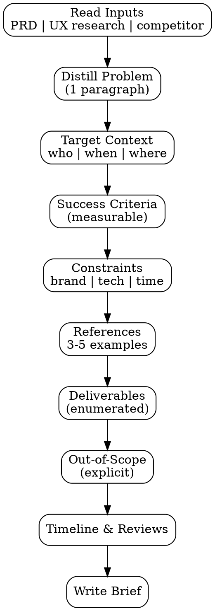

# Design Brief Generator

Synthesize multi-source input (PRD, UX research, competitor analysis) menjadi **design brief 1-2 halaman** yang ready untuk handoff ke designer atau dipakai sebagai input `prototype-generator`. Brief = compressed context, bukan dump semua dokumen.

<HARD-GATE>
Brief WAJIB max 2 halaman — kalau lebih panjang, brief kurang sintesis, dump terlalu banyak info.
Setiap section WAJIB cite source (PRD section, UX research finding, competitor pattern).
Success criteria WAJIB measurable — gak boleh "looks good" atau "modern feel".
References WAJIB include 3-5 visual examples (screenshots, dribbble, atau competitor capture).
Deliverables WAJIB enumerate (e.g. "high-fi mockup desktop + mobile + 3 states") — gak boleh open-ended.
Brand constraints WAJIB explicit — color palette, typography, brand voice yang must-respect.
Out-of-scope section WAJIB ada — apa yang JANGAN designer touch (locks confusion).
</HARD-GATE>

## When to use

- Post-PRD lock — handoff ke designer (internal atau eksternal)
- Pre-prototype — brief jadi input untuk `prototype-generator`
- Re-design existing component — brief untuk capture target state
- External vendor design engagement

## When NOT to use

- Code-level spec (component props, state) — itu `fsd-generator` (EM)
- Detailed visual style guide — itu separate doc, `design-system` skill
- Pre-PRD discovery — designer akan kebanjiran context tanpa anchor

## Required Inputs

- PRD link (post-lock)
- UX research findings (kalau ada — `ux-research` output)
- Competitor patterns (kalau ada — `competitor-ux-analysis` output)
- Optional: previous design iterations untuk avoid

## Output

`outputs/YYYY-MM-DD-design-brief-{feature}.md`, max 2 pages, structured:

1. **Problem Statement** (1 paragraph)
2. **Target User & Context** (who, when, where they encounter)
3. **Success Criteria** (measurable design goals)
4. **Constraints** (brand, technical, time)
5. **References** (3-5 visual examples)
6. **Deliverables** (enumerated artifacts)
7. **Out-of-Scope** (explicit non-goals)
8. **Timeline & Review Points**

## Checklist

You MUST create a TodoWrite task for each item and complete them in order:

1. **Read Inputs** — PRD + UX research + competitor analysis
2. **Distill Problem** — 1 paragraph, designer-readable (no PM jargon)
3. **Identify Target Context** — who uses this, when, where, in what mood
4. **Define Success Criteria** — measurable design goals (not subjective)
5. **List Constraints** — brand, technical, time, must-respect items
6. **Curate References** — 3-5 visual examples dengan rationale per ref
7. **Enumerate Deliverables** — what designer must produce (concrete list)
8. **Define Out-of-Scope** — what NOT to touch (prevents scope creep)
9. **Set Timeline** — milestones + review checkpoints
10. **Output Document** — `outputs/YYYY-MM-DD-design-brief-{feature}.md`

## Process Flow



## Detailed Instructions

### Step 1 — Read Inputs

Required:
- PRD section "User Stories" + "Success Metrics"
- UX research findings (kalau available)
- Competitor analysis Adopt list (kalau available)

Kalau PRD belum locked → STOP, request lock first.

### Step 2 — Distill Problem

1 paragraph, designer-readable, no PM jargon.

❌ "Per PRD section 4.2, hypothesis-driven analysis indicates a value-score uplift opportunity in checkout conversion"
✅ "Returning users abandon mobile checkout at the discount field — they can't find it before clicking the primary CTA. We need to redesign the discount input so users discover it within 3 seconds and apply the code without scrolling."

### Step 3 — Target Context

Who:
- User segment (from PRD)
- Skill level / familiarity
- Tier (free/paid/enterprise) kalau differentiate

When:
- What triggers them to encounter this design
- What they were doing before (mental state)
- What they expect to do after

Where:
- Device (mobile/desktop/tablet)
- Network condition (good wifi vs flaky)
- Environment (calm browse vs urgent buy)

### Step 4 — Success Criteria

Measurable, derived dari PRD success metrics + UX research findings:

```
1. Task completion rate ≥ 80% on first try (validated via usability testing)
2. Time-on-task < 30s for discount apply
3. Error rate < 5% (wrong taps before correct action)
4. Visual hierarchy testable (5-second test: 4/5 users identify discount field)
```

Avoid: "feels modern", "looks premium", "good UX". Tidak measurable.

### Step 5 — Constraints

| Type | Constraint | Source |
|---|---|---|
| Brand | Primary color #8b5cf6, must use Inter font | brand guide |
| Technical | Must support iOS Safari 14+ + Android Chrome 90+ | tech-stack ADR |
| Time | Designer has 5 working days max | sprint capacity |
| Accessibility | WCAG AA minimum, no color-only feedback | compliance |
| Existing UX | Cannot break checkout step navigation | regression risk |

### Step 6 — References

3-5 visual examples. Each WAJIB include:
- Source (URL atau path to screenshot)
- Why this is referenced (what to learn from it)
- What to NOT copy (caveats)

```
1. Stripe checkout discount field
   - Source: https://stripe.com/checkout (captured 2026-04-15)
   - Adopt: Inline validation with green check on valid code
   - Avoid: Their multi-currency dropdown — too complex for our context

2. Tokopedia mobile cart
   - Source: outputs/raw/competitor-screens/tokopedia/cart-1.png
   - Adopt: Promo code visible in card hierarchy
   - Avoid: Auto-apply popup — annoying to power users
```

### Step 7 — Deliverables

Concrete, enumerated:

```
- High-fidelity mockup (Figma):
  - Mobile portrait — discount field redesign + 3 states (empty, valid, invalid)
  - Desktop — equivalent layout
- Interactive prototype (clickable Figma) covering happy path
- Component spec: padding, type sizes, color tokens
- Edge cases: empty cart with code, expired code, code already applied
- Asset export: SVG icons (success/error states)
```

Avoid open-ended "design the new flow" tanpa concrete list.

### Step 8 — Out-of-Scope

Explicit non-goals — prevents scope creep dan designer wandering:

```
- DO NOT redesign checkout payment step (separate ticket)
- DO NOT change typography system globally — only this flow
- DO NOT add gamification (badges, animations) — out of brand voice
- DO NOT propose backend changes (e.g. new code formats)
```

### Step 9 — Timeline & Reviews

```
| Milestone | Date | Reviewer |
|---|---|---|
| Brief ack + questions | Day 1 | Designer + UX Lead |
| Wireframe / low-fi review | Day 2 | UX Lead + PM |
| High-fi review #1 | Day 3 | UX Lead + PM + EM |
| Final review | Day 4 | UX Lead + PM + Stakeholder |
| Handoff to dev | Day 5 | EM + SWE |
```

### Step 10 — Output Document

```bash
./scripts/brief.sh --feature "checkout-mobile-discount" \
  --prd "outputs/2026-04-20-prd-checkout-mobile-discount.md" \
  --research "outputs/2026-04-22-ux-insights-checkout-mobile-discount.md" \
  --competitors "outputs/2026-04-23-competitor-ux-checkout-mobile.md"
```

## Output Format

See `references/format.md`.

## Inter-Agent Handoff

| Direction | Trigger | Skill / Tool |
|---|---|---|
| **UX** ← **PM** | Post-PRD lock | UX picks up PRD, generates brief |
| **UX** → **UX** | Brief ready, internal design | `prototype-generator` |
| **UX** → **External Designer** | Brief ready, vendor engagement | Hand off via task tag `external-design` |
| **UX** → **EM** | Constraint conflicts | Negotiate via `feasibility-brief` revision |
| **UX** → **PM** | Out-of-scope item disputed | PM updates PRD scope OR designer skips |

## Anti-Pattern

- ❌ Brief > 2 pages — gak compressed enough
- ❌ Success criteria subjective ("looks modern") — not measurable
- ❌ References tanpa rationale ("just look at this") — designer tebak
- ❌ Deliverables open-ended ("design the flow") — invites scope creep
- ❌ Skip Out-of-Scope — designer wanders
- ❌ Constraint missing — designer pakai brand violations dengan good intention
- ❌ Brief ditulis sebelum PRD lock — fondasi gak solid, brief akan revisi banyak
- ❌ Source citation absent — reviewer gak bisa trace decision
