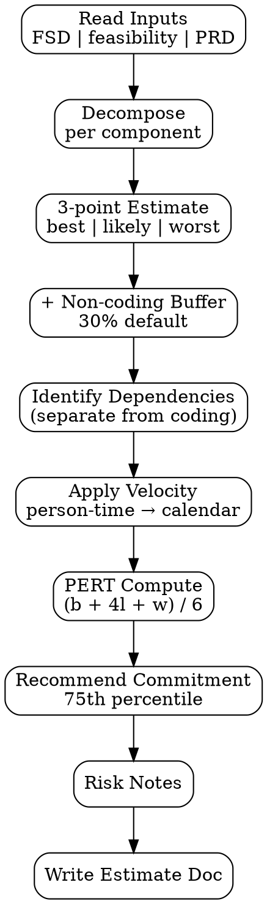

# Effort Estimator

Estimate effort untuk fitur — output dalam **person-weeks atau story points dengan confidence interval**, broken down per component. Tujuan: estimasi yang **honest dan transparent**, bukan optimistic-unrealistic.

<HARD-GATE>
Setiap estimate WAJIB punya 3-point breakdown: best / likely / worst case (PERT-style).
Setiap component punya penjelasan rationale singkat — bukan angka tanpa sumber.
Estimate WAJIB account for non-coding effort: code review, testing, docs, debugging, deploy.
Velocity assumption WAJIB declared (e.g. "2 SWE @ 60% capacity = 1.2 person-weeks/calendar week").
Dependency wait time (vendor, external team) di-track separate dari coding time.
Estimate panjang > 8 weeks WAJIB di-split: bikin milestone breakdown, jangan single big-bang.
</HARD-GATE>

## When to use

- Sprint planning — break feature jadi tasks dengan estimate
- Roadmap commitment — kasih timeline ke stakeholder/CEO
- Capacity check — "bisa gak kita kerjakan X di Q3?"
- Bid/proposal — kalau client work, estimate untuk pricing
- Budget review — feature cost too high, look for trim

## When NOT to use

- 1-day bug fix — overkill, cukup quick assessment
- Ill-defined scope — output garbage; minta PRD/FSD selesai dulu
- Pure research / spike — gunakan time-box, bukan effort estimate

## Output

`outputs/YYYY-MM-DD-effort-{feature}.md` — single document dengan:

1. **Summary** — total range (best/likely/worst) + recommended commitment
2. **Component breakdown** — per FE/BE/QA/Design/Docs/Deploy
3. **Velocity assumption** — team available + capacity
4. **Dependency wait time** — separate dari coding
5. **Risk buffer** — hidden cost (debugging, scope creep)
6. **Calendar estimate** — person-weeks → calendar weeks via velocity

## Checklist

You MUST create a TodoWrite task for each item and complete them in order:

1. **Read Inputs** — FSD complexity scores OR feasibility brief OR PRD user stories
2. **Decompose** — break feature jadi components (FE/BE/QA/Design/Docs/Deploy/Migration)
3. **Estimate Per Component** — 3-point: best, likely, worst (in person-days or story points)
4. **Add Non-coding Buffer** — code review, testing, debugging, retrospective tax (default 30%)
5. **Identify Dependencies** — external waits (vendor, ops, security review) — track separately
6. **Apply Velocity** — convert person-time → calendar time using team capacity
7. **Compute PERT** — `(best + 4×likely + worst) / 6`
8. **Recommend Commitment** — pick conservative point (75th percentile of distribution)
9. **Write Risk Notes** — what could blow estimate (scope creep, key person unavailable)
10. **Output Document** — `outputs/YYYY-MM-DD-effort-{feature}.md`

## Process Flow



## Detailed Instructions

### Step 1 — Read Inputs

Best sequence:
1. **FSD complexity scores** (most accurate) — `fsd-generator` §4 atau §6 has per-component low/medium/high
2. **Feasibility brief** complexity assessment table
3. **PRD user stories** (least accurate, often optimistic)

Kalau cuma punya PRD, flag estimate confidence rendah.

### Step 2 — Decompose

Component breakdown standard:

| Component | Includes |
|---|---|
| **Frontend (FE)** | Component implementation, state mgmt, styling, responsive, a11y |
| **Backend (BE)** | API endpoints, models, business logic, migrations |
| **Database** | Schema design, migration, index, backup config |
| **QA** | Test plan, test cases, manual + automated testing, regression |
| **Design** | Mockup, prototype, design review (if ongoing during build) |
| **Documentation** | API docs, user guide draft, runbook |
| **DevOps / Deploy** | CI/CD config, monitoring, alerting, feature flag, rollout |
| **Migration / Data** | Backfill scripts, ETL, data validation (if applicable) |
| **Integration** | 3rd-party API, webhook, OAuth setup |

Kalau ada Odoo module, replace FE/BE dengan: model, view XML, security, workflow.

### Step 3 — Estimate Per Component (3-point)

Per component, estimate:

| Component | Best | Likely | Worst | Unit |
|---|---|---|---|---|
| FE — Discount section | 2 | 3 | 5 | person-days |
| BE — API endpoints | 3 | 5 | 8 | person-days |
| DB — Schema + migration | 0.5 | 1 | 2 | person-days |
| QA — Test cases + execution | 2 | 4 | 6 | person-days |
| DevOps — Feature flag + monitoring | 1 | 1.5 | 3 | person-days |
| Docs — API docs + user guide | 1 | 2 | 3 | person-days |

**Best case** = everything goes smoothly, no surprises (rare reality)
**Likely case** = realistic given team experience, complexity, known unknowns
**Worst case** = significant rework, scope creep, debugging, or person on PTO

Anchor estimates ke historical similar work kalau ada.

### Step 4 — Add Non-coding Buffer

Default tax untuk hal yang sering lupa di-estimate:

| Activity | Tax % of coding time |
|---|---|
| Code review back-and-forth | 10% |
| Pre-merge integration debugging | 10% |
| Standups, planning, ceremony | 10% |

Total default: **30% on top of coding estimates**.

Adjust kalau:
- Team baru / cross-team coordination → 40-50%
- Solo SWE familiar codebase → 20%
- High process maturity (good CI/CD) → 25%

### Step 5 — Identify Dependencies

External waits — TIDAK include di coding total karena tidak burn team capacity:

| Dependency | Wait time | Critical path? |
|---|---|---|
| Vendor X webhook setup | 1 week | yes (BE blocked) |
| Security team auth review | 2-3 days | yes |
| Design system update | 5 days | no (parallel work) |

Critical path dependencies extend calendar timeline meskipun gak burn person-weeks.

### Step 6 — Apply Velocity

Convert person-time → calendar time:

```
team_capacity = N_swe × focus_factor
focus_factor = 0.6 (default — accounts for meetings, interruptions, support)
              0.7 (focused team, minimal interrupts)
              0.5 (interrupt-heavy team)

calendar_weeks = total_person_weeks / team_capacity
```

Example:
- 2 SWE @ 0.6 focus = 1.2 person-weeks/calendar week
- Total estimate (likely): 12 person-days = 2.4 person-weeks
- Calendar: 2.4 / 1.2 = **2 calendar weeks**

### Step 7 — Compute PERT

PERT = `(best + 4 × likely + worst) / 6`

Provides "expected value" considering uncertainty. Always between best and worst, weighted toward likely.

```
Component                Best  Likely  Worst  PERT
FE                       2     3       5      3.17
BE                       3     5       8      5.17
DB                       0.5   1       2      1.08
QA                       2     4       6      4.00
DevOps                   1     1.5     3      1.67
Docs                     1     2       3      2.00
─────────────────────────────────────────────────
Subtotal (person-days)   9.5   16.5    27     17.09
+ 30% non-coding buffer  12.4  21.5    35.1   22.21
TOTAL                    12.4  21.5    35.1   22.21 person-days
                                              ≈ 4.5 person-weeks
```

### Step 8 — Recommend Commitment

PERT mean is the expected value, but commitments should use 75th percentile (more conservative — accounts for upside risk).

```
std_dev = (worst - best) / 6
percentile_75 = mean + 0.674 × std_dev
```

Example: mean=22.2, worst=35.1, best=12.4 → std_dev = 3.78 → P75 = 22.2 + 2.55 = **24.8 person-days ≈ 5 person-weeks**

Commit to stakeholder: **5 weeks** (with 2 SWE @ 0.6 focus = 4.2 calendar weeks)

### Step 9 — Risk Notes

List concrete risks yang bisa blow estimate:

- **Scope creep**: PRD lock soft — likely to absorb 1-2 add-ons during build (+20%)
- **Key person**: Backend implementation depends on Senior X yang punya 2 PTO weeks during sprint (calendar +1 week if not back-up planned)
- **Vendor uncertainty**: Payment vendor SLA tidak fixed — could add 1 week wait
- **Performance tuning**: Kalau benchmark fail di QA, +3-5 days optimization

### Step 10 — Output Document

```bash
./scripts/estimate.sh --feature "discount-line" --fsd-link "outputs/2026-04-25-fsd-discount-line.md" \
  --team-size 2 --focus-factor 0.6
```

## Output Format

See `references/format.md` for canonical schema.

## Inter-Agent Handoff

| Direction | Trigger | Skill / Tool |
|---|---|---|
| **EM** ← **EM** | After FSD complete | This skill reads complexity scores from FSD |
| **EM** → **PM** | Roadmap commitment | PM uses estimate untuk timeline communication |
| **EM** → **SWE** | Sprint planning | SWE uses component breakdown sebagai task list |
| **EM** → **Biz Analyst** | Build vs buy decision | Biz Analyst compares effort × hourly rate vs vendor cost |

## Anti-Pattern

- ❌ Single number estimate ("12 days") — gak honest, risk hidden
- ❌ Best case di-commit ke stakeholder — guaranteed to miss
- ❌ Skip non-coding buffer — code review/testing always under-estimated
- ❌ Total tanpa breakdown — gak actionable untuk planning
- ❌ Velocity assumption omitted — calendar time gak bisa di-derive
- ❌ Dependency wait time mixed dengan coding total — overstate burden, understate risk
- ❌ Estimate > 8 weeks single block — split jadi milestones (2-3 weeks each)
- ❌ Estimate dari PRD only (no FSD) tanpa low-confidence flag
