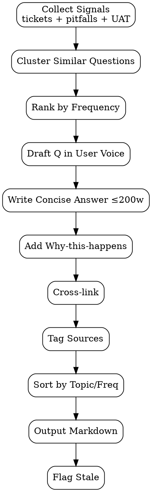

# FAQ Generator

Generate **clustered FAQ entries** dari support tickets / user guide pitfalls / UAT feedback. Tujuan: deflect repeat support tickets, surface answers searchable.

<HARD-GATE>
Setiap FAQ entry WAJIB cite source (ticket ID / pitfall ref / UAT feedback) — provenance.
Question WAJIB user-language (verbatim atau paraphrased close), JANGAN re-write ke marketing tone.
Answer WAJIB ≤200 words — kalau lebih, link ke deep doc, jangan dump.
Cluster duplicate questions WAJIB single entry — gak boleh 5 variant Q/A untuk 1 issue.
JANGAN generate FAQ dari FSD assumption — harus ada signal real (ticket / observation).
JANGAN paraphrase ke "When does the feature work?" generic — keep specific.
Update cadence WAJIB tracked — entry > 90 days stale flagged for review.
Cross-link ke user guide / troubleshooting WAJIB di setiap entry.
</HARD-GATE>

## When to use

- Post-release: 2 weeks after launch, harvest tickets
- Monthly support review — top-N repeat tickets
- User guide pitfalls section grows → promote some to FAQ
- UAT feedback batch processing

## When NOT to use

- Speculative FAQ (no real questions yet) — wait for signal
- Sales/marketing FAQ — separate (PM/marketing domain)
- Deep technical Q/A — that's developer doc, not user FAQ

## Required Inputs

- **Source signals** — list of tickets, pitfalls, UAT feedback paths
- **Topic scope** — feature/module the FAQ covers
- **Optional:** existing FAQ to extend (avoid duplication)

## Output

`outputs/{date}-faq-{topic}.md` — Markdown publishable to KB.

## FAQ Entry Template

```markdown
## Q: {Question in user's voice, ≤120 chars}

**A:** {Concise answer ≤200 words. Numbered steps if procedural.}

**Why this happens:** {Optional 1-sentence root cause for context.}

**See also:** [Deep doc link], [Related FAQ link]

---
**Source:** ticket-#1142, ticket-#1187 (cluster of 4 similar)
**Last reviewed:** 2026-05-02
**Tags:** discount, sale-order, validation
```

## Sample FAQ Page

```markdown
# Sale Discount FAQ

> Last updated: 2026-05-02 | Sources: 47 tickets clustered into 9 questions

## Q: Why can't I add a discount to a confirmed order?

**A:** Confirmed orders are locked to preserve audit trail. To apply a discount:
1. Cancel the order (Action → Cancel)
2. Re-draft it (Action → Set to Quotation)
3. Add the discount line
4. Confirm again

**Why this happens:** Once confirmed, sale orders are committed accounting documents per company policy.

**See also:** [User guide: Cancel order](./cancel-order.md), [Troubleshooting: confirmed-order errors](./troubleshooting-discount.md#confirmed)

---
**Source:** ticket-#1142, #1187, #1203, #1248 (4-ticket cluster)
**Last reviewed:** 2026-05-02

---

## Q: Discount more than 100% — is that allowed?

**A:** No. Maximum discount is 100% (giving the item away free). For "buy one get one free" or higher promotions, use a fixed-amount discount line instead, or split into multiple line items.

**See also:** [Pricing strategy guide](./pricing-strategy.md)

---
**Source:** ticket-#1156, UAT-feedback-2026-04-22
**Last reviewed:** 2026-05-02

---
```

## Checklist

You MUST create a TodoWrite task for each item and complete them in order:

1. **Collect Signals** — tickets + pitfalls + UAT feedback for topic scope
2. **Cluster Similar Questions** — group by intent/root cause
3. **Rank by Frequency** — top-N first (impact ordering)
4. **Draft Q in User Voice** — verbatim or paraphrased close
5. **Write Concise Answer** — ≤200 words, numbered if procedural
6. **Add Why-this-happens** — 1-sentence root cause (optional)
7. **Cross-link** — to user guide / troubleshooting / related FAQ
8. **Tag Sources** — ticket IDs, observation refs
9. **Sort by Topic / Frequency** — most-asked first
10. **Output Markdown** — `outputs/{date}-faq-{slug}.md`
11. **Track Stale** — flag entries unreviewed > 90 days

## Process Flow



## Anti-Pattern

- ❌ Speculative FAQ ("users might ask...") — no real signal
- ❌ Verbose answer dumping deep doc into FAQ — defeats purpose
- ❌ Fragmented duplicate entries (5 variants for 1 issue) — bloat
- ❌ Marketing-tone rewrite ("our amazing feature...") — user wants answer
- ❌ Skip source attribution — no provenance, hard to update
- ❌ FAQ without cross-link — dead-end for deep questions
- ❌ Static FAQ never reviewed — stale signal
- ❌ Q without specificity ("How does it work?") — too generic

## Inter-Agent Handoff

| Direction | Trigger | Skill / Tool |
|---|---|---|
| **Doc** ← `user-guide-generator` | Pitfalls grow | promote to FAQ |
| **Doc** ← support tickets API | Repeat tickets | cluster + dispatch FAQ |
| **Doc** ← UAT feedback | UAT closed | mine for FAQ candidates |
| **Doc** → KB publishing | FAQ approved | ship |
| **Doc** → `manual-book` | Major release | include FAQ chapter |
