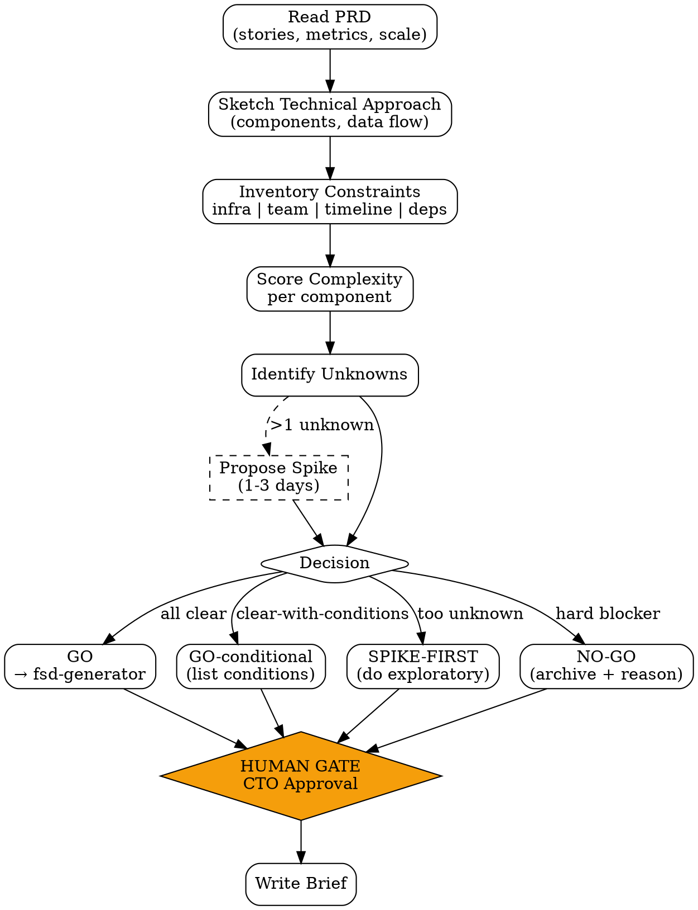

# Feasibility Brief

Brief teknis cepat (1-2 halaman) yang dijawab sebelum invest waktu di full FSD. Tujuan: **jangan menulis FSD yang ternyata tidak bisa dibangun.**

<HARD-GATE>
Brief WAJIB di-approve CTO sebelum fsd-generator dipanggil.
Conditional Yes (e.g. "feasible kalau X") harus list konkret, bukan "akan kita lihat nanti".
Setiap constraint WAJIB punya source: link ke incident, capacity report, vendor docs, atau team statement.
Unknown risks ≥ 2 = flag "needs-spike" — minta exploratory work 1-3 hari sebelum lock FSD.
Decision result HARUS satu dari: GO / GO-conditional / SPIKE-FIRST / NO-GO. Bukan "akan kita lihat".
</HARD-GATE>

## When to use

- PRD sudah locked + Value Score PROCEED — sebelum mulai FSD
- Stakeholder ide besar yang belum jelas teknisnya — "apakah ini bisa dibangun?"
- Feature touches infra/integration kompleks (payments, AI, real-time, audit-heavy)
- Migration / replatform — sebelum commit timeline
- Re-evaluation setelah team capacity / vendor change

## When NOT to use

- Iteration kecil di area existing yang sudah punya pattern jelas
- Pure UX change tanpa backend impact
- Bug fix — gunakan `bug-report` flow

## Output

Single document `feasibility-brief-{feature}.md`, max 2 halaman, dengan 7 section:

1. **Decision** (top of doc) — GO / GO-conditional / SPIKE-FIRST / NO-GO
2. **Context** — feature ringkas + link ke PRD
3. **Technical Approach** — 1 paragraf high-level: core components, integration points
4. **Constraints**: infra, team expertise, timeline, third-party dependency
5. **Complexity Assessment** — per component (low/medium/high) + rationale
6. **Unknown Risks** — list of unknowns + proposed spike untuk resolve
7. **CTO Sign-off**

## Checklist

You MUST create a TodoWrite task for each item and complete them in order:

1. **Read PRD** — extract user stories, success metrics, scale assumptions
2. **Sketch Technical Approach** — core components, data flow, integration touchpoints
3. **Inventory Constraints** — 4 dimensions (infra/team/timeline/dependency), cite source per item
4. **Score Complexity** — per major component low/medium/high
5. **Identify Unknowns** — list yang gak yakin, propose spike kalau >1
6. **Determine Decision** — GO / conditional / spike / no-go
7. **[HUMAN GATE — CTO]** — kirim brief, tunggu approval
8. **Output Document** — `outputs/YYYY-MM-DD-feasibility-{feature}.md`

## Process Flow



## Detailed Instructions

### Step 1 — Read PRD

Capture langsung dari PRD:
- **Core user stories** (top 3-5)
- **Success metrics** (target + threshold)
- **Scale assumptions**: peak users, request volume, data volume, growth projection
- **Mandatory integrations**: existing system yang harus connect

Kalau PRD belum punya scale numbers, **stop & ask** — tanpa angka, feasibility tidak bisa dijawab.

### Step 2 — Sketch Technical Approach

1 paragraf, gak detail. Tujuan: prove kita punya gambaran.

Cover:
- Frontend approach (existing component? new framework?)
- Backend approach (existing service extension? new microservice? Odoo module?)
- Data layer (new tables? schema changes? denormalization?)
- Integration points (auth? payments? notifications? external APIs?)
- Real-time / async needs (websocket? queue? cron?)

### Step 3 — Inventory Constraints

4 dimensions, table format. Source per row.

| Dimension | Constraint | Severity | Source |
|---|---|---|---|
| Infra | "Postgres single-instance, max 5k QPS" | high | infra capacity report 2026-Q2 |
| Team | "No internal Odoo expertise — first module" | medium | team skill matrix |
| Timeline | "Must ship before peak season Sept" | high | CEO commitment, board deck |
| Dependency | "Payment vendor X migration ongoing" | high | vendor email 2026-04-15 |

**Severity rule**:
- **high** = blocks GO outright atau forces conditional
- **medium** = makes effort estimate ±50%
- **low** = note di FSD, manageable

### Step 4 — Score Complexity

Per major component (max 6 components di list):

| Component | Complexity | Rationale |
|---|---|---|
| Checkout API extension | medium | Existing endpoint, extend with new field |
| Payment webhook handler | high | New integration, retry/idempotency required |
| Mobile UI changes | low | Component library covers it |

Complexity drives effort estimate downstream — `effort-estimator` reads this output.

### Step 5 — Identify Unknowns

**Unknown** = pertanyaan teknis yang jawabannya menentukan approach.

Contoh:
- "Apakah payment vendor X support webhook idempotency?"
- "Berapa request rate sustained kalau push notification dikirim sekali ke 50k users?"
- "Apakah Odoo 17 compute field bisa async?"

**Rule**: kalau >1 unknown affects core path, propose **SPIKE** sebelum lock FSD:

```
SPIKE: 2 days for [name]
- Goal: answer "[question]"
- Method: [prototype | doc reading | vendor call | benchmark]
- Output: short memo + decision
- Owner: [SWE name]
```

### Step 6 — Determine Decision

| Decision | When |
|---|---|
| **GO** | All constraints manageable, no critical unknowns, complexity all low/medium |
| **GO-conditional** | Feasible IF [list 1-3 explicit conditions met] |
| **SPIKE-FIRST** | >1 unknown affects core path; do 1-3 day spike, re-run brief |
| **NO-GO** | Hard blocker (regulatory, no team capacity Q-current, vendor refusal) — archive with reason |

### Step 7 — [HUMAN GATE — CTO]

```bash
./scripts/notify.sh "Feasibility brief [feature]: GO-conditional. Need CTO review by [date]."
```

CTO sign-off mandatory sebelum FSD work. Brief tertolak → revisit constraints, mungkin pivot scope.

### Step 8 — Output Document

```bash
./scripts/brief.sh --feature "checkout-mobile-redesign" --prd-link "outputs/2026-04-20-prd-checkout-mobile-redesign.md"
```

## Output Format

See `references/format.md` for canonical schema.

## Inter-Agent Handoff

| Direction | Trigger | Skill / Tool |
|---|---|---|
| **EM** → **EM** (next step) | Decision = GO / conditional | `fsd-generator` |
| **EM** → **SWE** | Decision = SPIKE-FIRST | task tag `spike` + memo template |
| **EM** → **PM** | Decision = NO-GO | `re-discovery-trigger` (back to PM with reason) |
| **EM** → **EM** (effort) | After CTO approval | `effort-estimator` (uses complexity scores) |

## Anti-Pattern

- ❌ "Feasibility: yes" tanpa constraint inventory — superficial, will surprise later
- ❌ Conditional decision tanpa list explicit conditions — meaningless gate
- ❌ Skip spike untuk multi-unknown — FSD will be wrong, expensive rework
- ❌ Constraint tanpa source — belum diverifikasi, belum trustable
- ❌ "Complexity: medium" untuk seluruh fitur — break down per component
- ❌ NO-GO tanpa specific blocker yang citable — kemungkinan defeatist bukan analisa
- ❌ Brief panjang > 3 halaman — kalau perlu lebih, langsung FSD aja
