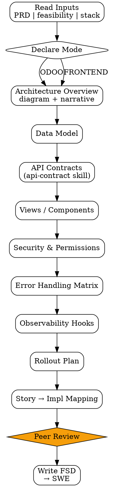
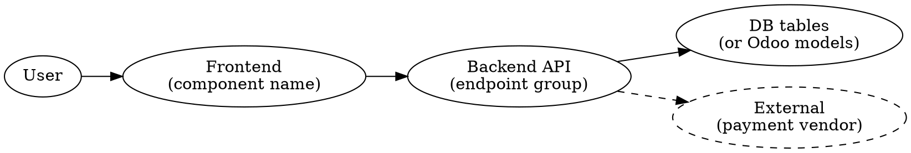

# FSD Generator

Functional Spec Document — blueprint detail yang diberikan ke SWE untuk implementasi. Bridge dari PRD (what + why) ke code (how).

<HARD-GATE>
FSD WAJIB di-build setelah feasibility-brief approved CTO — bukan sebelum.
Setiap section (data model / API / view / security) WAJIB filled atau explicit "N/A: [reason]".
API contracts WAJIB pakai api-contract skill output, bukan free-form prose.
Setiap user story dari PRD WAJIB punya implementasi mapping di FSD (story → component/endpoint).
Mode (ODOO vs FRONTEND) WAJIB declared di header — agent harus pilih sesuai env target.
Hand-off ke SWE HANYA setelah peer review (1+ EM atau senior SWE) dan stakeholder PRD owner sign-off.
</HARD-GATE>

## When to use

- After `feasibility-brief` approved (Decision: GO atau GO-conditional)
- Stakeholder minta implementation plan detail
- SWE bilang "saya butuh spec lebih detail untuk start"
- Re-architect existing — gunakan FSD untuk capture target state

## When NOT to use

- Discovery / problem framing — itu PM (PRD) territory
- 1-line bug fix — overkill
- Quick experiment / spike — gunakan spike memo (lighter format)

## Two Modes

Pilih SATU mode di header:

### ODOO mode

Untuk fitur yang ship sebagai Odoo module (Odoo 17/18 backend). Sections:
- Module manifest (`__manifest__.py`)
- Data model (`models/*.py`) — fields, relations, computed, constraints
- View XML — form / tree / kanban / search / wizard
- Security — `ir.model.access.csv` + record rules
- Workflow / state machine (kalau ada)
- Server actions / scheduled actions
- Wizards (transient models)

### FRONTEND mode

Untuk fitur yang ship sebagai frontend (React/Vue/etc) dengan backend API. Sections:
- Component tree (`<Page>` → `<Section>` → leaves)
- State shape (top-level store + per-component local state)
- Routing
- Data fetching strategy (server components, client fetch, cache invalidation)
- Form handling + validation
- Error boundaries + loading states

Both modes share:
- Architecture overview diagram (dot)
- API contracts (use `api-contract` skill output)
- Security & permissions
- Error handling matrix
- Observability hooks (events, metrics)
- Rollout plan (feature flag, migration, deprecation)

## Checklist

You MUST create a TodoWrite task for each item and complete them in order:

1. **Read Inputs** — PRD + feasibility-brief + tech-stack-advisor decision
2. **Declare Mode** — ODOO atau FRONTEND di header (read context from stack)
3. **Write Architecture Overview** — high-level diagram + 1-paragraph narrative
4. **Define Data Model** — Odoo models OR DB tables OR state shape
5. **Generate API Contracts** — call `api-contract` skill, embed output
6. **Define Views / Components** — Odoo XML OR component tree
7. **Define Security & Permissions** — access rules + auth requirements
8. **Define Error Handling** — error matrix (where errors come from, how handled)
9. **Define Observability Hooks** — what events, what metrics, where logged
10. **Write Rollout Plan** — feature flag, migration, monitoring, rollback
11. **Story → Implementation Mapping** — table mapping each PRD user story to FSD sections
12. **[HUMAN GATE — Peer Review]** — minimum 1 EM atau senior SWE review
13. **Output Document** — `outputs/YYYY-MM-DD-fsd-{feature}.md`

## Process Flow



## Detailed Instructions

### Step 1 — Read Inputs

Required artifacts:
- **PRD** — extract user stories (top 5-10), success metrics, scale assumptions
- **Feasibility brief** — decision (must be GO/conditional), constraints, complexity scores
- **Tech stack** — kalau ada `tech-stack-advisor` ADR, baca pilihan stack
- **Existing code references** — kalau extend existing, link ke module/page yang relevant

Kalau salah satu missing → stop & request before proceeding.

### Step 2 — Declare Mode

Header FSD:

```yaml
mode: odoo            # or "frontend"
target-version: 17    # or "react-18" / "vue-3" / etc
ship-as: module       # or "feature" / "page" / "component"
```

Mode picked dari context:
- Project Odoo? → ODOO
- Standalone web app? → FRONTEND
- Hybrid (Odoo backend + standalone frontend)? → split into 2 FSDs

### Step 3 — Architecture Overview

Dot diagram + 1-paragraph narrative.



Narrative cover: data flow direction, sync vs async, key transformations.

### Step 4 — Define Data Model

#### ODOO mode

Per model:
```yaml
model: sale.order.discount.line
fields:
  - name: type
    type: selection
    selection: [percent, fixed]
    required: true
  - name: value
    type: float
    digits: [16, 2]
  - name: order_id
    type: many2one
    comodel: sale.order
    ondelete: cascade
constraints:
  - type: SQL
    rule: "value > 0"
    message: "Discount value must be positive"
computed:
  - name: amount
    depends: [value, type, order_id.amount_total]
    method: _compute_amount
```

#### FRONTEND mode

State shape (top-level Zustand/Redux/etc):
```typescript
interface DiscountStore {
  currentDiscount: { type: 'percent' | 'fixed'; value: number } | null
  setDiscount: (d: Discount) => void
  clearDiscount: () => void
}
```

DB tables (kalau backend juga digenerate):
```sql
CREATE TABLE discount_line (
  id          BIGSERIAL PRIMARY KEY,
  order_id    BIGINT REFERENCES "order"(id) ON DELETE CASCADE,
  type        TEXT CHECK (type IN ('percent', 'fixed')),
  value       NUMERIC(16,2) CHECK (value > 0),
  created_at  TIMESTAMPTZ NOT NULL DEFAULT now()
);
CREATE INDEX idx_discount_line_order ON discount_line(order_id);
```

### Step 5 — Generate API Contracts

Delegate ke `api-contract` skill:
```bash
./skills/api-contract/scripts/contract.sh --feature "discount-line" --style "openapi"
```

Embed output di FSD. Don't duplicate — reference link.

### Step 6 — Define Views / Components

#### ODOO mode

Per view (form/tree/kanban):
```xml
<record id="view_sale_order_form_inherit_discount" model="ir.ui.view">
  <field name="name">sale.order.form.inherit.discount</field>
  <field name="model">sale.order</field>
  <field name="inherit_id" ref="sale.view_order_form"/>
  <field name="arch" type="xml">
    <xpath expr="//field[@name='order_line']" position="after">
      <field name="discount_line_ids">
        <tree editable="bottom">
          <field name="type"/>
          <field name="value"/>
          <field name="amount" sum="Total Discount"/>
        </tree>
      </field>
    </xpath>
  </field>
</record>
```

#### FRONTEND mode

Component tree:
```
<CheckoutPage>
  ├── <OrderSummary />
  ├── <DiscountSection>            // new
  │     ├── <DiscountTypeToggle />
  │     ├── <DiscountValueInput />
  │     └── <ApplyButton />
  ├── <PaymentMethods />
  └── <ConfirmButton />
```

Per new component, document props/state:
```typescript
function DiscountSection() {
  const discount = useDiscountStore(s => s.currentDiscount)
  const setDiscount = useDiscountStore(s => s.setDiscount)
  // ...
}
```

### Step 7 — Define Security & Permissions

#### ODOO mode

`ir.model.access.csv`:
```csv
id,name,model_id:id,group_id:id,perm_read,perm_write,perm_create,perm_unlink
access_discount_line_user,discount.line.user,model_sale_order_discount_line,sales_team.group_sale_salesman,1,1,1,0
access_discount_line_manager,discount.line.manager,model_sale_order_discount_line,sales_team.group_sale_manager,1,1,1,1
```

Record rules kalau ada multi-tenant / company-scoped:
```xml
<record id="discount_line_company_rule" model="ir.rule">
  ...
</record>
```

#### FRONTEND mode

- Auth requirement: signed-in / specific role
- API endpoint protection: which JWT scopes required
- Sensitive data masking: PII fields, redaction rules

### Step 8 — Error Handling Matrix

| Source | Error type | User-facing message | Recovery |
|---|---|---|---|
| API timeout (>5s) | `TIMEOUT` | "Connection slow, retrying…" | Auto-retry 2x w/ backoff |
| Validation fail | `VALIDATION` | Field-specific inline message | Block submit, focus first error |
| 403 from auth | `FORBIDDEN` | "Anda tidak punya akses" | Redirect ke login |
| 500 server | `SERVER` | "Sistem sedang ada gangguan" | Show retry button + report link |

### Step 9 — Observability Hooks

| Event | When | Where logged | Use case |
|---|---|---|---|
| `discount_applied` | User clicks Apply | Mixpanel + internal log | Adoption tracking |
| `discount_failed` | API error | Datadog | Error rate monitoring |
| `discount_amount_distribution` | On apply success | Mixpanel custom | Distribution analysis |

Provide concrete event schema (properties).

### Step 10 — Rollout Plan

| Phase | When | What | Rollback if |
|---|---|---|---|
| Internal | Week 1 | Feature flag = team only | Any error in 24h |
| Beta | Week 2 | Flag = 10% returning users | error rate >1% |
| GA | Week 3-4 | Flag = 100% gradual | conversion drop >5% baseline |
| Cleanup | Week 6 | Remove flag | — |

Migration plan kalau ada DB schema change (use `data-migration` skill kalau Odoo).

### Step 11 — Story → Implementation Mapping

WAJIB exhaustive — setiap user story dari PRD muncul di sini.

| User Story (from PRD) | FSD Section(s) | Notes |
|---|---|---|
| "As a sales rep, saya bisa apply discount fixed/percent" | §4 (data model), §6 (form view), §5 (API) | — |
| "Sistem mencegah discount > order total" | §4 (constraint), §8 (error: VALIDATION) | — |
| "Manager bisa approve discount > 20%" | §7 (security: manager group), §6 (button visibility) | New approval flow |

Kalau ada user story tanpa mapping → FSD incomplete, stop & fix.

### Step 12 — [HUMAN GATE — Peer Review]

```bash
./scripts/notify.sh "FSD [feature] siap peer review. Reviewer: @[em-name]. Target review: [date]."
```

Minimum 1 review. Reviewer mark "approved" + comments → ready untuk SWE.

### Step 13 — Output Document

```bash
./scripts/fsd.sh --feature "discount-line" --mode odoo \
  --prd-link "outputs/2026-04-20-prd-discount-line.md" \
  --feasibility-link "outputs/2026-04-22-feasibility-discount-line.md"
```

## Output Format

See `references/format.md` for canonical schema. ODOO/FRONTEND mode templates di `references/odoo-template.md` dan `references/frontend-template.md`.

## Inter-Agent Handoff

| Direction | Trigger | Skill / Tool |
|---|---|---|
| **EM** → **EM** | Need API detail | `api-contract` skill (embed output) |
| **EM** → **EM** | Effort estimation | `effort-estimator` skill (reads complexity from FSD §4) |
| **EM** → **SWE** | After peer review | Hand off task with FSD link + tag `ready-to-build` |
| **EM** → **QA** | Parallel to SWE | QA reads FSD untuk plan test cases |
| **EM** → **Doc Writer** | Mid-build | Doc reads FSD untuk early user-guide drafting |
| **SWE** → **EM** | Implementation question | Update FSD with clarification, change log entry |

## Anti-Pattern

- ❌ FSD without explicit mode header — SWE bingung target stack
- ❌ Free-form prose untuk API contracts — gunakan `api-contract` skill output
- ❌ Skip peer review karena "kepepet" — bug expensive di-catch belakangan
- ❌ Story → mapping incomplete — pasti ada user story yang lupa di-implementasi
- ❌ Rollout plan tanpa rollback condition — gak ada exit kalau bermasalah
- ❌ Error handling cuma "show error" tanpa user-facing message — UX failure
- ❌ Observability hooks generic ("log everything") — gak useful untuk PA monitoring
- ❌ FSD jadi PRD revisi — kalau ada perubahan scope, update PRD dulu, baru FSD
