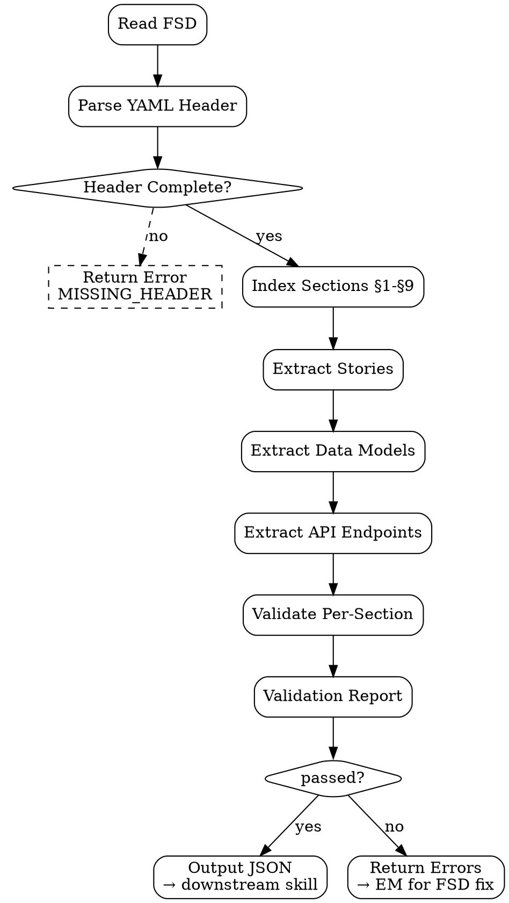

# FSD Reader

**Parser** untuk FSD — turn structured Markdown jadi JSON yang downstream skills consume. Plus **validator**: detect missing sections, malformed tables, misalignment with PRD. Tujuan: prevent downstream skill running on broken/incomplete spec.

<HARD-GATE>
FSD WAJIB punya YAML header dengan `mode` + `target-version` + `ship-as` — kalau missing, return error to EM.
Setiap "Story → Implementation Mapping" entry WAJIB cite minimum 1 FSD section — orphan stories = incomplete spec.
API endpoints WAJIB pakai `api-contract` skill output (atau embedded OpenAPI block) — free-form prose = reject.
Data model section WAJIB punya field types yang valid per stack (Odoo: fields.X, TypeScript: primitives).
Acceptance criteria WAJIB testable per user story — vague "good UX" = reject.
JANGAN downstream dispatch (code-generator/test-case-doc/etc.) kalau validation fails — return errors first.
</HARD-GATE>

## When to use

- `code-generator` reads FSD untuk plan implementation
- `test-case-doc` (QA) extracts user stories untuk derive test scenarios
- `user-guide-generator` (Doc) reads features untuk write user-facing docs
- EM self-check sebelum publishing FSD as `approved`
- Pipeline pre-flight: validate FSD before any role agent picks up

## When NOT to use

- Generate FSD content — itu `fsd-generator` (EM)
- Free-form Markdown parsing — gunakan generic Markdown libs
- Validate PRD — itu separate (PRD has different schema)

## Parsed Output Shape

```json
{
  "meta": {
    "feature": "discount-line",
    "date": "2026-04-25",
    "status": "approved",
    "mode": "odoo",
    "targetVersion": "odoo-17",
    "shipAs": "module",
    "prdLink": "outputs/2026-04-20-prd-discount-line.md",
    "feasibilityLink": "outputs/2026-04-22-feasibility-discount-line.md"
  },
  "sections": {
    "1_architecture": { "lineRange": [22, 48], "rendered": "...", "hasDot": true },
    "2_data_model": { "lineRange": [49, 95], "models": [...] },
    "3_api_contracts": { "lineRange": [96, 130], "endpointsCount": 5, "openapiEmbedded": true },
    "4_views": { "lineRange": [131, 180], "viewsCount": 3 },
    "5_security": { "lineRange": [181, 210], "accessRulesCount": 4 },
    "6_error_handling": { "lineRange": [211, 240], "errorsCount": 6 },
    "7_observability": { "lineRange": [241, 265], "eventsCount": 4 },
    "8_rollout": { "lineRange": [266, 300], "phases": [...] },
    "9_story_mapping": { "lineRange": [301, 340], "stories": [...] }
  },
  "stories": [
    {
      "id": "S1",
      "text": "As a sales rep, saya bisa apply discount...",
      "fsdSections": ["§2", "§4", "§5"],
      "acceptanceCriteria": [...]
    }
  ],
  "dataModels": [
    {
      "name": "sale.order.discount.line",
      "fields": [
        { "name": "type", "type": "selection", "required": true, "constraints": [...] }
      ]
    }
  ],
  "apiEndpoints": [
    { "method": "POST", "path": "/v1/discounts", "auth": "bearerAuth", "idempotent": true }
  ],
  "validation": {
    "passed": true,
    "errors": [],
    "warnings": []
  }
}
```

## Validation Rules

### Hard errors (block downstream dispatch)

| Rule | Error code |
|---|---|
| Missing YAML header | `MISSING_HEADER` |
| Missing `mode` field | `MISSING_MODE` |
| Missing `target-version` field | `MISSING_TARGET_VERSION` |
| Status not in `approved` / `peer-reviewed` | `STATUS_NOT_APPROVED` |
| Missing required section (any of §1-§9) | `MISSING_SECTION` |
| Story → Implementation Mapping table absent | `MISSING_STORY_MAPPING` |
| Story without FSD § citation | `ORPHAN_STORY` |
| API endpoint defined free-form (no OpenAPI block / api-contract link) | `API_FREEFORM` |

### Warnings (allow but flag)

| Rule | Warning code |
|---|---|
| `feasibility-link` missing | `NO_FEASIBILITY_LINK` |
| `prd-link` missing | `NO_PRD_LINK` |
| Acceptance criteria vague (no measurable threshold) | `VAGUE_ACCEPTANCE` |
| Architecture diagram absent (no dot graph) | `NO_ARCH_DIAGRAM` |
| Rollout phases <3 (no progressive rollout) | `THIN_ROLLOUT` |
| Test plan section absent (FSD lacks QA bridge) | `NO_TEST_PLAN` |

## Checklist

You MUST create a TodoWrite task for each item and complete them in order:

1. **Read FSD File** — load + validate Markdown parses
2. **Parse YAML Header** — extract meta fields
3. **Validate Header Completeness** — hard-error if missing required
4. **Index Sections** — find §1-§9 boundaries (line ranges)
5. **Extract User Stories** — from §9 mapping table
6. **Extract Data Models** — from §2 (parse YAML/SQL/TypeScript blocks)
7. **Extract API Endpoints** — from §3 (parse OpenAPI or api-contract reference)
8. **Validate Per-Section** — apply validation rules
9. **Compile Validation Report** — errors + warnings list
10. **Output JSON** — feed to downstream skill, atau return errors

## Process Flow



## Detailed Instructions

### Step 1 — Read FSD

```bash
[ ! -f "$FSD" ] && echo "ERROR: FSD not found: $FSD" && exit 1
```

### Step 2-3 — Parse + Validate YAML Header

Header format (strict):

```yaml
mode: odoo                # required: odoo | frontend | backend | fullstack
target-version: odoo-17   # required: stack version
ship-as: module           # required: module | feature | service | page | component
```

Plus regular metadata:
- Date (line: `**Date:**`)
- Status (line: `**Status:**`)
- PRD link (line: `**PRD:**`)
- Feasibility link (line: `**Feasibility Brief:**`)

Validate:
- mode in valid set
- target-version non-empty
- ship-as in valid set
- Status in `[draft, peer-reviewed, approved, deprecated]`

### Step 4 — Index Sections

Scan for headings `## §N`:

```python
import re
section_pattern = re.compile(r'^## §(\d+) (.+)$', re.MULTILINE)
sections = {}
for match in section_pattern.finditer(content):
    section_num = match.group(1)
    section_title = match.group(2)
    line_start = content[:match.start()].count('\n') + 1
    sections[f"{section_num}_{slugify(section_title)}"] = {
        "lineStart": line_start,
        "title": section_title,
    }
```

### Step 5 — Extract User Stories (from §9 Mapping)

Parse "Story → Implementation Mapping" table:

```markdown
| User Story (from PRD) | FSD Section(s) | Notes |
|---|---|---|
| "As a sales rep, can apply discount" | §2, §4, §5 | — |
```

Convert to:
```json
[
  {
    "id": "S1",
    "text": "As a sales rep, can apply discount",
    "fsdSections": ["§2", "§4", "§5"],
    "notes": ""
  }
]
```

### Step 6 — Extract Data Models

Per stack:
- **Odoo**: parse YAML blocks (`model:`, `fields:`)
- **Frontend (state)**: parse TypeScript interface blocks
- **Backend**: parse SQL CREATE TABLE atau ORM model definition

Extract:
- Model name
- Fields (name, type, required, constraints)
- Relations (foreign keys, many2one, many2many)
- Computed/derived fields

### Step 7 — Extract API Endpoints

Two valid formats:
1. **Linked**: section §3 mentions `api-contract` skill output path → parse that file
2. **Embedded**: OpenAPI YAML block inline atau Odoo XML-RPC method signatures

Per endpoint:
- Method + path (REST)  atau model + method (XML-RPC)
- Auth requirement
- Idempotent flag
- Request schema name
- Response schemas (per status code)

Free-form prose ("we'll have an endpoint to apply discount") = `API_FREEFORM` error.

### Step 8 — Validate Per-Section

Apply rules dari "Validation Rules" matrix above.

Vague acceptance detection (warning, not error):
- "good UX", "looks modern", "feels premium" → flag
- Missing threshold for measurable claim ("fast enough" without time number) → flag

### Step 9 — Compile Validation Report

```json
{
  "passed": false,
  "errors": [
    { "code": "API_FREEFORM", "section": "§3", "message": "API endpoints described as prose, no OpenAPI block found" },
    { "code": "ORPHAN_STORY", "story": "S3", "message": "Story 'manager approves' has no FSD section citation" }
  ],
  "warnings": [
    { "code": "VAGUE_ACCEPTANCE", "story": "S2", "message": "Acceptance 'fast checkout' has no time threshold" }
  ]
}
```

### Step 10 — Output JSON

```bash
./scripts/parse.sh --fsd outputs/2026-04-25-fsd-discount-line.md \
  --output outputs/parsed/discount-line.json
```

Or pipe directly:
```bash
./scripts/parse.sh --fsd ... | jq '.stories[].text'
```

## Output Format

JSON structure di "Parsed Output Shape" section above.

## Inter-Agent Handoff

| Direction | Trigger | Skill / Tool |
|---|---|---|
| **EM** ← self | Pre-publish FSD validation | EM runs reader on draft to catch errors |
| **SWE** ← `code-generator` | Implementation start | code-generator calls reader to plan files |
| **QA** ← `test-case-doc` | Test plan generation | test-case-doc reads stories + acceptance criteria |
| **Doc** ← `user-guide-generator` | Doc drafting | doc-writer reads features for user-facing content |
| **Reader** → **EM** | Validation fails | task tag `fsd-needs-fix` with error list |

## Anti-Pattern

- ❌ Skip validation, dispatch downstream regardless — broken FSD propagates
- ❌ "Validation passed but warnings" → ignore warnings — they accumulate
- ❌ Parse free-form prose for API contract — guess will mislead code-generator
- ❌ Cache parsed JSON without invalidation on FSD change — stale data
- ❌ Treat warning as error (over-strict) — block legitimate FSDs
- ❌ Treat error as warning (under-strict) — broken FSD ke production
