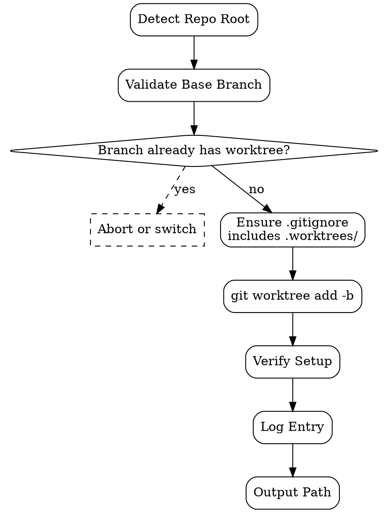

# Git Worktree

Manage **git worktrees** untuk parallel feature development. Each feature dapat isolated checkout, no stash dance, no branch-switch interruption. Setup: `<repo>/.worktrees/{branch}` co-located convention.

<HARD-GATE>
Worktree path WAJIB pakai pattern `<repo-root>/.worktrees/{branch-slug}` — co-located, predictable, gitignored.
`.worktrees/` WAJIB di-gitignore di repo (skill check + add automatically kalau missing).
JANGAN buat worktree dari branch yang sudah punya worktree existing — error out, atau switch ke yang ada.
JANGAN commit / push dari main checkout — semua feature work via worktree.
Cleanup WAJIB dilakukan setelah merge atau abandon — `.worktrees/` membengkak silent.
JANGAN delete worktree directory langsung dengan `rm -rf` — gunakan `git worktree remove` (handles ref cleanup).
Setiap worktree create WAJIB log ke `outputs/worktrees/log.jsonl` untuk audit trail.
</HARD-GATE>

## When to use

- Start fitur baru — orchestrator butuh isolated workspace
- Parallel features — 2+ feature concurrent tanpa branch-switch dance
- Hotfix tanpa interrupt feature work yang lagi WIP
- Code review — checkout PR branch tanpa lose context di main
- Test branch in isolation tanpa pollute main

## When NOT to use

- Quick read-only inspection — `git show {ref}` cukup
- Single-branch shop dengan team gak parallel — overhead worktree gak worth it
- Bare repos atau shallow clones — worktree gak supported atau buggy

## Worktree convention

```
my-repo/                       ← main checkout (default branch)
├── .git/                      ← single .git
├── .gitignore                 ← includes .worktrees/
├── .worktrees/                ← co-located worktrees (gitignored)
│   ├── discount-line/         ← feature/discount-line
│   ├── checkout-mobile/       ← feature/checkout-mobile
│   └── hotfix-payment/        ← hotfix/payment-422
└── ... (main checkout files)
```

Path naming:
- `feature/{slug}` → `.worktrees/{slug}` (drop "feature/" prefix to keep dir name short)
- `hotfix/{slug}` → `.worktrees/hotfix-{slug}` (keep "hotfix-" disambiguation)
- `release/{version}` → `.worktrees/release-{version}`

## Lifecycle

### Create

```bash
./scripts/wt.sh create --branch feature/discount-line --base main
```

Behind scenes:
```bash
cd <repo-root>
mkdir -p .worktrees
git worktree add .worktrees/discount-line -b feature/discount-line main
```

### List

```bash
./scripts/wt.sh list
```

Calls `git worktree list --porcelain` + formats:

```
 main (HEAD: a3f1b2c)
 feature/discount-line     .worktrees/discount-line     (HEAD: 7c2e9d4)
 feature/checkout-mobile   .worktrees/checkout-mobile   (HEAD: 9f4a1b8)
```

### Switch context

```bash
./scripts/wt.sh switch --branch feature/discount-line
# Prints: cd <repo>/.worktrees/discount-line
```

Agent eval prints `cd ...` sendiri (shell-dependent).

### Remove (after merge or abandon)

```bash
./scripts/wt.sh remove --branch feature/discount-line
```

Internally:
```bash
git worktree remove .worktrees/discount-line
git branch -d feature/discount-line  # only if merged; -D to force-delete unmerged
```

### Bulk cleanup (orphan worktrees)

```bash
./scripts/wt.sh prune
```

Calls `git worktree prune` — removes worktree refs di `.git/worktrees/` whose dirs sudah deleted manually.

## Checklist

You MUST create a TodoWrite task for each item and complete them in order:

### Create flow

1. **Detect Repo Root** — `git rev-parse --show-toplevel`
2. **Validate Base Branch** — `--base main` exists & up-to-date
3. **Check Existing Worktree** — abort kalau target branch sudah punya worktree
4. **Ensure `.gitignore`** — auto-add `.worktrees/` kalau missing (with comment)
5. **Create Worktree** — `git worktree add` dengan `-b` untuk new branch
6. **Verify Setup** — `cd` works, `git status` clean, branch correct
7. **Log Entry** — append ke `outputs/worktrees/log.jsonl`
8. **Output Path** — print absolute path untuk caller

### Remove flow

1. **Detect Repo Root**
2. **Locate Worktree** — find path via `git worktree list`
3. **Check Clean State** — uncommitted changes → require `--force` flag atau abort
4. **Remove Worktree** — `git worktree remove`
5. **Optional: Delete Branch** — `--delete-branch` flag, only if merged (or `--force-delete-branch` to force)
6. **Log Entry** — append remove action ke log
7. **Verify** — `git worktree list` confirms gone

## Process Flow (create)



## Detailed Instructions

### Step 1 — Detect Repo Root

```bash
REPO_ROOT=$(git rev-parse --show-toplevel 2>/dev/null) || {
  echo "ERROR: not in a git repo"; exit 1;
}
```

### Step 2 — Validate Base Branch

```bash
git fetch origin "$BASE_BRANCH" 2>/dev/null || true
git rev-parse --verify "$BASE_BRANCH" >/dev/null 2>&1 || {
  echo "ERROR: base branch not found: $BASE_BRANCH"; exit 1;
}
```

Optional: warn kalau base behind origin:
```bash
LOCAL=$(git rev-parse "$BASE_BRANCH")
REMOTE=$(git rev-parse "origin/$BASE_BRANCH" 2>/dev/null) || REMOTE="$LOCAL"
[ "$LOCAL" != "$REMOTE" ] && echo "⚠️  $BASE_BRANCH is behind origin — consider git pull first"
```

### Step 3 — Check Existing Worktree

```bash
EXISTING=$(git worktree list --porcelain | awk -v b="$BRANCH" '
  /^worktree / {wt=$2}
  /^branch refs\/heads\// {
    sub("refs/heads/", "", $2)
    if ($2==b) print wt
  }
')
[ -n "$EXISTING" ] && {
  echo "Branch $BRANCH already has worktree at: $EXISTING"
  echo "Use: ./wt.sh switch --branch $BRANCH"
  exit 1
}
```

### Step 4 — Ensure .gitignore

```bash
if ! grep -qE '^\.worktrees/$' "$REPO_ROOT/.gitignore" 2>/dev/null; then
  echo "" >> "$REPO_ROOT/.gitignore"
  echo "# Local git worktrees (managed by git-worktree skill)" >> "$REPO_ROOT/.gitignore"
  echo ".worktrees/" >> "$REPO_ROOT/.gitignore"
  # Note: agent should commit this gitignore update separately
  echo "✓ Added .worktrees/ to .gitignore (commit this change separately)"
fi
```

### Step 5 — Create Worktree

```bash
SLUG=$(echo "$BRANCH" | sed 's|^feature/||' | sed 's|/|-|g')
WT_PATH="$REPO_ROOT/.worktrees/$SLUG"

git worktree add "$WT_PATH" -b "$BRANCH" "$BASE_BRANCH"
```

Kalau branch sudah ada (no `-b`):
```bash
git worktree add "$WT_PATH" "$BRANCH"
```

### Step 6 — Verify

```bash
[ -d "$WT_PATH" ] || { echo "ERROR: worktree not created"; exit 1; }
( cd "$WT_PATH" && git status --short && git rev-parse --abbrev-ref HEAD )
```

### Step 7 — Log Entry

```bash
mkdir -p outputs/worktrees
cat <<JSON >> outputs/worktrees/log.jsonl
{"action":"create","branch":"$BRANCH","base":"$BASE_BRANCH","path":"$WT_PATH","at":"$(date -Iseconds)"}
JSON
```

### Step 8 — Output

```bash
echo "$WT_PATH"
```

Caller (orchestrator) captures stdout sebagai worktree path untuk subsequent operations.

## Output Format

See `references/format.md` for log schema + edge cases.

## Common patterns

### Multiple parallel features

```bash
./wt.sh create --branch feature/discount-line --base main
./wt.sh create --branch feature/checkout-mobile --base main
./wt.sh create --branch hotfix/payment-422 --base release/2026-04
./wt.sh list
# Each agent dispatches claude in its own worktree
```

### Switch context for code review

```bash
./wt.sh create --branch pr-1234-review --base "origin/feature/their-pr"
cd $(./wt.sh switch --branch pr-1234-review)
# inspect, run tests, then:
./wt.sh remove --branch pr-1234-review
```

### Cleanup after merge

```bash
# After PR merged
./wt.sh remove --branch feature/discount-line --delete-branch
# Branch deleted; worktree gone; .git/worktrees ref pruned
```

## Inter-Agent Handoff

| Direction | Trigger | Skill / Tool |
|---|---|---|
| **SWE** ← `claude-code-orchestrator` | Need isolated workspace | git-worktree creates first |
| **SWE** → `claude-code-orchestrator` | Worktree ready | orchestrator dispatched dengan worktree path |
| **SWE** → `commit-strategy` | Code work in worktree | commit-strategy operates di worktree |
| **SWE** → `rebase-strategy` | Cleanup before PR | rebase-strategy in worktree |
| **SWE** → self | Post-merge cleanup | wt.sh remove |

## Anti-Pattern

- ❌ Worktree di location random (`/tmp/wt-X`, `~/some-place`) — convention violated, hard to discover
- ❌ Forget `.gitignore` `.worktrees/` — accidentally committed worktree tree to repo
- ❌ Manual `rm -rf .worktrees/X` — leaves orphan ref di `.git/worktrees/`, `git worktree list` shows ghost
- ❌ Same branch in multiple worktrees — git refuses anyway, but agent should not attempt
- ❌ Forget cleanup setelah merge — `.worktrees/` membengkak (5GB+ untuk repo besar)
- ❌ Commit dari main checkout — bypass isolated work, may pollute main
- ❌ Force-delete branch dengan unmerged work tanpa user explicit confirm — data loss risk
