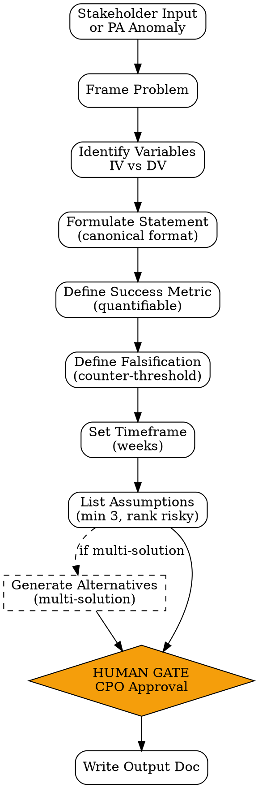

# Hypothesis Generator

Skill untuk memformulasi product hypothesis yang **testable, measurable, falsifiable, dan time-bound** sebelum riset / PRD dimulai (untuk PM) atau sebagai bagian dari anomaly investigation (untuk PA).

<HARD-GATE>
Jangan mulai riset / build tanpa hypothesis yang terformulasi.
Jangan accept hypothesis tanpa metric yang quantifiable.
Setiap hypothesis WAJIB punya falsification criteria — kapan kita anggap salah.
Setiap hypothesis WAJIB punya timeframe eksplisit (bukan "in the future").
PA: jangan trigger re-discovery tanpa minimal 2 hipotesis penyebab + ranking by likelihood.
</HARD-GATE>

## When to use

- **PM Discovery step 2**: turn abstract problem statement → hypothesis testable
- **PM ideation**: explore solusi alternatif, format jadi parallel hypotheses
- **PA Monitor anomaly**: bikin hipotesis penyebab metric drop sebelum panggil PM
- **Stakeholder ide**: kalau stakeholder lempar fitur ide, FRAME jadi hypothesis dulu sebelum diskusi prioritas

## When NOT to use

- Sudah ada PRD locked dengan success metric — tidak perlu re-formulate
- Bug fix mekanikal (no behavioral question) — langsung ke `bug-report` skill
- Operational task tanpa unknown — execute langsung

## Canonical Format

```
HYPOTHESIS: Kami percaya [aksi/fitur] akan menghasilkan [outcome terukur] untuk [target user segment].
 Kami akan tahu ini berhasil ketika [metric] mencapai [threshold] dalam [timeframe].

FALSIFICATION: Hypothesis dianggap salah jika [metric] di bawah [counter-threshold] setelah [timeframe + buffer],
 ATAU [secondary metric] menunjukkan [signal kontra].
```

Contoh real:
```
HYPOTHESIS: Kami percaya menambahkan one-click checkout akan meningkatkan conversion rate
 untuk returning users di mobile. Kami akan tahu berhasil ketika mobile checkout
 conversion naik dari 2.4% menjadi 3.2% (+33%) dalam 4 minggu post-rollout.

FALSIFICATION: Salah jika conversion < 2.6% setelah 4 minggu, ATAU drop-off rate naik > 15%
 (tanda UX confusion bukan checkout helping).
```

## Checklist

You MUST create a TodoWrite task for each item and complete them in order:

1. **Frame Problem** — abstract problem dari input stakeholder/PA findings
2. **Identify Variable** — apa yang dependent vs independent variable?
3. **Formulate Statement** — pakai canonical format
4. **Define Success Metric** — must be quantifiable, baseline-knowable
5. **Define Falsification** — counter-threshold + secondary signal
6. **Set Timeframe** — explicit weeks/days (no "eventually")
7. **List Underlying Assumptions** — minimal 3, mark yang riskiest
8. **[OPTIONAL] Generate Alternative Hypotheses** — kalau diminta multi-solution ideation
9. **[HUMAN GATE — CPO]** — kirim summary via `notify.sh` (skip kalau PA internal investigation)
10. **Output Document** — `outputs/YYYY-MM-DD-hypothesis-{topic}.md`

## Process Flow



## Detailed Instructions

### Step 1 — Frame Problem

Identify dari input:
- **Siapa** yang mengalami masalah? (specific user segment)
- **Apa** masalahnya secara concrete? (avoid abstract: "users frustrated" → "users abandon checkout at step 3")
- **Seberapa besar** dampaknya? (quantifiable scope)

### Step 2 — Identify Variables

| Variable | Role | Contoh |
|---|---|---|
| **Independent (IV)** | Yang kita ubah | "tambah one-click checkout" |
| **Dependent (DV)** | Yang kita measure | "conversion rate mobile" |
| **Confounding** | Yang bisa polusi hasil | "promo bersamaan", "seasonality" |

Confounding harus di-mention di output supaya saat eksperimen tahu yang harus di-control.

### Step 3 — Formulate Statement

Pakai canonical format. **Avoid weasel words**: "mungkin", "kemungkinan", "akan lebih baik" — ganti dengan threshold konkret.

❌ "Mungkin user akan lebih engaged kalau ada notification."
✅ "Kami percaya menambah daily reminder notification akan meningkatkan DAU dari user trial. Kami akan tahu berhasil ketika DAU naik dari 35% menjadi 50% dalam 2 minggu."

### Step 4 — Define Success Metric

Metric harus:
- **Quantifiable** — angka, bukan deskriptif
- **Baseline-knowable** — kita tahu nilai sekarang (atau bisa cepat tahu)
- **Single, primary** — 1 metric utama; secondary jelas terpisah
- **Tied to user behavior** — bukan vanity (e.g. "click count" tanpa convert)

Anti-pattern: "improve user experience" — bukan metric, terlalu abstract.

### Step 5 — Define Falsification

**Falsification = guard against confirmation bias.** Tentukan upfront kapan kita bilang "salah".

2 komponen wajib:
- **Counter-threshold** pada primary metric (kalau metric < X, hypothesis salah)
- **Secondary signal** — bisa metric lain yang justru turun, indikasi UX confusion, atau retention drop

Tanpa falsification, hypothesis cuma wishful thinking.

### Step 6 — Set Timeframe

- Minimum: cukup waktu untuk metric mencapai statistical significance (depends on traffic)
- Maximum: jangan terlalu lama (3 bulan untuk most B2C features cukup)
- Default rules of thumb:
 - High-traffic surface (>10k DAU): 2-4 minggu
 - Mid-traffic: 4-8 minggu
 - Low-traffic / B2B: 8-12 minggu

### Step 7 — List Underlying Assumptions

Minimal 3 assumption, mark yang **riskiest** (paling mungkin salah). Ini yang harus divalidasi pertama via riset cepat sebelum heavy build.

Contoh:
1. **[RISKY]** User actually want shorter checkout (vs more options)
2. Mobile users are converted lower because of checkout friction (not pricing)
3. One-click button visual pattern familiar untuk user kita

Kalau riskiest assumption belum tervalidasi (ada data) → flag di output, recommend qualitative riset 1 minggu dulu.

### Step 8 — [OPTIONAL] Multi-solution Ideation

Kalau task adalah "multi-solution ideation", generate 3-5 hypothesis paralel dengan IV berbeda untuk DV sama. Output as comparative table.

### Step 9 — [HUMAN GATE — CPO]

```bash
./scripts/notify.sh "Hypothesis [topic] siap review: [1-line summary]"
```

Tunggu approval. Skip step ini kalau PA internal anomaly investigation (gak perlu CPO untuk explore).

### Step 10 — Output Document

```bash
./scripts/run.sh --topic "one-click-checkout" \
 --action "tambah one-click checkout button" \
 --outcome "conversion rate naik dari 2.4% ke 3.2%" \
 --segment "returning mobile users" \
 --metric "mobile_checkout_conversion" \
 --threshold "3.2%" \
 --timeframe "4 weeks" \
 --falsification "conversion < 2.6% atau drop-off > 15%" \
 --output outputs/$(date +%Y-%m-%d)-hypothesis-one-click-checkout.md
```

## Output Format

See `references/format.md` for canonical schema.

## Inter-Agent Handoff

| Direction | Trigger | Skill / Tool |
|---|---|---|
| **PM** → self | step 2 | embed di PRD section "Hypothesis" |
| **PM** → **Market Research** | After hypothesis frame | `market-research` skill validate assumptions |
| **PM** → **UX** | Multi-solution ideation | `ux-research` to validate user-side assumptions |
| **PA** → **PM** | Re-discovery trigger | `re-discovery-trigger` dengan hipotesis penyebab |

## Anti-Pattern

- ❌ Hypothesis tanpa falsification — wishful thinking, bukan testable
- ❌ "User akan lebih happy" — bukan metric, terlalu abstract
- ❌ Timeframe "in the future" / "next quarter" — set explicit weeks
- ❌ Single hypothesis untuk fitur kompleks — break down jadi multiple atomic hypotheses
- ❌ Skip riskiest assumption marking — semua assumption gak sama tingkat risikonya
- ❌ Multi-solution ideation tanpa parallel structure — kalau IV beda, DV juga harus comparable
