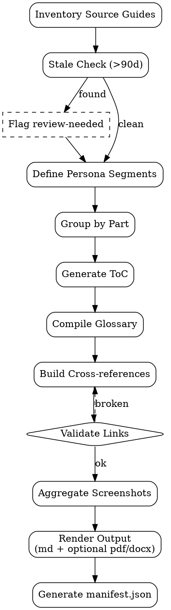

# Manual Book Compiler

Compile multiple user guides → **comprehensive manual book** per module/product. Tujuan: single source of truth untuk user training + distribution.

<HARD-GATE>
Manual book WAJIB punya: cover page, ToC, version history, glossary, index — bukan sekadar concat guides.
Setiap chapter WAJIB cite source guide path + last-updated date — traceability.
Cross-references antar chapter WAJIB working — link rot prevention.
Glossary WAJIB include semua jargon yang muncul di body — user-language baseline.
Version mismatch antar guides WAJIB flagged — manual book hanya valid kalau semua source guides aligned.
JANGAN compile guides yang stale (>90 hari tanpa review) tanpa flag review-needed.
JANGAN skip persona segmentation — admin chapters mixed dengan end-user chapters bikin overwhelming.
Output format WAJIB Markdown + optional PDF/DOCX via pandoc — distribution flexibility.
</HARD-GATE>

## When to use

- Major release shipping (compile feature guides into release manual)
- Quarterly training material refresh
- New customer onboarding kit
- Compliance / audit readiness (formal manual artifact required)

## When NOT to use

- Single-feature release — `user-guide-generator` cukup
- API reference compilation — separate (developer doc)
- Marketing brochure — separate domain

## Required Inputs

- **Product/module scope** — list of features yang masuk manual
- **Version** — manual book version (semver atau release name)
- **Source guides path** — `outputs/*-user-guide-*.md` selection
- **Personas** — admin / end-user / power-user segmentation
- **Optional:** export format (md / pdf / docx)

## Output

`outputs/{date}-manual-{product}-v{version}/`:
- `manual.md` — main consolidated file
- `chapters/` — per-chapter source (re-organized from inputs)
- `assets/` — screenshots aggregated
- `manual.pdf` (optional) — pandoc rendered
- `manifest.json` — chapter list + source mapping + checksums

## Manual Book Structure

```markdown
# {Product} User Manual
**Version:** v{version} | **Released:** {date} | **Pages:** ~{count}

## Front Matter
1. Cover
2. Copyright + version history
3. About this manual (audience, conventions, how to use)
4. Quick navigation

## Table of Contents
> Auto-generated from chapter headings

## Part I — Getting Started (End-User)
- Ch 1. First-time login
- Ch 2. Dashboard tour
- Ch 3. Common workflows

## Part II — Sales & Orders (End-User)
- Ch 4. Create quotation
- Ch 5. Add discount lines  ← from outputs/2026-04-25-user-guide-discount.md
- Ch 6. Confirm + invoice

## Part III — Configuration (Admin)
- Ch 7. User management
- Ch 8. Permission groups
- Ch 9. Email templates

## Appendices
- A. Glossary
- B. Keyboard shortcuts
- C. Troubleshooting index
- D. Change log per chapter
- E. Index (alphabetical)

## Back Matter
- Feedback & support contacts
```

## Checklist

You MUST create a TodoWrite task for each item and complete them in order:

1. **Inventory Source Guides** — list paths + last-updated dates
2. **Stale Check** — flag guides >90 days unreviewed
3. **Define Persona Segments** — admin / end-user / power-user
4. **Group Chapters by Part** — per persona + workflow order
5. **Generate ToC** — from chapter headings
6. **Compile Glossary** — extract jargon + cross-link to definitions
7. **Build Cross-references** — Ch X ↔ Ch Y, Ch X ↔ FAQ
8. **Validate Links** — no broken cross-refs, no orphan chapters
9. **Aggregate Screenshots** — copy + de-duplicate by checksum
10. **Render Output** — Markdown + optional pandoc → PDF/DOCX
11. **Generate manifest.json** — source mapping, checksums, version

## Process Flow



## Pandoc Render Command

```bash
# PDF
pandoc manual.md \
  --toc --toc-depth=3 \
  --metadata title="${PRODUCT} User Manual v${VERSION}" \
  --metadata date="${DATE}" \
  --pdf-engine=xelatex \
  -o manual.pdf

# DOCX (Google Docs compatible)
pandoc manual.md \
  --toc --toc-depth=3 \
  --reference-doc=template.docx \
  -o manual.docx
```

## manifest.json Schema

```json
{
  "manualVersion": "1.2.0",
  "renderedAt": "2026-05-02T10:00:00Z",
  "product": "Sales Module",
  "audiencePersonas": ["end-user", "admin"],
  "chapters": [
    {
      "id": "ch-05",
      "title": "Add discount lines",
      "sourcePath": "outputs/2026-04-25-user-guide-discount.md",
      "sourceUpdated": "2026-04-25",
      "wordCount": 1240,
      "checksum": "sha256:..."
    }
  ],
  "totalWordCount": 28400,
  "screenshotCount": 47,
  "glossaryTerms": 32
}
```

## Anti-Pattern

- ❌ Concat without re-organize — overwhelming dump
- ❌ Mix admin + end-user chapters — context-switch fatigue
- ❌ Compile stale guides without flag — distributing outdated info
- ❌ No glossary — jargon barrier for new users
- ❌ Broken cross-references — degrades trust
- ❌ No version history — change blind
- ❌ Single-format output — distribution rigid
- ❌ No checksum manifest — hard to detect drift

## Inter-Agent Handoff

| Direction | Trigger | Skill / Tool |
|---|---|---|
| **Doc** ← `user-guide-generator` (multiple) | Release pending | compile manual |
| **Doc** → **PM** | Manual drafted | stakeholder review |
| **Doc** → **QA** | Manual published | UAT trains against manual |
| **Doc** → external publishing | Approved | ship to KB / customer portal |
