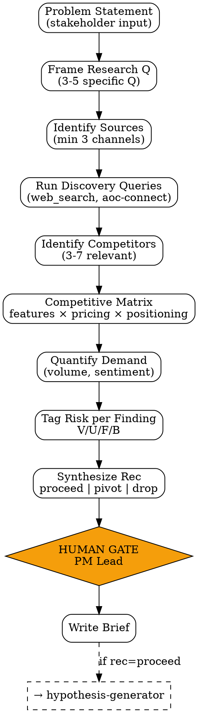

# Market Research

Riset pasar terstruktur untuk fitur/produk baru — investigates market opportunity, competitor positioning, dan demand signals untuk menghasilkan **briefing 1-page** yang feed langsung ke `hypothesis-generator` dan `value-score-calculator`.

<HARD-GATE>
Setiap claim WAJIB punya source — link/quote/screenshot. Tanpa source = halusinasi, tolak.
Minimum 3 competitor di-analisa (atau bukti tertulis cuma <3 yang relevan).
Minimum 2 demand signal channel (avoid single-source bias).
Setiap finding di-tag dengan risk impact (Value/Usability/Feasibility/Business).
Hand-off ke hypothesis-generator HANYA kalau rec = "proceed".
Confidence > 70% butuh multi-source corroboration (single-source max 70%).
</HARD-GATE>

## When to use

- **PM Discovery step 1**: stakeholder lempar problem space — sebelum frame hypothesis
- **PM Discovery step 3**: validate "real problem" via demand signals
- **Biz Analyst (#7) handoff**: enrich biz-viability-report dengan competitive moat data
- **Re-evaluation**: PA findings menunjukkan market shift, perlu re-research

## When NOT to use

- Iteration kecil dari fitur existing — gunakan `pa-metrics-report` untuk insight
- Pure UX research (jangan di-overlap dengan `ux-research` — itu domain UX Designer)
- Riset deep tech feasibility — itu `feasibility-brief` (EM #3)

## Input expected

- **Problem statement** (1 sentence atau paragraph dari stakeholder)
- **Optional**: target segment, geography, time horizon
- **Optional**: competitor names yang sudah diketahui (skill akan tetap discover yang lain)

## Output

A `market-research-brief.md` document berisi:
1. Executive Summary (2-3 sentences + recommendation)
2. Problem Prevalence (with sources)
3. Target Segments
4. Competitive Landscape Matrix
5. Demand Signals
6. Risk Tagging per Finding
7. Recommendation: proceed / pivot / drop + rationale

## Checklist

You MUST create a TodoWrite task for each item and complete them in order:

1. **Frame Research Question** — translate problem statement → 3-5 specific research questions
2. **Identify Sources** — minimum 3 channels (search trends, forums, news, helpdesk, internal data)
3. **Run Discovery Queries** — pakai `web_search` / `aoc-connect` untuk fetch raw data
4. **Identify Competitors** — minimum 3, max 7 yang truly relevant
5. **Build Competitive Matrix** — features, pricing, positioning, gap analysis
6. **Quantify Demand Signals** — search volume, forum thread count, ticket volume (citable)
7. **Tag Risk per Finding** — V/U/F/B matrix
8. **Synthesize Recommendation** — proceed / pivot / drop + 3-bullet rationale
9. **[HUMAN GATE — PM Lead]** — review draft sebelum dispatch ke `hypothesis-generator`
10. **Output Document** — `outputs/YYYY-MM-DD-market-research-{topic}.md`

## Process Flow



## Detailed Instructions

### Step 1 — Frame Research Questions

Convert problem → 3-5 atomic, answerable Q. Avoid umbrella questions.

❌ "Apakah pasar B2B SaaS untuk small business viable?"
✅
1. Berapa banyak SMB di Indonesia yang aktif cari accounting tool dalam 12 bulan terakhir?
2. Top 5 kompetitor di segment ini, gimana pricing & feature mereka?
3. Apa pain point yang user sebut paling sering di forum (Reddit, FB Group, IG comment)?
4. Berapa traffic / search volume untuk keyword "accounting software UMKM"?
5. Apakah ada regulatory tailwind/headwind (mis. PPN/tax compliance changes)?

### Step 2 — Identify Sources

Minimum 3 channels, max 8. Pilih yang most relevant:

| Channel | Best for | Tools |
|---|---|---|
| Search trends | Demand volume, seasonality | Google Trends, web_search |
| Community forums | Real complaints, language users pakai | Reddit, FB Groups, Discord |
| App stores | Competitor reviews + feature gaps | Play Store, App Store reviews |
| News / industry | Recent funding, M&A, regulatory | Tech news sites |
| Helpdesk (internal) | Existing user pain | Odoo helpdesk via aoc-connect |
| Sales conversations | Anti-competition, deal-breakers | Sales CRM via aoc-connect |
| Survey / poll | Quantified preference | Survey platform |
| Industry reports | Market sizing, trends | Statista, IBISWorld, public reports |

### Step 3 — Run Discovery Queries

Use AOC tools:
```bash
# Web search for competitor
./scripts/research.sh --query "accounting software SMB Indonesia 2026" --max-results 20

# Pull internal helpdesk for existing pain mentions
./scripts/research.sh --internal helpdesk --keyword "accounting" --period "90d"
```

Each query → log to `outputs/raw/{date}-{slug}/` for traceability.

### Step 4 — Identify Competitors

Criteria untuk include:
- Active dalam 12 bulan terakhir (gak deprecated)
- Target segment overlap minimal 40% dengan problem space
- Teach-by-example: include 1-2 yang "default choice" (what users compare against)

Per kompetitor, capture:
- Name, URL, founded year, last funding round
- Pricing tiers
- Top 5 features
- Key positioning claim ("we're the X for Y")
- Public review summary (avg star, top complaint, top praise)

### Step 5 — Build Competitive Matrix

Format strict table di output:

| Competitor | Pricing | Feature 1 | Feature 2 | Positioning | Review (avg) |
|---|---|---|---|---|---|

**Gap analysis** wajib: highlight feature/positioning yang belum di-cover anyone.

### Step 6 — Quantify Demand Signals

Citable, comparable across competitors atau over time:
- Search volume per month (Google Trends rel value)
- Forum thread count (last 90 days, di top 2 forum)
- Ticket volume (kalau internal data ada)
- App store review volume per month

Avoid: "lots of people complaining" tanpa angka.

### Step 7 — Risk Tagging per Finding

Setiap finding di-tag risk impact:

| Finding | V | U | F | B |
|---|:-:|:-:|:-:|:-:|
| Top 3 competitors all charge >$50/mo | | | | ✓ |
| 65% of forum complaints about onboarding UX | ✓ | ✓ | | |
| Compliance regulation Q3 favors local players | | | | ✓ |
| Existing solutions need server self-hosted (heavy) | | | ✓ | |

V=Value, U=Usability, F=Feasibility, B=Business Viability.

### Step 8 — Synthesize Recommendation

Output WAJIB salah satu dari 3:

| Recommendation | Kapan | Next step |
|---|---|---|
| **PROCEED** | Demand jelas, competitive gap teridentifikasi, risiko bisa di-mitigate | Hand off ke `hypothesis-generator` |
| **PIVOT** | Demand ada tapi posisi berbeda dari problem awal — re-frame | Re-frame problem statement, balik ke step 1 |
| **DROP** | Demand weak, competitive moat solid (>3 strong incumbents), unfavorable signals | Archive dengan rationale, lapor ke stakeholder |

Rationale: 3 bullet kunci, masing-masing sourced.

### Step 9 — [HUMAN GATE — PM Lead]

```bash
./scripts/notify.sh "Market research [topic] complete: rec=PROCEED. Review brief sebelum hypothesis-generator."
```

Tunggu approval. Skip kalau internal exploratory.

### Step 10 — Output Document

```bash
./scripts/research.sh --topic "accounting-smb" \
 --question "Apakah ada market untuk accounting tool SMB Indonesia?" \
 --output outputs/$(date +%Y-%m-%d)-market-research-accounting-smb.md
```

Script akan walk through web_search + format ke template.

## Output Format

See `references/format.md` for canonical schema.

## Inter-Agent Handoff

| Direction | Trigger | Skill / Tool |
|---|---|---|
| **PM** → **PM** (next step) | rec=PROCEED | `hypothesis-generator` |
| **PM** → **PM** (re-frame) | rec=PIVOT | back to step 1 with new problem statement |
| **PM** → archive | rec=DROP | task tag `archived` + reason in task body |
| **PM** → **Biz Analyst (#7)** | Pricing/moat findings rich | `pricing-strategy-analyzer` skill |
| **PM** → **UX Designer (#2)** | Forum complaints UX-heavy | `competitor-ux-analysis` skill |

## Anti-Pattern

- ❌ Claim tanpa source link/quote — halusinasi
- ❌ Single-source confidence > 70% — corroborate min 2 sources
- ❌ "Top kompetitor X, Y, Z" tanpa criteria pemilihan — show why ke-3 ini, bukan yang lain
- ❌ Skip gap analysis — fitur identik bukan informative; gap yang menentukan opportunity
- ❌ Recommendation tanpa rationale 3-bullet sourced — keputusan yang gak audit-trail
- ❌ Demand signal qualitatif saja ("ada banyak yang mau") — quantify atau jangan claim
- ❌ Forget tag risk per finding — bikin downstream `hypothesis-generator` butuh re-analyze
