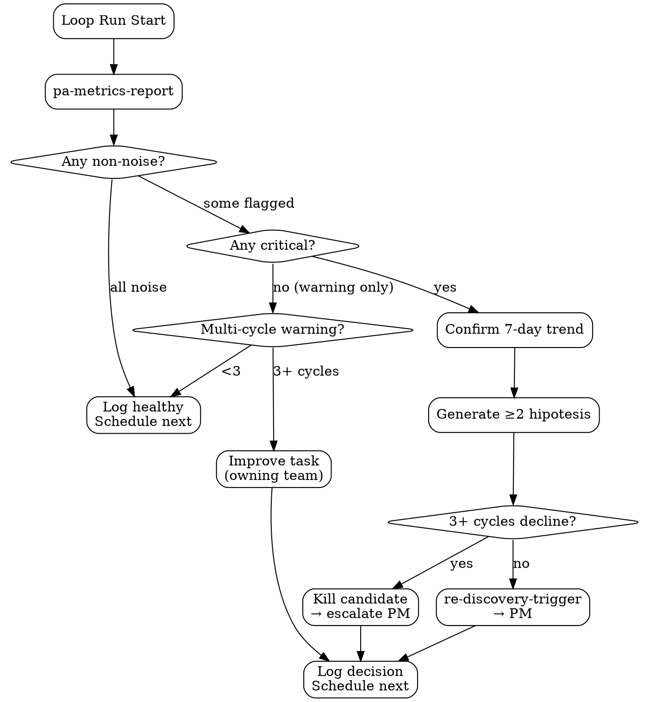

# PA Adaptive Loop

Master skill PA Monitor yang implementasi ** adaptive loop** — continuous health monitoring dengan anomaly-triggered re-discovery. Wraps `pa-metrics-report` + decision logic untuk routing actionable signal ke role yang tepat.

<HARD-GATE>
Skill ini WAJIB dipanggil cron-driven (bukan ad-hoc) untuk routine health — supaya cadence konsisten.
Setiap iterasi WAJIB selesai dengan eksplisit decision: noise / improve / trigger-re-discovery / kill-candidate.
Re-discovery trigger HANYA dispatch kalau evidence package complete (anomaly + 2+ hipotesis penyebab + 7+ day trend confirmation).
Jangan trigger PM untuk noise (false positive expensive) — high bar untuk re-discovery.
Setiap loop run WAJIB log ke task dengan tag `monitoring` supaya audit trail jelas.
Kalau loop run gagal di middle (e.g. data source down), WAJIB partial-fail flag — jangan fake green.
</HARD-GATE>

## When to use

- **Cron-scheduled**: weekly health (each owned feature), monthly composite (cross-feature), quarterly review
- **Ad-hoc investigation**: stakeholder ask "is X still healthy?"
- **Post-launch follow-up**: 1/2/4/8/12 weeks setelah feature ship
- **PA receives PM ping** asking metric status sebelum decision

## When NOT to use

- Single SQL query / quick lookup — pakai `bigquery-usage` directly
- Bug investigation deep — escalate ke QA dengan `bug-report`
- Pre-launch metrics — gunakan `monitoring-spec-generator` (PM-side) untuk define baseline dulu

## Loop Anatomy

```
┌─────────────────────────────────────────────────────────────┐
│ PA ADAPTIVE LOOP (per feature, per cadence) │
│ │
│ ┌─ INPUT ────────────────────────────────────────────────┐ │
│ │ • Feature slug │ │
│ │ • Cadence (weekly / monthly / quarterly) │ │
│ │ • PRD monitoring-spec (baselines + thresholds) │ │
│ └────────────────────────────────────────────────────────┘ │
│ ↓ │
│ ┌─ MEASURE (pa-metrics-report) ──────────────────────────┐ │
│ │ • Pull 4 pillars: retention, engagement, errors, UX │ │
│ │ • Compute Δ vs baseline │ │
│ │ • Severity per metric: noise/warning/critical │ │
│ └────────────────────────────────────────────────────────┘ │
│ ↓ │
│ ┌─ EVALUATE (decision logic) ────────────────────────────┐ │
│ │ • All noise → log healthy, schedule next │ │
│ │ • Warnings only → trend check (3+ cycles?) │ │
│ │ • Critical → confirm 7-day trend, generate hipotesis │ │
│ └────────────────────────────────────────────────────────┘ │
│ ↓ │
│ ┌─ DECIDE (route to action) ─────────────────────────────┐ │
│ │ noise → log + schedule next iteration │ │
│ │ improve → task tag `improve` to owning team │ │
│ │ re-discovery → re-discovery-trigger → PM Discovery │ │
│ │ kill → escalate to PM with kill rec │ │
│ └────────────────────────────────────────────────────────┘ │
│ ↓ │
│ ┌─ LOG (audit trail) ────────────────────────────────────┐ │
│ │ aoc-tasks: monitoring tag + outcome + next-cadence │ │
│ └────────────────────────────────────────────────────────┘ │
└─────────────────────────────────────────────────────────────┘
```

## Checklist

You MUST create a TodoWrite task for each item and complete them in order:

1. **Read Input** — feature slug + cadence + PRD monitoring-spec
2. **Run pa-metrics-report** — generate baseline-vs-current report
3. **Apply Default Thresholds** atau PRD-specific thresholds
4. **Trend Confirmation** — kalau ada warning/critical, fetch prior 2 cycles' reports
5. **Generate Hipotesis Penyebab** (kalau critical) — minimum 2 hypotheses dari `hypothesis-generator`
6. **Apply Decision Tree** — noise / improve / re-discovery / kill
7. **Bundle Evidence Package** (kalau re-discovery) — report + hipotesis + screenshots
8. **Dispatch Action** — task creation atau skill chain
9. **Log Loop Run** — task entry dengan tag `monitoring` + outcome
10. **Schedule Next Iteration** — based on cadence + decision

## Decision Tree (detail)



## Default Cadences

| Cadence | What | When triggered |
|---|---|---|
| **Daily quick-check** | error rate spike only | cron `0 9 * * *` |
| **Weekly health** | full pa-metrics-report per feature | cron `0 8 * * 1` (Mon) |
| **Monthly composite** | cross-feature, segment breakdown | cron `0 8 1 * *` (1st of month) |
| **Quarterly review** | strategic re-score, kill/keep decisions | manual trigger from PM |

PRD `monitoring-spec` overrides cadence per feature.

## Trend Confirmation Rule

Critical metric WAJIB confirmed across 7+ days sebelum trigger re-discovery:
- Single-day spike = potential noise (deploy issue, holiday, weather, news event)
- 3-day spike = possible
- 7-day spike = likely real signal
- 14-day persistent = confirmed signal, high confidence

Skip 7-day rule HANYA kalau severity is "fail-safe critical" (>50% drop, infra outage) — these need immediate response.

## Hipotesis Generation (kalau critical)

Minimum 2 hipotesis penyebab pakai `hypothesis-generator`:

Contoh untuk "checkout conversion drop -35%":

H1: **[likely]** Recent FE deploy introduced UX regression in checkout step 3.
- Validate: check deploy log, A/B with prior version
- Falsification: if pre-deploy data also shows drop, this isn't cause

H2: Pricing change Q3 caused price-sensitive segment churn.
- Validate: segment by acquisition cohort
- Falsification: drop concentrated in price-stable segment → not pricing

H3: External factor (competitor launch / regulatory).
- Validate: market signal scan (`market-research` quick query)

Rank by **likelihood × testability** — likely + cheap to test = test first.

## Kill Candidate Criteria

Trigger "kill candidate" decision (escalate ke PM dengan kill rec) kalau:

- 3+ cycles consistent decline (no improvement post-action)
- Cost-to-maintain > value-delivered (consult Biz Analyst data)
- Strategic re-prioritization signal (OKR drift)
- Underlying assumption falsified (PRD hypothesis no longer holds)

Kill bukan keputusan PA unilateral — output adalah recommendation + evidence, decision di PM/CPO.

## Detailed Instructions

### Step 1 — Read Input

```bash
./scripts/run-loop.sh --feature "checkout-flow-mobile" --cadence weekly
```

Skill akan:
- Lookup `monitoring-spec` di `~/.openclaw/agents/{me}/outputs/prd-{feature}.md` (kalau ada)
- Fetch baseline + thresholds; default kalau PRD belum sync

### Step 2-3 — Measure & Apply Thresholds

Delegasi ke `pa-metrics-report`:
```bash
./scripts/metrics.sh --feature "checkout-flow-mobile" --window "7d"
```

Output: report dengan severity per metric.

### Step 4 — Trend Confirmation

Read prior 2 cycles' reports dari `outputs/`:
```bash
ls outputs/*-pa-metrics-checkout-flow-mobile.md | tail -3
```

Cross-reference: same metric severity di 3+ reports?

### Step 5 — Generate Hipotesis (kalau critical)

```bash
# For each hypothesis
./scripts/hypothesize.sh --topic "checkout-conversion-drop" \
 --metric "mobile_checkout_conversion" \
 --observed-drop "-35%" \
 --output outputs/hypotheses/...
```

Atau langsung pakai `hypothesis-generator` skill.

### Step 6 — Apply Decision Tree

Map ke 4 outcomes via decision tree (above).

### Step 7 — Bundle Evidence Package (re-discovery)

Kalau re-discovery:
```bash
./scripts/evidence-package.sh \
 --feature "checkout-flow-mobile" \
 --metrics-report outputs/2026-05-02-pa-metrics-checkout-flow-mobile.md \
 --hypotheses "outputs/hypotheses/h1.md,outputs/hypotheses/h2.md" \
 --output outputs/2026-05-02-re-discovery-checkout-flow-mobile.md
```

Then dispatch via `re-discovery-trigger` skill (creates aoc-tasks ticket assigned to PM).

### Step 8 — Dispatch Action

| Decision | Action |
|---|---|
| noise | log only, no task creation |
| improve | `update_task.sh --create --tag improve --assignee {owning-team}` |
| re-discovery | `re-discovery-trigger` skill (full handoff to PM Discovery #1) |
| kill | `update_task.sh --create --tag kill-candidate --assignee pm-discovery` (escalate, not unilateral) |

### Step 9 — Log Loop Run

WAJIB tag task `monitoring`:
```bash
update_task.sh --create \
 --tag monitoring \
 --tag "feature:checkout-flow-mobile" \
 --tag "outcome:re-discovery" \
 --body "Loop run $(date -I): $(jq '.summary' outputs/...)"
```

### Step 10 — Schedule Next

Per cadence default + adjust untuk feature urgency.

## Inter-Agent Handoff

| Decision | Skill / Direction |
|---|---|
| noise | self (next iteration) |
| improve | `update_task.sh` → owning team |
| re-discovery | `re-discovery-trigger` → PM Discovery (#1) |
| kill | task escalation → PM Discovery (#1) + CPO notification |

## Anti-Pattern

- ❌ Trigger re-discovery di single-day spike — kemungkinan besar noise/false positive
- ❌ Skip trend confirmation karena "obvious problem" — tetap kasih 7-day check, kecuali fail-safe
- ❌ Re-discovery tanpa hipotesis penyebab — bikin PM mulai dari nol, expensive
- ❌ Kill candidate decision unilateral PA — selalu rec + escalate, never decide
- ❌ Loop run gagal di middle tanpa partial-fail log — fake green data, akan misleading next iteration
- ❌ Skip log task — gak ada audit trail, susah debug PA loop misbehave
- ❌ Cadence longgar (sebulan sekali untuk fitur high-traffic) — terlambat detect drift
