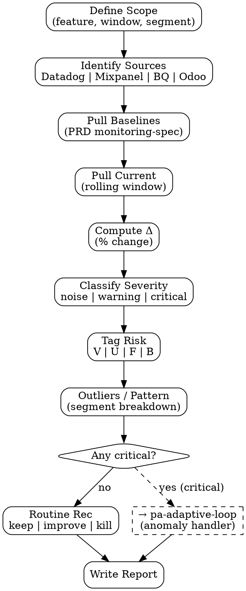

# PA Metrics Report

Composite observability report dari multi-source data — generate snapshot kesehatan fitur existing dengan **4 metric pillars** + risk tagging untuk feed `pa-adaptive-loop` decision logic.

<HARD-GATE>
Setiap metric WAJIB punya source eksplisit (Datadog dashboard URL, Mixpanel report ID, BQ query, Odoo record).
Setiap metric WAJIB punya baseline + current + delta. Tidak boleh "baseline=N/A" tanpa flag explicit.
Anomaly threshold WAJIB di-define upfront (default ±15% deviation = warning, ±30% = critical).
Reports yang tag 1+ metric "critical" WAJIB trigger `pa-adaptive-loop` decision flow — jangan stop di reporting.
Jangan trust single-data-point — minimum 7-day rolling window, 14-day untuk weekly metrics, 28-day untuk monthly.
</HARD-GATE>

## When to use

- **Routine health check**: weekly/monthly per fitur or per agent's owned area
- **Post-launch monitoring**: 1/2/4/8/12 weeks after feature ship
- **Anomaly investigation**: PA cron triggers, atau stakeholder ask
- **Pre-decision support**: PM/EM minta data sebelum decision — tidak untuk pure discovery

## When NOT to use

- New feature discovery — gunakan `market-research` (PM scope)
- Bug detail investigation — escalate ke QA/SWE via `bug-report` task tag
- Single one-off SQL query — gunakan `bigquery-usage` atau `postgresql-query` directly

## 4 Metric Pillars

Setiap report WAJIB cover 4 pillars (skip tertulis explicit kalau gak applicable):

| Pillar | What | Risk addressed |
|---|---|---|
| **Retention** | D1/D7/D30 cohort, churn rate | Value |
| **Engagement** | DAU/MAU, session length, time-on-task, feature adoption | Value, Usability |
| **Error rates** | Server 5xx, client errors, validation failures, drop-off | Feasibility, Usability |
| **Usability proxies** | Drop-off in critical flows, error-per-session, support ticket volume | Usability |

## Checklist

You MUST create a TodoWrite task for each item and complete them in order:

1. **Define Scope** — fitur/area yang di-monitor, time window, segments
2. **Identify Data Sources** — Datadog (errors/perf), Mixpanel (events), BQ (cohort), Odoo (business KPI)
3. **Pull Baselines** — kalau belum ada, fetch dari PRD `monitoring-spec` block
4. **Pull Current Metrics** — actual values dari tiap source untuk window
5. **Compute Deltas** — % change vs baseline
6. **Classify Severity** — noise / warning / critical per default thresholds (or PRD-specified)
7. **Tag Risk per Metric** — V/U/F/B
8. **Identify Outliers / Patterns** — segment breakdown kalau composite metric anomalous
9. **Generate Recommendation** — keep / improve / kill (kalau routine), atau hand-off ke `pa-adaptive-loop` kalau anomaly
10. **Output Document** — `outputs/YYYY-MM-DD-pa-metrics-{feature}.md`

## Process Flow



## Detailed Instructions

### Step 1 — Define Scope

| Field | Required | Example |
|---|---|---|
| Feature | yes | "checkout-flow-mobile" |
| Window | yes | "last 14 days" |
| Comparison | yes | "vs prior 14 days" or "vs same window last quarter" |
| Segments | optional | "mobile / desktop", "tier-1 city / others" |

### Step 2 — Identify Data Sources

| Source | Connection | Best for |
|---|---|---|
| Datadog | `aoc-connect.sh "Datadog" api "/api/v1/query?..."` | Error rate, latency, infra |
| Mixpanel | `aoc-connect.sh "Mixpanel" api "/api/2.0/events?..."` | Event funnel, retention cohort |
| BigQuery | `aoc-connect.sh "BigQuery" sql "..."` | Long-window cohort, cross-table |
| Odoo (internal) | `aoc-connect.sh "Odoo" sql "SELECT..."` | Business KPI (sales, helpdesk, accounting) |
| PostHog | `aoc-connect.sh "PostHog" api "..."` | Alternative funnel/event |

**Single-source bias warning**: kalau metric cuma muncul di 1 source, flag di output. Cross-validate kalau possible.

### Step 3 — Pull Baselines

Order of preference:
1. **PRD `monitoring-spec` block** — kalau feature shipped via PM Discovery flow, baseline sudah set
2. **Prior period rolling window** — comparable timeframe sebelumnya
3. **Same window last quarter** — untuk seasonal-sensitive metrics
4. **Sample-based estimate** — last resort, flag confidence rendah

### Step 4 — Pull Current Metrics

Pakai script:
```bash
./scripts/metrics.sh --feature "checkout-flow-mobile" --window "14d" --output outputs/...
```

Script will:
- Walk through 4 pillars
- Issue queries per source via `aoc-connect.sh`
- Save raw response ke `outputs/raw/{date}-{feature}/`
- Aggregate ke composite report skeleton

### Step 5 — Compute Deltas

Per metric:
```
delta_pct = (current - baseline) / baseline × 100
```

Edge case: baseline = 0 → flag "no baseline" instead of inf.

### Step 6 — Classify Severity (default thresholds)

| Severity | Δ from baseline | Action |
|---|---|---|
| **noise** | < ±15% | log only, no flag |
| **warning** | ±15% to ±30% | flag in report, watch next cycle |
| **critical** | > ±30% | flag + trigger `pa-adaptive-loop` |

PRD-specific thresholds override default kalau di-set di `monitoring-spec`.

### Step 7 — Tag Risk per Metric

Setiap metric outcomes maps ke 1+ risk:

| Metric | Maps to | Why |
|---|---|---|
| Retention drop | Value | feature stops delivering value |
| Time-on-task ↑ | Usability | UX confusion |
| 5xx error spike | Feasibility | infra/code issue |
| Conversion drop | Value, Usability | could be either, investigate |
| Support ticket volume ↑ | Usability | confused users |
| Cost per acquisition ↑ | Business Viability | unit economics drift |

### Step 8 — Identify Outliers / Pattern

Kalau composite metric anomalous, breakdown by segment untuk find pattern:
- Mobile vs desktop
- Geographic
- New vs returning
- Tier (free / paid / enterprise)
- Time-of-day / day-of-week

Pattern signals:
- "Issue isolated to mobile" → routing ke UX
- "Issue across all segments" → likely infra or pricing
- "Issue only during peak hours" → infra capacity

### Step 9 — Generate Recommendation

| Case | Recommendation |
|---|---|
| All metrics noise/warning, trends stable | **Keep** — log as healthy, next check per cadence |
| 1+ warning trends consistent over 2+ cycles | **Improve** — task for incremental fix |
| 1+ critical OR multi-warning compounding | **Trigger pa-adaptive-loop** — re-discovery may be needed |
| Persistent decline across 3+ cycles, no quick fix | **Kill candidate** — escalate decision to PM via `re-discovery-trigger` |

### Step 10 — Output Document

```bash
./scripts/metrics.sh --feature "checkout-flow-mobile" --window "14d" \
 --output outputs/$(date +%Y-%m-%d)-pa-metrics-checkout-flow-mobile.md
```

## Output Format

See `references/format.md`.

## Inter-Agent Handoff

| Direction | Trigger | Skill / Tool |
|---|---|---|
| **PA** → **PA** (self) | 1+ critical metric | `pa-adaptive-loop` decision flow |
| **PA** → **PM** | Adaptive loop says re-discover | `re-discovery-trigger` skill |
| **PA** → **QA** | Error rate spike confirmed | task tag `bug` + repro link |
| **PA** → **EM** | Latency / infra drift | task tag `tech-debt` |
| **PA** → **Doc** | Spike in support tickets all about same flow | task tag `doc-gap` |

## Anti-Pattern

- ❌ Single data point claim — minimum rolling window
- ❌ "No baseline" tanpa flag explicit — bikin downstream gak bisa decide
- ❌ Stop at reporting saat ada critical — WAJIB trigger adaptive-loop
- ❌ Single-source metric tanpa flag — possible source-side bug, cross-validate
- ❌ Recommendation "improve" tanpa specific task — vague, gak actionable
- ❌ Skip risk tagging — bikin PM/EM gak tahu siapa harus respond
- ❌ Pakai vanity metric (page views, click count) tanpa link ke value/conversion outcome
