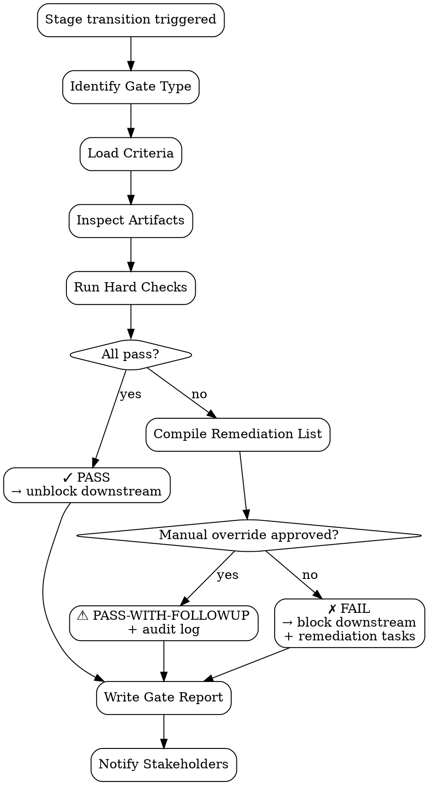

# Pipeline Gate Enforcer

Cross-cutting **quality gate** antara ADLC stages — validate stage N output sebelum stage N+1 pickup. Enforce Definition of Done (DoD) sebagai HARD criteria, bukan soft checklist.

<HARD-GATE>
Setiap gate WAJIB hard-criteria (binary pass/fail), JANGAN soft "looks good".
Gate fail WAJIB block downstream agent pickup — gak boleh "lanjut aja, fix later".
Gate WAJIB punya remediation list kalau fail — actionable, ditugaskan ke agent terkait.
JANGAN bypass gate dengan manual override tanpa explicit EM/PM approval + audit log entry.
JANGAN soften criteria untuk hit deadline — escalate scope cut instead.
Gate result WAJIB persisted di `outputs/gates/` — audit trail per release.
Multiple stage gates WAJIB independent — gate-FSD pass ≠ gate-impl pass.
JANGAN gate stage transition tanpa input artifact path — abstract gate = unauditable.
</HARD-GATE>

## Gates per ADLC Stage

```
┌─────────────────────────────────────────────────────────┐
│  PM (Discovery) → Gate-PRD → UX                          │
│  UX (Design)    → Gate-Design → EM                       │
│  EM (Architecture) → Gate-FSD → SWE                      │
│  SWE (Build)    → Gate-Impl → QA                         │
│  QA (Verify)    → Gate-Release → Release                 │
│  Release        → Gate-PostRelease (PA monitoring)       │
└─────────────────────────────────────────────────────────┘
```

## When to use

- Stage transition (any direction)
- Pre-merge to `main` / release branch
- Pre-release sign-off
- Post-release verification (PA → resolution loop)

## When NOT to use

- Within-stage iteration (e.g., SWE writing tests, doesn't need gate)
- Brainstorm / exploratory work (no DoD yet)
- Hotfix bypass — has separate `hotfix-gate` (lighter)

## Gate Criteria (per stage)

### Gate-PRD (PM → UX)

- [ ] PRD exists at `outputs/{date}-prd-{feature}.md`
- [ ] All 4 product risks addressed (Value, Usability, Feasibility, Business Viability)
- [ ] Hypothesis stated explicitly (testable)
- [ ] Success metrics defined with target values
- [ ] Stakeholder review note attached
- [ ] No `_[fill]_` placeholder remaining

### Gate-Design (UX → EM)

- [ ] Design brief exists at `outputs/{date}-design-{feature}.md`
- [ ] User flow diagram included (states + transitions)
- [ ] Wireframe / mockup attached (Figma link or static)
- [ ] Accessibility checklist (WCAG AA color contrast, keyboard nav, ARIA)
- [ ] Edge case states defined (empty, error, loading, partial data)
- [ ] Usability test result (kalau prototype-tested) — issues triaged

### Gate-FSD (EM → SWE)

- [ ] FSD exists at `outputs/{date}-fsd-{feature}.md`
- [ ] Acceptance criteria explicit (numbered AC-XX)
- [ ] API contract defined (kalau backend)
- [ ] Schema migration declared (kalau DB change) — reversible flag
- [ ] Effort estimate via PERT (P75 commitment)
- [ ] Tech stack confirmed (no TBD)
- [ ] Out-of-scope explicit

### Gate-Impl (SWE → QA)

- [ ] All commits on feature branch follow convention (Odoo OCA / Conventional)
- [ ] Tests exist for every public function (≥80% line coverage on new code)
- [ ] All tests pass locally + CI
- [ ] PR description complete (no placeholder)
- [ ] FSD § citations in commit body
- [ ] No `WIP`/`xxx`/`temp` commits remaining
- [ ] Branch rebased onto main (or merge commit if shared work)

### Gate-Release (QA → Release)

- [ ] Test execution report exists (`outputs/test-runs/`)
- [ ] All P1 test cases pass
- [ ] No S1/S2 bugs open
- [ ] Coverage ≥80% (line + AC matrix)
- [ ] Regression plan executed (per `regression-test-planner`)
- [ ] Critical paths all green
- [ ] Sign-off from PM + EM

### Gate-PostRelease (PA monitoring)

- [ ] Metrics dashboard configured + accessible
- [ ] Alert thresholds set (P×I scoring per metric)
- [ ] On-call rotation aware
- [ ] First-week metric report scheduled (`pa-metrics-report` skill)
- [ ] Adaptive loop trigger criteria set (`pa-adaptive-loop`)

## Required Inputs

- **Gate name** — `prd | design | fsd | impl | release | post-release`
- **Stage artifacts path** — file/folder produced by upstream stage
- **Optional:** override approver (EM/PM ID for emergency bypass)

## Output

`outputs/gates/{date}-gate-{stage}-{feature}.md`:
- Pass/fail per criterion (binary)
- Remediation list (if fail) — owner + ETA
- Override note (if bypassed) — approver + rationale + risk acknowledgement

## Checklist

You MUST create a TodoWrite task for each item and complete them in order:

1. **Identify Gate** — which stage transition
2. **Load Criteria** — per gate type
3. **Inspect Artifacts** — read produced files
4. **Run Hard Checks** — binary pass/fail per criterion
5. **Compile Remediation List** — for fails, assign owner
6. **Decide Pass/Fail/Conditional** — pass / fail / pass-with-followup
7. **Write Gate Report** — Markdown to `outputs/gates/`
8. **Notify Stakeholders** — task tag per result
9. **Block Downstream** — if fail, prevent next-stage pickup
10. **Audit Override** (if bypassed) — log approver + risk

## Process Flow



## Gate Report Template

```markdown
# Gate-${STAGE} — ${FEATURE}

**Date:** ${DATE}
**Gate type:** ${GATE_TYPE}
**Triggered by:** ${UPSTREAM_AGENT}
**Inspecting:** ${ARTIFACT_PATH}
**Result:** ✓ PASS / ⚠ PASS-WITH-FOLLOWUP / ✗ FAIL

## Criteria results

| # | Criterion | Result | Note |
|---|---|---|---|
| 1 | FSD exists at outputs/2026-04-25-fsd-discount.md | ✓ | — |
| 2 | All AC numbered explicitly | ✓ | 7 ACs found |
| 3 | API contract defined | ✗ | Missing endpoint contract for `/api/discount/preview` |
| 4 | Schema migration declared | ✓ | migrations/17.0.1.0/01-add-column.py (reversible: yes) |
| 5 | Effort estimate via PERT | ⚠ | Estimate present but P75 commitment not stated |
| 6 | Tech stack confirmed | ✓ | Odoo 17 + standard ORM |
| 7 | Out-of-scope explicit | ✓ | — |

**Pass:** 5/7 | **Fail:** 1/7 | **Warn:** 1/7

## Remediation list (if fail)

| ID | Criterion | Owner | ETA | Task ref |
|---|---|---|---|---|
| R1 | API contract for `/api/discount/preview` | EM agent | EOD 2026-04-26 | task-789 |
| R2 | P75 commitment value statement | EM agent | EOD 2026-04-26 | task-790 |

## Decision

✗ FAIL — downstream stage (SWE) BLOCKED until R1+R2 closed.

## Re-gate

Once remediation complete, re-trigger gate:
`./skills/pipeline-gate/scripts/gate.sh --stage fsd --feature discount`

## Override (only if explicitly approved)

- [ ] Approver: ${APPROVER_NAME} (EM/PM)
- [ ] Rationale: ${RATIONALE}
- [ ] Risk acknowledged: ${RISK_NOTE}
- [ ] Compensating action: ${ACTION}
- [ ] Audit log entry: outputs/audit/${DATE}-override-${GATE}.md
```

## Anti-Pattern

- ❌ Soft criteria ("design looks reasonable") — non-auditable
- ❌ Pass with `_[fill]_` placeholder — incomplete artifact
- ❌ Bypass without approver — accountability gap
- ❌ Re-run gate without re-inspecting artifact — stale check
- ❌ Combined gate (FSD+Impl one gate) — loses isolation
- ❌ "Gate pass tapi bug pasti ada" — gate criteria too lax, tighten
- ❌ Skip post-release gate — feature shipped tanpa monitoring plan
- ❌ Gate result tidak dipersist — no release audit trail

## Inter-Agent Handoff

| Direction | Trigger | Skill / Tool |
|---|---|---|
| **QA** ← any stage agent | Stage output ready | run gate |
| **QA** → upstream agent | Gate fail | dispatch remediation tasks |
| **QA** → downstream agent | Gate pass | unblock pickup |
| **QA** → **EM/PM** | Override request | escalate for approval |
| **QA** → **PA** | Gate-PostRelease pass | hand off monitoring duty |
