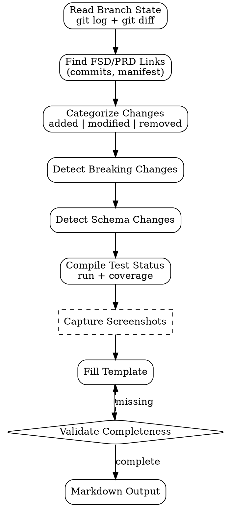

# PR Description Writer

Generate **review-ready PR description** dari git diff + commits + linked spec docs (FSD/PRD). Tujuan: reviewer punya context lengkap tanpa harus dig sendiri ke code.

<HARD-GATE>
PR description WAJIB cite linked FSD atau PRD path — gak boleh ada "see the code".
Setiap PR WAJIB include test plan: yang sudah di-test (auto + manual) dan yang belum.
Breaking changes WAJIB explicit di section terpisah, gak boleh hidden di body.
Schema migration WAJIB declared (path + reversible flag).
Kalau touched > 500 LoC, WAJIB summary section "Why so big?" dengan justifikasi atau link ke split plan.
Screenshots WAJIB ada untuk UI changes (FE) atau view changes (Odoo) — text-only PR untuk UI = blocked.
Closing/related issue WAJIB linked dengan keyword (`Closes #N`, `Refs #N`).
</HARD-GATE>

## When to use

- Final step di SWE orchestration pipeline — setelah `commit-strategy` + `rebase-strategy` selesai
- Manual PR creation untuk feature yang gak via orchestration flow
- Backporting commits ke release branch (description re-generation)
- Hot-fix PR — needs minimal but mandatory context

## When NOT to use

- Internal commits (push-to-main on hotfix-only branches) — cukup commit message
- Documentation-only repo PRs — simpler template (commit-style description OK)
- Auto-generated PRs (Dependabot, etc.) — leave as-is, don't override

## Output

Single Markdown text yang langsung paste ke PR body field di GitHub/GitLab.

Optional: file di `outputs/{date}-pr-{branch}.md` untuk audit trail.

## PR Description Template (canonical)

```markdown
## Summary

> 1-2 sentences explaining what this PR does, in plain language.

## Motivation

> Why this change is needed. Link to FSD/PRD/issue.

- FSD: `outputs/2026-04-25-fsd-{feature}.md`
- PRD: `outputs/2026-04-20-prd-{feature}.md`
- Issue: Closes #142

## Scope (what's in this PR)

- Added: ...
- Modified: ...
- Removed: ... (if any)

## Out of scope (deferred to follow-up PRs)

- ...

## Implementation notes

> Technical approach, key decisions, alternatives considered (briefly).

- ...

## Database / Schema changes

- [ ] No schema change
- [ ] Schema change — migration: `migrations/{path}` (reversible: yes/no)
- [ ] Data backfill required: yes/no — script: `{path}`

## Breaking changes

- [ ] None
- [ ] **Yes**: <describe; mention API version bump, deprecation timeline>

## Test plan

### Automated
- [ ] Unit tests added/updated — coverage: X%
- [ ] Integration tests added/updated
- [ ] All tests pass locally

### Manual
- [ ] Test on staging URL: <link>
- [ ] Tested on devices: <list>
- [ ] Manual smoke test of critical paths: <list>

## Screenshots / Screencast

> Required for UI changes.

| Before | After |
|---|---|
| <screenshot> | <screenshot> |

## Deployment notes

- [ ] Behind feature flag — flag name: `{flag}`
- [ ] Requires sequenced deploy: <FE/BE/migration order>
- [ ] Rollback procedure: <how to revert>
- [ ] Monitoring: <which dashboard, which alerts>

## Reviewer checklist

- [ ] Code review (logic + style)
- [ ] Test coverage adequate
- [ ] Security review (if auth/data sensitive)
- [ ] Accessibility check (if UI)
- [ ] Performance review (if hot path)
```

## Checklist

You MUST create a TodoWrite task for each item and complete them in order:

1. **Read Branch State** — `git log main..HEAD`, `git diff main...HEAD --stat`
2. **Identify FSD / PRD Links** — search commit messages for `FSD:` reference; or pull from manifest.json
3. **Categorize Changes** — added / modified / removed per major area
4. **Detect Breaking Changes** — API contract changes, removed exports, schema drops
5. **Detect Schema Changes** — find migration files, check reversibility
6. **Compile Test Status** — run test suite + coverage; capture results
7. **Capture Screenshots** — for UI changes (frontend or Odoo views)
8. **Generate Description** — fill template per change set
9. **Validate Completeness** — all required sections filled, no placeholders left
10. **Output** — Markdown ready to paste, optional save to file

## Process Flow



## Detailed Instructions

### Step 1 — Read Branch State

```bash
git log main..HEAD --pretty=format:'%h %s' | head -50
git diff main...HEAD --stat
git diff main...HEAD --name-status
```

Capture:
- Commits list (subject lines)
- Files changed + LoC diff
- Files added vs modified vs removed

### Step 2 — Find FSD / PRD Links

Priority order:
1. `manifest.json` di codegen output bundle (kalau via code-generator)
2. Commit messages matching `FSD:` atau `PRD:` regex
3. Branch name: `feature/{slug}` → search `outputs/*-fsd-{slug}.md`
4. PR title: ask user kalau tidak ada link discoverable

### Step 3 — Categorize Changes

Per major area (depends on stack):

| Stack | Areas |
|---|---|
| Odoo | models, views, security, controllers, wizards, data, migrations, tests |
| React | types, lib/api, stores, components, pages, hooks, tests |
| Vue | types, api, stores, components, views, composables, tests |
| Express | routes, controllers, services, middlewares, validators, tests |
| FastAPI | api, models, schemas, services, tests |

Group changes per area. Brief bullet per area di Scope section.

### Step 4 — Detect Breaking Changes

Heuristics:
- Removed exports / deleted public methods
- Changed function signatures (params added without default, return type changed)
- API contract version bump (path `/v1` → `/v2`)
- Removed columns / changed types in DB
- Deprecated features

Each → list di Breaking Changes section dengan migration path.

### Step 5 — Detect Schema Changes

Look for migration files:
- Odoo: `migrations/{version}/{phase}-migrate.py`
- Knex: `migrations/{timestamp}-{name}.ts`
- Alembic: `alembic/versions/{rev}.py`
- Prisma: `prisma/migrations/{timestamp}/migration.sql`

Per migration:
- Path
- Reversible? (presence of down migration)
- Backfill required? (data migration vs schema-only)

### Step 6 — Compile Test Status

```bash
# Run tests + coverage per stack
npm test  # or pytest, odoo-bin --test-tags, etc.

# Capture results
- Tests passed: X/Y
- Coverage: Z%
- New tests added: count
- Modified tests: count
```

Honest report — kalau coverage drop, declare; kalau tests fail, fix sebelum PR.

### Step 7 — Capture Screenshots

For UI changes:
- Before/after table (kalau modifying existing UI)
- Single screenshot (kalau new UI)
- Screencast/GIF untuk multi-step interaction

Path: `outputs/screenshots/pr-{branch}/` atau attach langsung di PR via paste.

Skip screenshot = block PR untuk UI changes (anti-pattern enforced).

### Step 8 — Generate Description

Use script:
```bash
./scripts/build-pr.sh \
  --branch feature/discount-line \
  --base main \
  --fsd outputs/2026-04-25-fsd-discount-line.md \
  --prd outputs/2026-04-20-prd-discount-line.md \
  --output outputs/$(date +%Y-%m-%d)-pr-discount-line.md
```

Script auto-fills sections, leaves `_[fill]_` placeholders untuk manual content (screenshots, manual test plan).

### Step 9 — Validate Completeness

Reject if:
- Any `_[fill]_` placeholder remains
- Test plan section empty
- Breaking changes section omitted (must be "None" or list)
- Schema migration omitted (must be "No schema change" or detail)
- Screenshot missing untuk UI change (auto-detected via touched paths)

### Step 10 — Output

Print to stdout (untuk pipe ke `gh pr create --body`) atau write to file.

```bash
gh pr create \
  --title "feat: discount line on sale order (FSD: 2026-04-25)" \
  --body-file outputs/2026-05-02-pr-discount-line.md \
  --base main \
  --head feature/discount-line
```

## PR Title Convention

```
{type}: {short description} (FSD: YYYY-MM-DD)
```

Types: `feat | fix | refactor | test | chore | docs | style | perf | ci`

Examples:
- `feat: discount line on sale order (FSD: 2026-04-25)`
- `fix: race condition in checkout retry handler (Refs #142)`
- `refactor: extract auth middleware to shared package`

## Inter-Agent Handoff

| Direction | Trigger | Skill / Tool |
|---|---|---|
| **SWE** ← `rebase-strategy` | History clean, ready to PR | auto-dispatch pr-description-writer |
| **SWE** ← `commit-strategy` (no rebase needed) | Commits clean | auto-dispatch pr-description-writer |
| **SWE** → **EM/Reviewer** | PR ready | task tag `ready-for-review` |
| **SWE** ← **Doc Writer** | UI changes detected | dispatch doc update task tag `doc-needed` |
| **SWE** → **QA** | After merge | task tag `ready-to-test-staging` |

## Anti-Pattern

- ❌ "See code" or "self-explanatory" — reviewer always needs context
- ❌ Skip test plan section — invisible test coverage
- ❌ Breaking change hidden in body, no dedicated section
- ❌ UI change tanpa screenshot — reviewer can't validate visually
- ❌ Migration tanpa reversibility flag — rollback risk silent
- ❌ Big PR (>500 LoC) tanpa "Why so big?" justification
- ❌ Generic title ("update files", "small fix") — search/audit unfriendly
- ❌ Issue/FSD link missing — reviewer can't trace decision back
