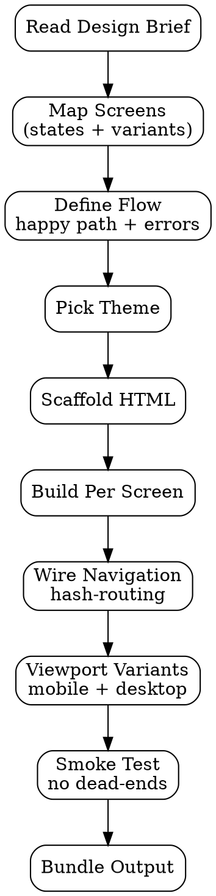

# Prototype Generator

Generate **single-file HTML prototype** untuk validate design hypothesis sebelum invest di high-fi atau code. Output: shareable `.html` (no build step, no server) yang bisa langsung dipakai untuk usability testing atau stakeholder review.

<HARD-GATE>
Output WAJIB single self-contained HTML file — no external CDN dependencies untuk core display (CSS inline, fonts via system stack, optional logo/img base64).
Multi-screen flow WAJIB pakai hash-routing (#screen-1) atau JS toggle visibility — file harus work offline.
Setiap screen WAJIB labeled (data-screen-id) untuk usability test traceability.
Click targets WAJIB visible affordance — bukan invisible div.
Mobile vs desktop WAJIB tested via viewport meta + responsive at default breakpoints.
Hindari over-engineering: prototype is for validation, bukan production code.
Setiap "go" link WAJIB working (jangan dead-end) atau explicitly labeled "out-of-scope".
</HARD-GATE>

## When to use

- Post-design-brief — concrete prototype untuk validate
- Stakeholder review yang butuh "interactive feel" dari static mockup
- Pre-build sanity check — designer + EM align via prototype walkthrough
- Pre-usability-test artifact

## When NOT to use

- Odoo backend UI — gunakan `uiux-odoo-generator`
- Production-grade frontend — itu SWE territory dengan FSD
- Pure visual mockup tanpa interaction — gunakan Figma/Sketch (ekspor PNG)
- Animation-heavy / 3D / canvas-heavy demo — HTML prototype gak ideal

## Output

`outputs/{date}-prototype-{feature}/` directory:
- `index.html` — main entry, multi-screen
- `screens/` — per-screen partial HTML (kalau di-split)
- `assets/` — base64 inline atau optional images
- `README.md` — how to use, screen list, known limitations

## Checklist

You MUST create a TodoWrite task for each item and complete them in order:

1. **Read Brief** — design brief output dari `design-brief-generator`
2. **Map Screens** — list semua state/screen dari brief
3. **Define Flow** — connection antar screen (happy path + 1-2 error paths)
4. **Pick Theme** — match brand atau use neutral (gray/blue) untuk testing focus
5. **Scaffold HTML** — base structure dengan multi-screen toggle
6. **Build Per Screen** — content + interactive elements
7. **Wire Navigation** — hash-routing atau JS state machine
8. **Add Viewport Variants** — mobile + desktop layout
9. **Smoke Test** — open di browser, walk through flow, no dead-ends
10. **Output Bundle** — `outputs/{date}-prototype-{feature}/`

## Process Flow



## Detailed Instructions

### Step 1 — Read Brief

Required:
- Problem statement (yang akan diprototype-kan)
- Success criteria (yang akan di-test)
- Deliverables list (concrete artifacts)
- References (visual patterns to adopt)
- Out-of-scope (apa yang TIDAK perlu di-prototype)

Tanpa brief → STOP, dispatch `design-brief-generator` first.

### Step 2 — Map Screens

Per state/screen yang perlu di-prototype:

```yaml
screens:
  - id: cart-default
    label: "Cart with items, no discount applied"
    viewport: [mobile, desktop]
    interactive: yes  # has click targets
  - id: cart-discount-input
    label: "User clicked Apply Discount field"
    viewport: [mobile]
    interactive: yes
  - id: cart-discount-valid
    label: "Valid code entered, discount applied"
    viewport: [mobile, desktop]
    interactive: no  # display only
  - id: cart-discount-invalid
    label: "Invalid code, error shown"
    viewport: [mobile]
    interactive: yes  # retry button works
```

### Step 3 — Define Flow

```
START → cart-default
  ↓ click "Apply Discount" link
cart-discount-input
  ↓ type "SAVE10" + submit
cart-discount-valid (END — happy path)

ERROR PATH:
cart-discount-input
  ↓ type "WRONGCODE" + submit
cart-discount-invalid
  ↓ click "Try again"
cart-discount-input (loop back)
```

Document di README.md output supaya tester tahu expected flow.

### Step 4 — Pick Theme

Two options:

| Theme | When |
|---|---|
| **Neutral** (gray/blue) | Usability test focus on functionality, not aesthetic. Reduces "I love the color" feedback noise. |
| **Brand** (sesuai brand guide) | Stakeholder review, demo to leadership, branding alignment validation |

Brand theme: hardcode color palette dari brand guide di CSS variables.

### Step 5 — Scaffold HTML

Single-file template:

```html
<!doctype html>
<html lang="id">
<head>
  <meta charset="utf-8">
  <meta name="viewport" content="width=device-width,initial-scale=1">
  <title>Prototype: {Feature}</title>
  <style>
    /* Inline CSS — no external deps */
    :root {
      --bg: #ffffff;
      --fg: #1a1a1a;
      --primary: #8b5cf6;
      --muted: #f5f5f5;
      --border: #e5e7eb;
    }
    * { box-sizing: border-box; }
    body { margin: 0; font-family: system-ui, -apple-system, sans-serif; color: var(--fg); background: var(--bg); }
    .screen { display: none; min-height: 100vh; padding: 16px; }
    .screen.active { display: block; }
    .nav-debug {
      position: fixed; bottom: 0; left: 0; right: 0;
      background: rgba(0,0,0,0.85); color: white; padding: 8px;
      font-size: 11px; font-family: monospace; z-index: 999;
      display: flex; gap: 8px; flex-wrap: wrap;
    }
    .nav-debug a { color: #8b5cf6; text-decoration: none; }
    /* ... per-screen styles */
  </style>
</head>
<body>
  <div class="screen active" data-screen-id="cart-default" id="cart-default">
    <!-- content -->
  </div>
  <div class="screen" data-screen-id="cart-discount-input" id="cart-discount-input">
    <!-- content -->
  </div>
  <!-- ... -->

  <!-- Debug nav (remove for clean usability test, keep for dev) -->
  <nav class="nav-debug">
    <span>Screens:</span>
    <a href="#cart-default">cart-default</a>
    <a href="#cart-discount-input">discount-input</a>
    <a href="#cart-discount-valid">discount-valid</a>
    <a href="#cart-discount-invalid">discount-invalid</a>
  </nav>

  <script>
    // Hash routing — show only screen matching #hash
    function syncRoute() {
      const id = location.hash.slice(1) || 'cart-default';
      document.querySelectorAll('.screen').forEach(s => {
        s.classList.toggle('active', s.id === id);
      });
    }
    window.addEventListener('hashchange', syncRoute);
    syncRoute();
  </script>
</body>
</html>
```

### Step 6 — Build Per Screen

Per screen, focus on **realistic content** (bukan lorem ipsum kalau bisa hindari):

```html
<div class="screen" id="cart-default">
  <header>
    <h1>Keranjang Anda (3)</h1>
  </header>
  <ul class="items">
    <li>
      
      <div>
        <p>Produk A</p>
        <p>Rp 150.000</p>
      </div>
    </li>
    <!-- ... -->
  </ul>
  <a href="#cart-discount-input" class="apply-discount">+ Apply Discount Code</a>
  <button class="primary-cta">Checkout</button>
</div>
```

### Step 7 — Wire Navigation

Hash-routing default. Plus:
- Form submit → JS handle → hash change
- Button click → hash change OR state toggle
- Back action → `history.back()`

Debug nav bar di bottom-fixed untuk dev convenience. **Remove sebelum usability test** atau hide dengan query param `?clean=1`.

### Step 8 — Viewport Variants

Min default: mobile-first (375x812 iPhone-class).
Test desktop di responsive breakpoint (≥1024px).

```css
@media (min-width: 1024px) {
  .screen { padding: 32px; max-width: 1200px; margin: 0 auto; }
  .items { display: grid; grid-template-columns: 1fr 1fr; gap: 16px; }
}
```

### Step 9 — Smoke Test

Walk through:
1. Open `index.html` di browser
2. Test happy path — semua link/button works
3. Test error path — error states reachable
4. Test back/forward browser button
5. Resize window — mobile + desktop layout works
6. Disconnect network — masih works (fully offline)

Kalau ada dead-end → add explicit "out-of-scope" placeholder atau back link.

### Step 10 — Output Bundle

```bash
./scripts/scaffold.sh --feature "checkout-mobile-discount" \
  --brief "outputs/2026-04-25-design-brief-checkout-mobile-discount.md" \
  --output outputs/$(date +%Y-%m-%d)-prototype-checkout-mobile-discount/
```

Open via `file://` — share via:
- Static hosting (Vercel/Netlify drop)
- Cloudflare Pages
- ZIP via task attachment

## Output Format

See `references/format.md`.

## Inter-Agent Handoff

| Direction | Trigger | Skill / Tool |
|---|---|---|
| **UX** ← **UX** | Design brief ready | UX picks up brief, generates prototype |
| **UX** → **UX** | Prototype ready | `usability-testing` (use prototype as test artifact) |
| **UX** → **PM/Stakeholder** | Stakeholder review | Share .html + walkthrough |
| **UX** → **EM/SWE** | Pre-build alignment | Walkthrough prototype, capture feasibility flags |
| **UX** → **UX** | Usability test fails | Iterate prototype based on findings |

## Anti-Pattern

- ❌ External CDN dependency (font, framework) — breaks offline
- ❌ No hash-routing — testers gak bisa direct-link to screen
- ❌ Dead-end click target — confuses test participants
- ❌ Lorem ipsum di critical content — distorts user reaction
- ❌ Missing data-screen-id attribute — usability tracking gak bisa identify
- ❌ Over-engineering (use React/build tools) — defeats prototype purpose
- ❌ Skip viewport variants — mobile-only OR desktop-only test = incomplete
- ❌ Skip smoke test — broken prototype shipped to test session = wasted recruiting
