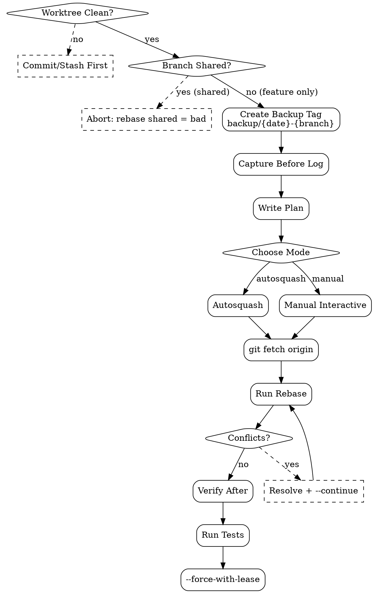

# Rebase Strategy

Cleanup git history sebelum PR. **Two modes**:
1. **Autosquash** (mechanical) — pakai `fixup!` / `squash!` commit markers; rebase auto-orders + squashes
2. **Manual interactive** — restructure dengan `git rebase -i`: pick/squash/reword/drop/edit/reorder

Plus playbook untuk handle conflict yang muncul saat rebase.

<HARD-GATE>
JANGAN rebase shared branches (main, develop, release/*) — cuma rebase feature branch sendiri.
JANGAN rebase commits yang sudah di-push + di-share dengan tim — bikin mereka harus force-pull.
JANGAN drop commits yang punya unique work tanpa user approval — silent data loss.
Setiap rebase WAJIB punya backup tag/branch dulu — `git tag backup/{date}-{branch}` sebelum rebase, untuk rescue.
Conflict resolution WAJIB review diff sebelum `--continue` — JANGAN auto-accept untuk "keep going".
Setelah rebase, force-push WAJIB pakai `--force-with-lease` (NEVER `--force`) — `--force` akan overwrite teammate work.
JANGAN rebase setelah PR approved — re-review burden, plus broken review threads.
JANGAN squash + drop di rebase yang sama — split jadi 2 rebase agar reviewable.
</HARD-GATE>

## When to use

- Pre-PR cleanup: squash fixup commits, drop WIPs, reword unclear messages
- Sync dengan main yang sudah maju: `git rebase origin/main`
- Restructure: reorder commits untuk narrative flow, split big commit jadi smaller
- Recover dari accidentally-committed-to-wrong-branch

## When NOT to use

- Setelah PR approved & ready-to-merge — squash via merge button, gak rebase manual
- Shared branches (main, develop) — gak boleh rebase, pakai merge
- Commits yang udah jadi audit trail penting (compliance, post-mortem) — keep history immutable

## Two modes

### Mode 1: Autosquash (default — mechanical, low-risk)

**Setup:** Saat membuat fixup commits, pakai marker:
- `git commit --fixup=<sha>` → creates `fixup! <original subject>`
- `git commit --squash=<sha>` → creates `squash! <original subject>`

**Execute:**
```bash
git rebase -i --autosquash origin/main
```

Git auto-reorders fixup commits to immediately follow target, marks them as `fixup` action. User sees pre-arranged todo list, saves & quits → done.

**Pros:**
- Deterministic — same input always same output
- No manual reorder typos
- CI/lint friendly

**Cons:**
- Cuma works untuk fixup pattern (commits author from start)
- Gak handle reordering yang non-fixup-related

### Mode 2: Manual Interactive (restructuring)

**Execute:**
```bash
git rebase -i origin/main
```

Editor opens dengan todo list:

```
pick a3f1b2c [add][dke_discount] scaffold module structure
pick 7c2e9d4 [add][dke_discount] add discount_line model
pick 9f4a1b8 fix typo in field name
pick 2b8c1f3 [add][dke_discount] add views
pick 4d7a9e1 wip update tests
```

User edits actions per line:
- `pick` (default) — keep commit as-is
- `reword` — keep commit, edit message
- `edit` — pause rebase to amend (e.g. split into smaller commits)
- `squash` — combine with previous, merge messages
- `fixup` — combine with previous, drop this message
- `drop` — remove commit entirely
- `reorder` — drag lines to new position

**Save & quit** → rebase executes per todo.

## Required Inputs

- **Worktree path** — dari `git-worktree`
- **Base branch** — usually `origin/main` atau `main`
- **Mode**: `autosquash` (default) atau `manual`

## Output

`outputs/rebase/{date}-{branch}/`:
- `plan.md` — pre-rebase plan + backup tag
- `before.log` — `git log --oneline` before
- `after.log` — `git log --oneline` after
- `conflicts/` — kalau ada conflicts, store resolution notes

## Checklist

You MUST create a TodoWrite task for each item and complete them in order:

### Pre-rebase

1. **Verify Worktree Clean** — uncommitted changes? STOP, commit/stash first
2. **Verify Branch Not Shared** — `git config branch.<branch>.remote` — if remote tracking, check who else pushed
3. **Create Backup Tag** — `git tag backup/{date}-{branch}` for rescue
4. **Capture Before Log** — `git log --oneline origin/main..HEAD > before.log`
5. **Plan Document** — what changes will the rebase make

### Execution

6. **Choose Mode** — autosquash (mechanical) atau manual (restructuring)
7. **Sync Base** — `git fetch origin` to ensure base is up-to-date
8. **Run Rebase** — `git rebase -i [--autosquash] origin/main`
9. **Handle Conflicts** (kalau ada) — per-conflict review, resolve, `--continue`
10. **Verify After** — `git log --oneline` matches plan; `git status` clean

### Post-rebase

11. **Run Tests** — verify rebase didn't break anything (rebase can introduce subtle bugs at merge boundaries)
12. **Force-push (kalau perlu)** — `git push --force-with-lease` (NEVER `--force`)

## Process Flow



## Detailed Instructions

### Step 1 — Verify Worktree Clean

```bash
DIRTY=$(git status --porcelain | head -1)
[ -n "$DIRTY" ] && { echo "ERROR: uncommitted changes; commit or stash first"; exit 1; }
```

### Step 2 — Verify Not Shared

Check if branch is push-tracked dan ada commits dari teammate yang gak kamu punya:

```bash
git fetch origin "$BRANCH" 2>/dev/null || true
LOCAL_HEAD=$(git rev-parse HEAD)
REMOTE_HEAD=$(git rev-parse "origin/$BRANCH" 2>/dev/null) || REMOTE_HEAD=""

if [ -n "$REMOTE_HEAD" ] && [ "$LOCAL_HEAD" != "$REMOTE_HEAD" ]; then
  # Remote has commits we don't
  AHEAD=$(git rev-list --count "$LOCAL_HEAD".."$REMOTE_HEAD" 2>/dev/null || echo 0)
  if [ "$AHEAD" -gt 0 ]; then
    echo "⚠️  Remote has $AHEAD commits not in local. Pull first or rebase will lose them."
    exit 1
  fi
fi

# Check protected branches
case "$BRANCH" in
  main|master|develop|release/*|hotfix/release-*)
    echo "ERROR: refuse to rebase protected branch: $BRANCH"
    exit 1
    ;;
esac
```

### Step 3 — Create Backup Tag

```bash
TAG="backup/$(date +%Y%m%d-%H%M%S)-${BRANCH//\//-}"
git tag "$TAG"
echo "✓ Backup tag: $TAG"
echo "Rescue: git reset --hard $TAG"
```

### Step 4 — Capture Before Log

```bash
git log --oneline "origin/main..HEAD" > "$LOG_DIR/before.log"
```

### Step 6-7 — Choose Mode + Sync

```bash
git fetch origin

# Mode 1: autosquash
git rebase -i --autosquash origin/main

# Mode 2: manual
git rebase -i origin/main
```

### Step 9 — Conflict Resolution Playbook

When `git rebase` hits conflict:

```
CONFLICT (content): Merge conflict in models/discount_line.py
error: could not apply 7c2e9d4... [add][dke_discount] add discount_line model
```

Steps:

```bash
# 1. Inspect conflicted files
git status --short
# UU models/discount_line.py     ← conflict marker

# 2. Open file, find <<<<<<< / ======= / >>>>>>> markers
# Edit to resolve. Keep relevant code from BOTH branches.

# 3. Verify no leftover markers
grep -rn "<<<<<<< \|>>>>>>> \|^======="  | grep -v ".git/"

# 4. Run quick lint/syntax check on resolved file
# (per stack: pylint, eslint, etc.)

# 5. Mark resolved
git add models/discount_line.py

# 6. Continue rebase
git rebase --continue

# Or if stuck, abort:
git rebase --abort
# (returns to pre-rebase state; backup tag also available)
```

**Common conflict scenarios:**

| Scenario | Strategy |
|---|---|
| Same line edited differently | Keep the version that aligns with FSD §; verify with FSD |
| File renamed in main, modified in branch | Apply your modification to renamed file |
| File deleted in main, modified in branch | Restore needed; or accept deletion if work moved elsewhere |
| Merge commit in branch | Use `--rebase-merges` flag (rarely needed) |
| Same import added in both | Keep one (deterministic — alphabetical); verify no duplicate |

### Step 10 — Verify After

```bash
git log --oneline "origin/main..HEAD" > "$LOG_DIR/after.log"
diff "$LOG_DIR/before.log" "$LOG_DIR/after.log"
git status --porcelain  # must be empty (clean)
```

Expected:
- Commit count maybe lower (squash/fixup)
- Subjects updated kalau reword
- All commit content preserved (no orphan changes)

### Step 11 — Run Tests

CRITICAL: rebase can introduce subtle bugs at merge boundaries (kalau base advanced + branch had related changes). Always:

```bash
# Per stack
npm test  # or pytest, odoo-bin --test-tags, etc.
```

If tests fail post-rebase that passed pre-rebase → conflict was resolved wrong. Inspect, fix, or `git reset --hard backup/...` and retry.

### Step 12 — Force-push (if needed)

```bash
# Only if branch was previously pushed
git push --force-with-lease origin "$BRANCH"
```

`--force-with-lease` checks remote hasn't changed since last fetch. Safer than `--force` which will overwrite teammate's commits without warning.

## Output Format

See `references/format.md` for plan + log schema.

## Inter-Agent Handoff

| Direction | Trigger | Skill / Tool |
|---|---|---|
| **SWE** ← `commit-strategy` | Commits authored | rebase-strategy cleans up before PR |
| **SWE** → `pr-description-writer` | History clean | PR ready to create |
| **SWE** → **EM** | Conflict suggests overlapping feature | task tag `coordination-needed` |
| **SWE** → self | Backup tag rescue | `git reset --hard backup/...` |

## Anti-Pattern

- ❌ Rebase shared branch (main, develop, release) — broken history for everyone
- ❌ `--force` (without `--with-lease`) — overwrites teammate work silently
- ❌ Skip backup tag — no rescue lifeline
- ❌ Skip post-rebase test — conflict resolution may have broken something
- ❌ Auto-accept conflicts dengan "use ours" / "use theirs" tanpa review — mainline drift
- ❌ Drop commits dengan unique work tanpa user approval — silent data loss
- ❌ Squash + drop di rebase yang sama — un-reviewable
- ❌ Rebase post-PR-approved — invalidates review, broken review threads
- ❌ Long-running rebase di shared worktree — blocks other agents
