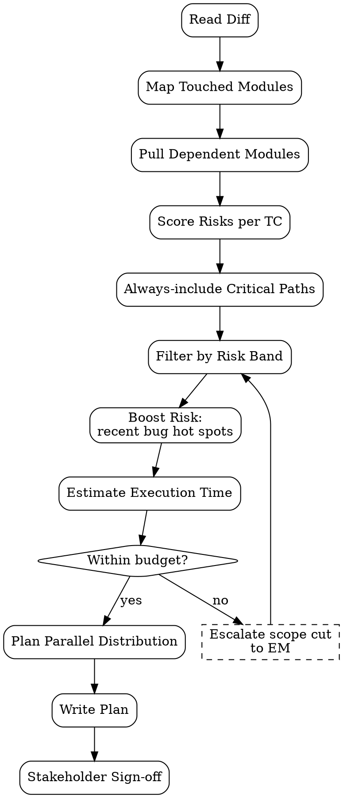

# Regression Test Planner

Plan regression scope untuk release pakai **risk-based test selection** — bukan "run everything" (mahal) bukan "run nothing" (risky). Output: scoped TC list yang justified.

<HARD-GATE>
Setiap regression plan WAJIB cite touched-modules dari diff — risk-based requires impact analysis input.
Setiap TC selected WAJIB punya rationale (impact link / historical defect / criticality tag).
Critical paths (login, checkout, payment, security) WAJIB always-included regardless of touched modules.
JANGAN exclude TC karena "lambat" — kalau critical path, run anyway atau parallel-distribute.
JANGAN run "all 500 TCs" tanpa filter — wasteful, signals no risk analysis done.
Time budget WAJIB explicit — kalau exec time > release window, escalate ke EM untuk parallel/scope cut.
Coverage proof WAJIB: % AC dari touched modules covered + % critical-path covered.
JANGAN sign-off plan tanpa stakeholder review (PM/EM) untuk major release.
</HARD-GATE>

## When to use

- Pre-release regression run scope
- Major refactor — verify no behavioral drift
- Hotfix — focused regression around fixed area
- Quarterly regression suite review (prune stale, add new)

## When NOT to use

- Single-TC re-run after bug fix — that's `test-execution` direct
- New feature initial test — that's `test-case-doc`
- Performance regression — separate skill (`performance-test-plan`)

## Risk Scoring Formula

```
risk_score = probability × impact

probability:
  1 = unlikely (stable module, no recent changes)
  3 = possible (touched in last 4 weeks)
  5 = likely (touched this release)
  
impact:
  1 = cosmetic
  3 = feature degraded, workaround
  5 = blocker, no workaround, data risk

priority bands:
  ≥15 → must include (P0)
  9-14 → should include (P1)
  4-8 → optional (P2)
  ≤3 → defer (P3)
```

## Required Inputs

- **Release ref** — version / sprint / branch
- **Diff** — `git diff main...release-branch --stat`
- **Test bank path** — `outputs/regression-bank/` atau external (TestRail/Zephyr ID)
- **Recent bugs** — last 60 days, for defect-density input
- **Time budget** — hours available for regression run

## Output

`outputs/regression-plans/{date}-{release}.md`:
1. Header (release, date, planner)
2. Impact analysis (touched modules + dependencies)
3. Risk-scored TC list
4. Scope boundary (in / out)
5. Execution plan (sequence, parallel groups, time estimate)
6. Sign-off checklist

## Checklist

You MUST create a TodoWrite task for each item and complete them in order:

1. **Read Diff** — `git diff main...release --stat --name-only`
2. **Map Touched → Modules** — which functional areas
3. **Pull Dependent Modules** — reverse dependency graph
4. **Score Risks per TC** — probability × impact
5. **Always-Include Critical Paths** — login, payment, security, data integrity
6. **Filter by Risk Band** — P0/P1 mandatory, P2 optional
7. **Pull Recent Bug Hot Spots** — modules with defects last 60 days → boost risk
8. **Estimate Execution Time** — sum per-TC duration (avg from bank)
9. **Plan Parallel Distribution** — group independent TCs for concurrent run
10. **Write Plan** — Markdown to `outputs/regression-plans/`
11. **Stakeholder Sign-off** — PM/EM review (task tag `regression-plan-review`)

## Process Flow



## Risk Matrix Example

| TC ID | Module | Touched? | P | I | Score | Band | Include? | Rationale |
|---|---|---|---|---|---|---|---|---|
| TC-AUTH-001 | auth | no | 1 | 5 | 5 | P2 | YES | Critical path always-include |
| TC-DSC-003 | sale_discount | yes | 5 | 5 | 25 | P0 | YES | Main change area + AC blocker |
| TC-INV-042 | stock | yes (dep) | 3 | 5 | 15 | P0 | YES | Sale depends on stock; impact severe |
| TC-RPT-018 | reports | no | 1 | 3 | 3 | P3 | DEFER | Untouched, low impact |
| TC-PAY-007 | payment | no | 1 | 5 | 5 | P2 | YES | Critical path |
| TC-MAIL-002 | mail | yes (indirect) | 3 | 3 | 9 | P1 | YES | Touched via mixin |
| TC-UI-099 | web | yes | 3 | 1 | 3 | P3 | DEFER | Cosmetic only |

## Plan Template

```markdown
# Regression Plan — Release ${VERSION}

**Release date:** ${DATE}
**Planner:** ${QA_AGENT}
**Time budget:** 4 hours

## Impact analysis

**Touched modules** (from `git diff main...release-${VERSION} --stat`):
- sale_discount (heavy, 12 files)
- sale (light, 2 files)
- stock (1 file)

**Dependent modules** (reverse dep): mail (mixin used), website_sale (extends sale)

**Recent bug hot spots** (last 60 days):
- sale_discount: 3 bugs (boost P)
- stock: 1 bug

## Scope

**In scope** (42 TCs):
- All P0 (15 TCs) — touched + critical
- All P1 (18 TCs) — should-include
- Critical paths (9 TCs) — auth, payment

**Out of scope** (deferred):
- 78 TCs in P2/P3 — untouched, low impact, cosmetic

**Justification for exclusions:**
- TC-RPT-* (12 TCs): reports module untouched, no dependency
- TC-UI-99..150 (38 TCs): cosmetic-only, manual visual diff sufficient
- TC-LEGACY-* (28 TCs): deprecated module, slated for removal next quarter

## Execution plan

| Phase | TCs | Parallel groups | Estimated time |
|---|---|---|---|
| 1. Critical path smoke | 9 | 1 (sequential) | 30 min |
| 2. P0 functional | 15 | 3 (parallel by area) | 60 min |
| 3. P1 regression | 18 | 3 (parallel) | 90 min |
| 4. Buffer + bug verify | — | — | 60 min |
| **Total** | 42 | — | **4 hours** |

## Sign-off checklist

- [ ] PM reviewed scope (Y/N)
- [ ] EM approved exclusions (Y/N)
- [ ] Time budget realistic vs release window
- [ ] Critical paths all-included
- [ ] Hot-spot modules boosted in risk
- [ ] Parallel groups have no shared state

## Coverage proof

- AC coverage from touched modules: 23/23 (100%) ✓
- Critical-path coverage: 9/9 (100%) ✓
- Total TC selected: 42 / 120 in bank (35%)

## Post-run dispatch

- Pass → release green-light → PM
- Fail → bug-report dispatch → EM triage
- Flaky → stabilize task → SWE before next release
```

## Anti-Pattern

- ❌ "Run all 500 TCs" — no risk analysis, time-wasteful
- ❌ "Run only 10 TCs" — unjustified, miss critical paths
- ❌ Skip dependency analysis — invisible blast radius
- ❌ Ignore hot spots — repeat-defect modules need extra coverage
- ❌ No time estimate — runs into release window blocker
- ❌ No stakeholder sign-off — solo decision on release readiness
- ❌ Exclude TC karena slow — parallelize instead
- ❌ Critical path opt-out — never acceptable

## Inter-Agent Handoff

| Direction | Trigger | Skill / Tool |
|---|---|---|
| **QA** ← **EM** | Release branch frozen | author regression plan |
| **QA** → **PM/EM** | Plan drafted | sign-off review |
| **QA** → `test-execution` | Plan signed off | execute scoped suite |
| **QA** → `bug-report` | Failures | per-fail dispatch |
| **QA** → `pipeline-gate` | All pass | release green-light gate |
