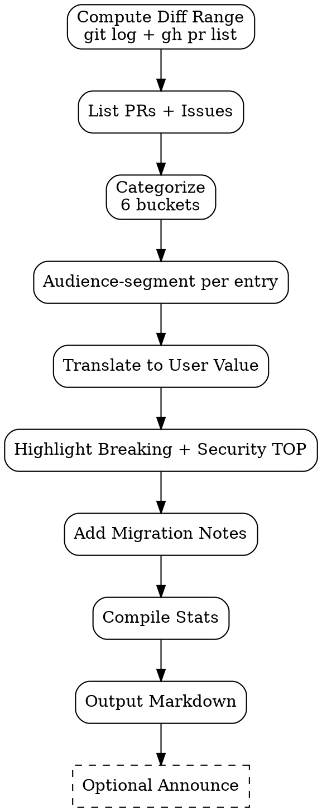

# Release Notes Writer

Compile **audience-segmented release notes** dari merged PRs / closed issues. Tujuan: stakeholder tahu "what's new" tanpa baca git log; bukan dump commit messages.

<HARD-GATE>
Setiap entry WAJIB ditulis dari user perspective ("You can now...") bukan dev perspective ("Refactored X").
Setiap release notes WAJIB segmented per audience (End-user / Admin / Developer) — relevance.
Categorization WAJIB strict: Added / Improved / Fixed / Deprecated / Security / Breaking.
Breaking changes WAJIB highlighted ATAS — gak boleh hidden di middle.
Security fixes WAJIB di-call-out separately + CVE link kalau ada.
JANGAN copy commit subject langsung — translate ke user value.
JANGAN skip "thank you" untuk external contributors (kalau open-source).
Versioning WAJIB semver-compatible: major.minor.patch — breaking → major bump.
Migration notes WAJIB ada untuk breaking changes.
</HARD-GATE>

## When to use

- Pre-release: gather notes for current sprint/version
- Hotfix release — minimal notes (1-2 fixes)
- Quarterly summary — aggregate multiple releases
- Major version bump — emphasize breaking changes + migration

## When NOT to use

- Internal-only release (no external stakeholders) — commit log + PR list cukup
- Pre-alpha / experimental — features may break, premature notes

## Required Inputs

- **Previous version tag** — `git tag` ref (e.g., `v1.4.0`)
- **Current ref** — `main` HEAD or release branch
- **Issue/PR source** — GitHub / GitLab / Jira API access
- **Audience scope** — end-user / admin / developer
- **Optional:** marketing tone hint (formal / friendly)

## Output

`outputs/{date}-release-notes-v{version}.md` — Markdown publishable.
Optional: post to Slack via `notify.sh`, email digest via `email-notif.sh`.

## Release Notes Template

```markdown
# Release v{VERSION} — {Release Name / Date}

> _One-paragraph executive summary: highlight 1-3 headline features + breaking changes._

---

## ⚠️ Breaking changes

> If you upgrade from v{PREV}, READ THIS FIRST.

- **API endpoint `/v1/orders` removed** — migrate to `/v2/orders`. See [migration guide](./migration-v2.md).
- **Default permission group renamed** — `sales_user` → `sales.user`. Re-assign in admin panel.

## 🔒 Security

- **CVE-2026-1234** — XSS in order notes field. Update strongly recommended. Affected: v1.0–v1.4.x.
- Updated dependencies: `lodash@4.17.21` (CVE-2024-XXXX).

## ✨ Added

### For end-users
- **Discount lines on sale orders** — apply percentage or fixed-amount discounts directly on order lines. [Guide →](./discount-line.md)
- **Bulk export to Excel** — select multiple orders → Export action.

### For admins
- **Configurable approval workflow** — set auto-approve thresholds per permission group.

### For developers
- **New webhook event** — `sale.order.confirmed` fires after state transition. [API doc →](./webhook.md)

## 🔧 Improved

- Faster order list rendering (~40% faster for >500 orders).
- Better error messages when discount > 100%.
- Mobile responsive: order detail page now usable on screens ≥320px.

## 🐛 Fixed

- Discount line negative amount not reflected in PDF report. (BUG-89)
- Cancel action sometimes left order in inconsistent state. (BUG-142)
- Email notification skipped for some confirmed orders. (BUG-156)

## 🚫 Deprecated

- **Field `order.legacy_discount_pct`** — use `order.discount_lines` (new). Legacy field will be removed in v2.0 (target Q4 2026).

## 📝 Migration notes

If you're on v{PREV}, follow these steps:
1. Backup database
2. Reassign renamed permission groups (script: `migrate-perms.py`)
3. Update API clients to `/v2/orders`
4. Run smoke test on staging

[Full migration guide →](./migration-v{VERSION}.md)

## 🙏 Contributors

Thanks to {names / handles} for {contribution}.

## 📊 Stats

- 47 PRs merged
- 23 issues closed
- 12 contributors

[Full diff →](https://github.com/org/repo/compare/v{PREV}...v{VERSION})
```

## Checklist

You MUST create a TodoWrite task for each item and complete them in order:

1. **Compute Diff Range** — `git log v{PREV}..HEAD --oneline`
2. **List Merged PRs** — `gh pr list --state=merged --search "merged:>{prev_release_date}"`
3. **List Closed Issues** — `gh issue list --state=closed --search "closed:>{prev_release_date}"`
4. **Categorize** — Added / Improved / Fixed / Deprecated / Security / Breaking
5. **Audience-segment** — end-user / admin / developer per entry
6. **Translate to User Value** — "You can now..." not "Refactored X"
7. **Highlight Breaking + Security** — top of doc
8. **Add Migration Notes** — for breaking changes
9. **Compile Stats** — PR count, contributor list, links
10. **Output Markdown** — `outputs/{date}-release-notes-v{version}.md`
11. **Optional Announce** — `notify.sh` Slack / email digest

## Process Flow



## Categorization Rules

| Category | Use when |
|---|---|
| **Added** | New feature visible to user |
| **Improved** | Existing feature better (perf, UX, error msg) |
| **Fixed** | Bug closed |
| **Deprecated** | Marked for future removal — give timeline |
| **Removed** | Already removed (was deprecated, now gone) |
| **Security** | CVE / vuln fix — separate section, prominent |
| **Breaking** | API/contract change requiring user action |

## Audience Tagging

PR labels recommended:
- `audience:end-user`
- `audience:admin`
- `audience:developer`
- `audience:internal` (excluded from public notes)

## Anti-Pattern

- ❌ Copy commit subject ("fix: handle edge case in OrderLine") — dev-speak
- ❌ Lump everything in single list — no categorization
- ❌ Hide breaking changes mid-doc — surprise stakeholder
- ❌ Skip migration notes — breaking change without escape route
- ❌ "Various improvements" generic — non-specific
- ❌ Marketing fluff ("our amazing new...") — stakeholder loses signal
- ❌ Skip security section — compliance risk
- ❌ No diff link — can't audit

## Inter-Agent Handoff

| Direction | Trigger | Skill / Tool |
|---|---|---|
| **Doc** ← **EM** | Release branch frozen | author release notes |
| **Doc** ← merged PR labels | Audience tags applied | auto-segment |
| **Doc** → **PM** | Notes drafted | review tone + completeness |
| **Doc** → external publishing | Approved | KB / customer portal / email digest |
| **Doc** → `manual-book` | Major release | include change log section |
