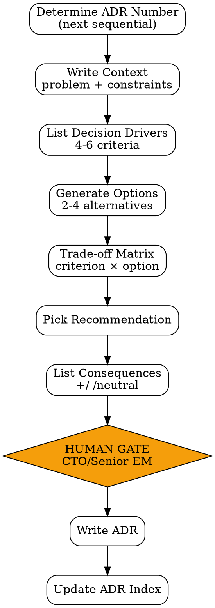

# Tech Stack Advisor

Decision-making skill untuk technology choice. Output adalah **Architecture Decision Record (ADR)** — capture konteks, alternatif, dan rationale supaya keputusan teknis audit-able.

<HARD-GATE>
Setiap rekomendasi WAJIB list 2-4 alternative options — gak boleh single-option ADR.
Setiap option WAJIB di-score di trade-off matrix dengan dimensi terstandard.
Recommendation WAJIB include "consequences" — apa yang kita accept dengan pilihan ini.
ADR yang touches data/security/cost > $X/month WAJIB CTO sign-off.
ADR pernah disetujui TIDAK di-edit — kalau berubah, buat ADR baru "Supersedes ADR-NNN".
Setiap ADR punya sequential number (ADR-001, ADR-002, ...) di filename.
</HARD-GATE>

## When to use

- New service / module — pilih framework, db, language
- Bottleneck identified — evaluate alternative (caching, queue, db migration)
- Vendor decision — payment gateway, observability, AI provider
- Re-platform consideration — pakai tech baru atau stick
- Approach decision — server-rendered vs SPA, monolith vs micro, sync vs async

## When NOT to use

- Trivial library choice (e.g. "axios vs fetch") — gak butuh ADR
- Settled team conventions (already in style guide / ADR existing)
- Spike exploration phase — wait sampai punya enough info untuk decide

## Output: ADR (Architecture Decision Record)

Standard 5-section format (MADR-style):

1. **Context** — what's the problem, what constraints exist
2. **Decision Drivers** — list of criteria yang matter
3. **Considered Options** — 2-4 alternatives
4. **Decision Outcome** — chosen option + rationale
5. **Consequences** — what we accept (positive + negative + neutral)

Filename: `docs/adrs/ADR-{NNN}-{slug}.md` (NNN = sequential number).

## Checklist

You MUST create a TodoWrite task for each item and complete them in order:

1. **Determine ADR Number** — check `docs/adrs/` for next sequential
2. **Write Context** — problem statement + constraints (link to feasibility brief / FSD)
3. **List Decision Drivers** — 4-6 criteria per problem
4. **Generate Options** — 2-4 alternatives (include "do nothing" kalau applicable)
5. **Build Trade-off Matrix** — per criterion × per option score
6. **Pick Recommendation** — best fit per drivers, rationale 3 bullets
7. **List Consequences** — positive, negative, neutral (mandate ≥1 negative)
8. **[HUMAN GATE — CTO/Senior EM]** — sign-off untuk impactful ADR
9. **Output Document** — `docs/adrs/ADR-{NNN}-{slug}.md`
10. **Update ADR Index** — `docs/adrs/README.md` index of all ADRs

## Process Flow



## Detailed Instructions

### Step 1 — Determine ADR Number

```bash
ls docs/adrs/ | grep -oE 'ADR-[0-9]+' | sort -V | tail -1
# Example output: ADR-007
# → next is ADR-008
```

ADR numbers sequential, never reused.

### Step 2 — Write Context

Context section answers "why are we deciding this now?". 1-2 paragraphs.

Cover:
- **Problem**: spesifik bottleneck / capability needed
- **Constraints**: budget, timeline, team expertise, existing infra commitments
- **Triggering signal**: incident, performance degradation, new requirement, etc.

Link to relevant docs (feasibility brief, FSD, post-mortem).

### Step 3 — List Decision Drivers

4-6 criteria yang matter untuk THIS decision. Generic-fit-everything bukan deciding.

Examples per problem type:

| Problem | Decision drivers |
|---|---|
| New web framework | Team expertise, ecosystem maturity, performance, learning curve, hiring pool |
| Database choice | Read/write pattern, scale needs, ACID requirement, ops cost, team familiarity |
| Caching layer | Latency target, eviction policy needs, persistence, consistency model |
| Message queue | Throughput, ordering guarantee, delivery semantic, ops complexity |
| Payment vendor | Local market support, fee, compliance, integration ease, settlement speed |

### Step 4 — Generate Options

2-4 alternatives. Quality > quantity.

Include:
- **Status quo / Do nothing** — kalau applicable (often a valid baseline)
- **Mainstream choice** — what most teams pick
- **Alternative** — different trade-off curve
- **Build in-house** — kalau buy-vs-build relevant

Don't pad list dengan obviously-wrong options just for length.

### Step 5 — Build Trade-off Matrix

Per criterion × per option, score on 1-5 scale (5=best fit).

```
| Criterion              | Option A: Postgres | Option B: MongoDB | Option C: DynamoDB |
|------------------------|---|---|---|
| Read/write pattern fit | 5 | 3 | 4 |
| ACID requirement       | 5 | 2 | 4 |
| Team familiarity       | 5 | 3 | 2 |
| Ops cost               | 4 | 3 | 5 |
| Scale ceiling          | 3 | 5 | 5 |
| Backup/recovery        | 5 | 4 | 5 |
| **Total**              | **27** | **20** | **25** |
```

Score rationale wajib di-sertakan (1 sentence per cell or as note below table).

### Step 6 — Pick Recommendation

Highest-total option default, BUT human judgment can override jika:
- Strategic factor outweighs total (e.g. "ACID is non-negotiable, Mongo's ACID = 2 disqualifies")
- Risk concentration (top option dependent on single vendor)
- Long-term trend (option B getting better, A stagnant)

Rationale: 3 bullets.

### Step 7 — List Consequences

3 categories, mandate ≥1 in each (especially **negative**):

**Positive**:
- _[what we gain]_

**Negative** (mandatory ≥1):
- _[what we lose / what we accept]_
- e.g. "Higher ops complexity for backup/restore"

**Neutral** (changes that aren't clearly +/-):
- _[]_

### Step 8 — [HUMAN GATE — CTO/Senior EM]

Trigger sign-off kalau ADR touches:
- Data layer (DB choice, schema strategy)
- Security boundary (auth, encryption, secrets)
- Cost > $X/month yang ongoing (default: $500/month)
- Lock-in (vendor, framework yang sulit migrate)

```bash
./scripts/notify.sh "ADR-${NNN} ${slug} draft. Sign-off needed: CTO. Decision needed by: [date]."
```

Untuk ADR ringan (library choice tactical), peer review 1 senior SWE cukup.

### Step 9 — Output Document

```bash
./scripts/adr.sh --number 008 --slug "use-postgres-for-orders" --status proposed
```

### Step 10 — Update ADR Index

`docs/adrs/README.md`:

```markdown
# ADR Index

| Number | Title | Status | Date |
|---|---|---|---|
| ADR-001 | Use React for frontend | accepted | 2025-11-10 |
| ADR-007 | Use Mixpanel for analytics | superseded by ADR-012 | 2026-02-15 |
| ADR-008 | Use Postgres for orders | accepted | 2026-05-02 |
```

Status values: `proposed | accepted | rejected | deprecated | superseded by ADR-NNN`.

## Output Format

See `references/adr-template.md` for full ADR shape.

## Inter-Agent Handoff

| Direction | Trigger | Skill / Tool |
|---|---|---|
| **EM** → **EM** | Feeds into FSD | `fsd-generator` references ADR for stack decision |
| **EM** → **SWE** | After ADR accepted | SWE implements per ADR |
| **EM** → **Biz Analyst** | If cost > threshold | Biz Analyst reviews unit economics impact |
| **EM** ↔ **EM** | Update | New ADR "Supersedes ADR-NNN" — never edit accepted ADRs |

## Anti-Pattern

- ❌ Single-option ADR — gak ada decision, sekedar dokumentasi
- ❌ Total score override tanpa rationale eksplisit — non-transparent
- ❌ "Consequences: positive only" — semua keputusan punya trade-off, list yang negative
- ❌ Edit ADR yang sudah accepted — bikin ADR baru yang supersedes
- ❌ ADR sequential numbering broken — gunakan `ls` pattern check
- ❌ Decision drivers generic ("scalable, fast, cheap") — specific ke problem
- ❌ Skip CTO gate untuk ADR data/security/cost — risk audit fail
