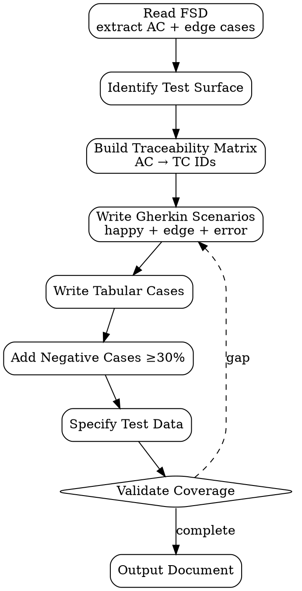

# Test Case Document Writer

Generate **test case document** dari FSD/PRD untuk feature baru — Gherkin scenarios + Tabular cases. Tujuan: setiap acceptance criterion ada test case kerangka, tidak ada gap.

<HARD-GATE>
Setiap acceptance criterion (AC) di FSD WAJIB punya minimal 1 test case — coverage gap = blocker.
Setiap test case WAJIB include: ID, Precondition, Steps, Expected, Priority, Category (functional/regression/edge/error).
Edge cases & error paths WAJIB explicit — JANGAN cuma happy path.
Test data WAJIB declared (fixture path atau inline) — gak boleh "use sample data" generic.
Negative test cases WAJIB ≥30% dari total cases — defensive coverage.
JANGAN test case tanpa Expected result — invalidates execution.
JANGAN duplikasi test case dengan existing regression suite — link instead.
Traceability matrix (AC → test case ID) WAJIB di-output bersama document.
</HARD-GATE>

## When to use

- Feature baru selesai FSD review — sebelum implementation start (test-first)
- Bug fix — write reproducing test case sebelum fix
- Regression suite expansion — capture coverage gap per release
- Pre-UAT — generate test scope untuk stakeholder sign-off

## When NOT to use

- Performance / load test — itu separate skill (`performance-test-plan`)
- Security pentest — separate domain
- Exploratory test session — gak butuh structured doc upfront
- Visual regression — itu screenshot diff tooling, beda workflow

## Required Inputs

- **FSD path** — `outputs/{date}-fsd-{feature}.md` (acceptance criteria source)
- **Stack** — Odoo / React / Vue / Express / FastAPI (untuk pattern)
- **Optional:** existing test suite path (untuk avoid duplication)

## Output

`outputs/{date}-test-cases-{feature}.md` — structured doc dengan:
1. Header (feature, FSD link, date, author)
2. Traceability matrix (AC → TC IDs)
3. Gherkin scenarios (high-level BDD)
4. Tabular cases (detailed steps)
5. Test data appendix

## Checklist

You MUST create a TodoWrite task for each item and complete them in order:

1. **Read FSD** — extract acceptance criteria + edge cases section
2. **Identify Test Surface** — flows, screens, API endpoints, data variations
3. **Build Traceability Matrix** — AC ID → expected TC IDs (1:N OK)
4. **Write Gherkin Scenarios** — happy + edge + error per AC
5. **Write Tabular Cases** — detail steps per scenario (1 Gherkin → N tabular)
6. **Add Negative Cases** — invalid input, boundary, auth fail, network error
7. **Specify Test Data** — fixtures path atau inline JSON/SQL
8. **Validate Coverage** — every AC has ≥1 TC, all TCs have Expected
9. **Output Document** — write to `outputs/`

## Process Flow



## Test Case Template (Gherkin)

```gherkin
Feature: Discount Line on Sale Order
  As a sales user
  I want to add discount lines to sale orders
  So that I can offer promotions transparently

  Background:
    Given a sale order in draft state
    And user has "Sales / User" group

  @happy @priority:high
  Scenario: Add 10% discount to existing line
    Given the order has 1 line with price_unit 1000
    When user adds a discount line "PROMO10" with percent 10
    Then the order total decreases by 100
    And the discount line is visible with negative amount -100

  @edge @priority:medium
  Scenario: Discount > 100% rejected
    Given the order has 1 line
    When user attempts to add discount with percent 150
    Then a validation error "Discount cannot exceed 100%" is shown
    And the order total remains unchanged

  @error @priority:high
  Scenario: Discount on confirmed order rejected
    Given the order is in "sale" state
    When user attempts to add a discount line
    Then the action is blocked with "Cannot modify confirmed order"
```

## Test Case Template (Tabular)

| ID | Title | Precondition | Steps | Expected | Priority | Category | AC Ref |
|---|---|---|---|---|---|---|---|
| TC-DSC-001 | Add 10% discount happy path | SO draft, 1 line @1000 | 1. Open SO<br>2. Add discount line<br>3. Set percent=10<br>4. Save | Total: 900<br>Discount line shown -100 | High | Functional | AC-DSC-1 |
| TC-DSC-002 | Discount 150% rejected | SO draft | 1. Add discount<br>2. Percent=150<br>3. Save | ValidationError shown | Medium | Edge | AC-DSC-3 |
| TC-DSC-003 | Discount on confirmed SO blocked | SO state=sale | 1. Open SO<br>2. Add discount line | "Cannot modify confirmed order" | High | Error | AC-DSC-4 |
| TC-DSC-004 | Discount empty value | SO draft | 1. Add discount<br>2. Leave percent blank<br>3. Save | Required field error | Low | Negative | AC-DSC-2 |
| TC-DSC-005 | Discount negative value | SO draft | 1. Add discount<br>2. Percent=-5<br>3. Save | "Discount must be ≥ 0" | Medium | Negative | AC-DSC-3 |

## Traceability Matrix

| AC ID | AC Description | TC IDs |
|---|---|---|
| AC-DSC-1 | User can add discount line as percent | TC-DSC-001 |
| AC-DSC-2 | Discount field required | TC-DSC-004 |
| AC-DSC-3 | Discount range [0, 100] | TC-DSC-002, TC-DSC-005 |
| AC-DSC-4 | Confirmed orders immutable | TC-DSC-003 |

## Stack-specific Notes

| Stack | Test framework hint | Categories priority |
|---|---|---|
| Odoo | TransactionCase (unit) + tour (E2E view) | Functional + business rule + access right |
| React | Vitest + RTL (component) + Playwright (E2E) | Functional + accessibility + state |
| Vue | Vitest + Vue Test Utils + Cypress | Same as React |
| Express | Vitest + supertest (API contract) | Contract + auth + edge |
| FastAPI | pytest + httpx | Contract + auth + edge |

## Anti-Pattern

- ❌ Test case "verify it works" — non-specific Expected
- ❌ Cuma happy path, skip edge — lulus QA tapi prod break
- ❌ Test data "use real DB" — non-reproducible
- ❌ Skip traceability matrix — gak audit-able
- ❌ Duplikasi dengan existing TC tanpa link — bloat
- ❌ Single TC covering 5 AC — hard to fail isolation
- ❌ Pre-condition implicit ("user logged in") — assumption gap
- ❌ Steps ambiguous ("test the form") — non-executable

## Inter-Agent Handoff

| Direction | Trigger | Skill / Tool |
|---|---|---|
| **QA** ← **EM** | FSD ready | author test-case-doc |
| **QA** → **SWE** | TC drafted | hand off as test contract reference |
| **QA** → `test-execution` | TC reviewed + signed off | execute against build |
| **QA** → `regression-test-planner` | Major feature done | promote selected TC ke regression suite |
