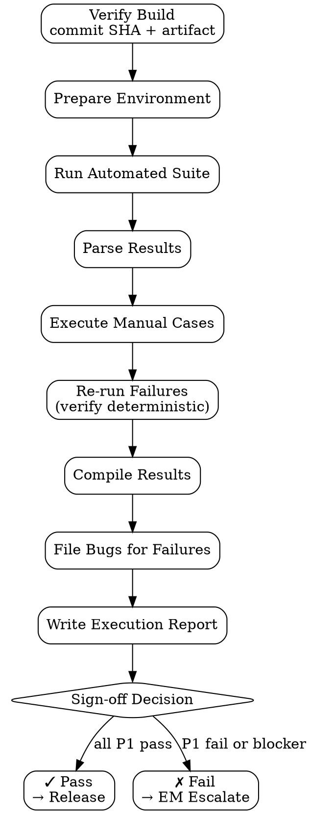

# Test Execution

Execute test cases (automated + manual) terhadap build/branch — capture pass/fail/blocked + evidence. Produce execution report yang reliable untuk go/no-go decision.

<HARD-GATE>
Setiap test run WAJIB tied ke commit SHA + build artifact + environment ID — non-reproducible run = invalid.
Failed cases WAJIB include: actual vs expected, screenshot/log, repro steps confirmed.
Blocked cases WAJIB declare blocker reason + dependency — gak boleh "skip" silent.
JANGAN re-run failed test berulang kali untuk "flake away" — flaky = file bug ke `bug-report` skill.
JANGAN cherry-pick subset cases tanpa justification — full suite atau scoped run dengan rationale.
JANGAN sign-off pass kalau ada P1/P2 fail — escalate ke EM/PM.
Coverage report WAJIB capture (line/branch + AC matrix completion).
Run history WAJIB persisted (audit trail) di `outputs/test-runs/{date}-{build}/`.
</HARD-GATE>

## When to use

- Pre-merge build verification (CI mode)
- Pre-release sign-off (full regression run)
- Hotfix verification (focused scope)
- Bug fix verification (re-run failing TC)

## When NOT to use

- Unit test writing — that's `unit-test-writer` (SWE skill)
- Performance/load test — separate skill
- Production monitoring — that's PA / observability domain

## Required Inputs

- **Test case doc** — `outputs/{date}-test-cases-{feature}.md`
- **Build/branch ref** — commit SHA atau tag
- **Environment** — staging URL / local DB / docker compose
- **Optional:** scoped run filter (priority/category tags)

## Output

`outputs/test-runs/{date}-{build}/`:
- `execution-report.md` — summary + per-case result
- `results.json` — machine-readable (untuk dashboard ingestion)
- `screenshots/` — failure evidence
- `logs/` — automated suite logs
- `coverage.json` — coverage from automated layer

## Checklist

You MUST create a TodoWrite task for each item and complete them in order:

1. **Verify Build** — pull commit SHA, build artifact ready
2. **Prepare Environment** — DB seed, config, fixtures loaded
3. **Run Automated Suite** — per stack command, capture exit code + output
4. **Parse Automated Results** — pass/fail/skipped per TC
5. **Execute Manual Cases** — follow steps, capture evidence
6. **Re-run Confirmed Failures** — verify deterministic vs flaky
7. **Compile Results** — total pass/fail/blocked + coverage %
8. **File Bugs for Failures** — dispatch `bug-report` skill per fail
9. **Write Execution Report** — Markdown summary
10. **Sign-off Decision** — pass/fail per gate criteria

## Process Flow



## Stack-specific Commands

### Odoo
```bash
# Per-module test
odoo-bin --test-tags=/sale_discount,sale_discount/at_install \
  -d test_db_${BUILD_SHA:0:7} \
  --stop-after-init \
  --log-handler=odoo.tests:INFO \
  > logs/odoo-test.log 2>&1

# Coverage
coverage run --source=addons/sale_discount odoo-bin --test-tags=/sale_discount ...
coverage json -o coverage.json
```

### React / Vue / Express
```bash
# Vitest with JUnit + coverage
npx vitest run --reporter=junit --reporter=verbose \
  --coverage --coverage.reporter=json \
  --outputFile.junit=results.xml \
  > logs/vitest.log 2>&1

# Playwright E2E
npx playwright test --reporter=junit,html \
  --output=test-runs/${BUILD_SHA}/playwright/
```

### FastAPI / Python
```bash
pytest \
  --junit-xml=results.xml \
  --cov \
  --cov-report=json:coverage.json \
  --cov-report=term-missing \
  -v > logs/pytest.log 2>&1
```

## Execution Report Template

```markdown
# Test Execution Report

**Build:** ${COMMIT_SHA}
**Branch:** ${BRANCH}
**Environment:** ${ENV} (${ENV_URL})
**Date:** ${DATE}
**Executed by:** ${QA_AGENT}
**Test case doc:** outputs/${DATE}-test-cases-${FEATURE}.md

## Summary

| Total | Pass | Fail | Blocked | Skipped |
|---|---|---|---|---|
| 47 | 42 | 3 | 1 | 1 |

**Pass rate:** 89% (42/47)
**Coverage:** 84% line / 76% branch
**P1 fail count:** 1 ← BLOCKER

## Failed cases

| TC ID | Title | Priority | Bug ref | Status |
|---|---|---|---|---|
| TC-DSC-003 | Discount on confirmed SO blocked | High | BUG-142 | Re-confirmed deterministic |
| TC-DSC-007 | Currency conversion edge | Medium | BUG-143 | Flaky? Re-ran 5x, 2 pass 3 fail |
| TC-DSC-015 | Multi-line discount aggregate | Low | BUG-144 | Cosmetic |

## Blocked cases

| TC ID | Reason |
|---|---|
| TC-DSC-020 | Depends on payment gateway test account (not provisioned) |

## Sign-off

- [ ] All P1 pass — **BLOCKED** (TC-DSC-003 fail)
- [x] All P2 pass
- [x] Coverage ≥80%
- [ ] No flaky tests unresolved — **PENDING** (TC-DSC-007)

**Decision:** FAIL — escalate to EM for TC-DSC-003 + investigate flake on TC-DSC-007.
```

## Anti-Pattern

- ❌ Re-run flaky test sampai pass — masking real issue
- ❌ Manual case "looks good" — no evidence captured
- ❌ Skip blocked cases tanpa note dependency
- ❌ Sign-off dengan P1 fail — production risk
- ❌ Run tanpa fresh DB — state pollution
- ❌ Coverage drop dari main tanpa flag — silent regression
- ❌ No commit SHA in report — non-reproducible

## Inter-Agent Handoff

| Direction | Trigger | Skill / Tool |
|---|---|---|
| **QA** ← `test-case-doc` | Cases drafted | execute |
| **QA** → `bug-report` | Test fail | dispatch per failure |
| **QA** → **EM** | P1 fail | escalate sign-off block |
| **QA** → **PM** | Sign-off pass | release green-light |
| **QA** → `regression-test-planner` | Run done | promote stable cases ke regression suite |
