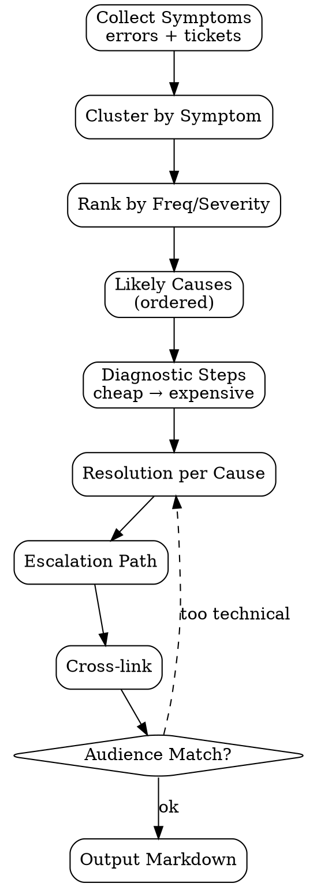

# Troubleshooting Guide Generator

Generate **symptom-driven troubleshooting guide** — bukan reference catalog. User start dari "what they see" (error message / behavior) → guided ke resolution. Decision-tree friendly.

<HARD-GATE>
Setiap entry WAJIB symptom-first heading (verbatim error atau observable behavior).
Setiap entry WAJIB struktur: Symptom → Likely Causes → Diagnostic Steps → Resolution → Escalate-If.
Resolution steps WAJIB executable oleh target audience (kalau end-user, no SQL queries).
Diagnostic steps WAJIB ordered cheapest → expensive (try X first sebelum Y).
Escalation path WAJIB explicit (kalau resolution gagal, lapor ke siapa).
JANGAN dump error code list tanpa context — itu reference, bukan trouble guide.
JANGAN propose "restart everything" sebagai first resolution — masking root cause.
Cross-link ke FAQ + user-guide WAJIB.
Each entry WAJIB cite source (ticket / bug ID) — provenance.
</HARD-GATE>

## When to use

- Post-release: harvest error tickets within 2-4 weeks
- New error message added → preempt with entry
- Migration/upgrade — anticipate transition errors
- On-call runbook for ops team

## When NOT to use

- API error reference — that's developer doc
- Bug-specific resolution that's already fixed — file as historical, don't promote
- Generic "troubleshooting" with no real symptoms documented — wait for signal

## Required Inputs

- **Module/feature scope** — what area
- **Error catalog** — known errors + messages
- **Support tickets** — last 60 days
- **Audience** — end-user vs admin vs ops (depth varies)

## Output

`outputs/{date}-troubleshooting-{module}.md` — Markdown.

## Entry Template

```markdown
## Symptom: "{Verbatim error message OR observable behavior}"

**Where you see this:** {Screen / action / log}

### Likely causes (most → least common)

1. {Cause A — brief}
2. {Cause B — brief}
3. {Cause C — rare}

### Diagnostic steps

> Try in order; stop when one resolves it.

1. **Check {fastest thing}** — {how}, expected: {what}
   - If shows X → cause A → resolution A
   - If shows Y → cause B → resolution B
2. **Check {next}** — {how}
3. **Check {expensive thing, last resort}** — {how}

### Resolution

**For Cause A:** {steps, ≤5}
**For Cause B:** {steps}
**For Cause C:** {steps}

### Escalate if

- Resolution fails after all causes tried
- Error persists across browser refresh + relogin
- Multiple users affected simultaneously

→ Open ticket with: error message verbatim, screenshot, user ID, time UTC, recent action history.

---
**Source:** ticket-#1142, BUG-89
**Audience:** End-user
**Last reviewed:** 2026-05-02
```

## Sample Entry

```markdown
## Symptom: "Cannot modify confirmed order"

**Where you see this:** Sale order page, when trying to edit lines after confirmation.

### Likely causes

1. Order is in `sale` or `done` state (most common)
2. Permission group lacks `Sale Manager` rights (rare)
3. Module override locking prematurely (very rare, contact admin)

### Diagnostic steps

1. **Check order state** — top-right badge.
   - If `Sale` or `Done` → Cause 1 → see Resolution A
   - If `Draft` → unexpected, see Cause 2
2. **Check your group** — Settings → Users → your account → Sales group.
   - If `User` only → Cause 2 → request Sales Manager from admin
   - If `Manager` → Cause 3 → Escalate

### Resolution

**For Cause 1 (most common):**
1. Action menu → Cancel
2. Action menu → Set to Quotation
3. Edit lines now (state back to Draft)
4. Confirm again

**For Cause 2:** Ask admin to grant `Sales Manager` group.

**For Cause 3:** Escalate to admin (likely custom module conflict).

### Escalate if

- Resolution A doesn't restore Draft state
- Cancel action itself fails
- Multiple confirmed orders affected simultaneously

→ Open ticket with: order ID, error timestamp UTC, screenshot of state badge.

---
**Source:** ticket-#1142, #1187, BUG-89
**Audience:** End-user (Sales)
**Last reviewed:** 2026-05-02
```

## Checklist

You MUST create a TodoWrite task for each item and complete them in order:

1. **Collect Errors / Symptoms** — error catalog + ticket harvest
2. **Cluster by Symptom** — same observable, different causes OK
3. **Rank by Frequency / Severity** — top-N first
4. **Identify Likely Causes per Symptom** — ordered most → least common
5. **Author Diagnostic Steps** — cheapest → expensive
6. **Author Resolution per Cause** — executable by audience
7. **Define Escalation Path** — when resolution fails, where to go
8. **Cross-link** — FAQ, user guide, related symptoms
9. **Validate Audience Match** — no SQL for end-user audience
10. **Output Markdown** — `outputs/{date}-troubleshooting-{slug}.md`
11. **Track Stale** — entries unreviewed > 90 days flagged

## Process Flow



## Anti-Pattern

- ❌ Reference-style catalog (alphabetical error codes) — user starts from symptom, not code
- ❌ Diagnostic step "check the logs" for end-user audience — wrong audience
- ❌ "Restart and try again" as primary resolution — masks root cause
- ❌ No escalation path — user stuck if resolution fails
- ❌ Single cause assumed (no "likely causes" list) — false confidence
- ❌ Diagnostic steps unordered — user tries expensive first, wastes time
- ❌ No source attribution — can't update when fix ships
- ❌ Mix audiences in single entry — confusing

## Inter-Agent Handoff

| Direction | Trigger | Skill / Tool |
|---|---|---|
| **Doc** ← support tickets API | Repeat error patterns | dispatch trouble entries |
| **Doc** ← `user-guide-generator` | Pitfalls section grows | extract trouble candidates |
| **Doc** ← **QA** | New error message added | preempt with entry |
| **Doc** → `faq-generator` | Symptom is question-shaped | also add as FAQ |
| **Doc** → KB publishing | Approved | ship |
