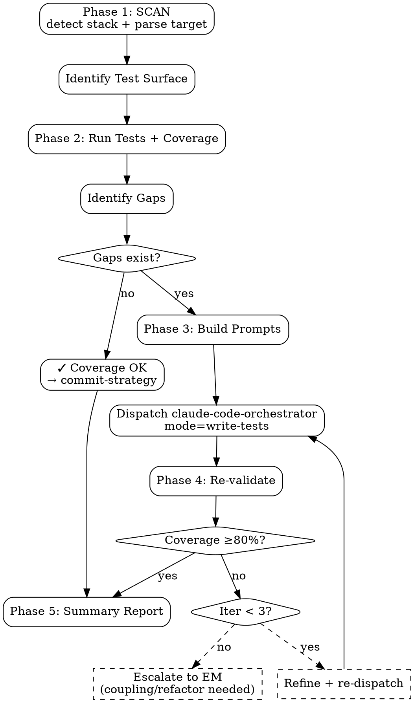

# Unit Test Writer (Validation-First)

**Validator + Dispatcher** untuk test coverage. Bukan generator langsung — agent **scan + identify gaps**, lalu **dispatch claude-code-orchestrator** dengan focused test-writing task. Tujuan: SWE agent jadi quality gate, claude-code jadi worker.

<HARD-GATE>
Setiap public function/method WAJIB minimum 1 happy-path + 1 edge-case test sebelum merge.
Coverage gate: ≥80% line coverage pada new code (delta from main), strict.
JANGAN write tests dengan FS tools langsung — dispatch ke claude-code-orchestrator.
JANGAN gate gaming (test trivial getters/setters untuk inflate %) — focus business logic.
JANGAN suppress tests dengan `xit`/`skip` tanpa ticket reference.
Coverage report WAJIB capture + log — auditable trail.
Tests WAJIB pass di CI sebelum merge — gak boleh push commit yang break tests.
Iteration limit 3x untuk dispatch — kalau coverage masih <80% setelah 3 dispatch, escalate ke EM (code mungkin too tightly coupled, butuh refactor).
</HARD-GATE>

## When to use

- Auto-chained dari `claude-code-orchestrator` setelah implementation work
- Backfill test coverage di legacy code
- Bug fix workflow: write failing test reproducing bug → fix → verify green
- Refactor verification: tests must still pass post-change
- Pre-PR gate: validate coverage threshold met

## When NOT to use

- E2E browser test — itu separate skill (Playwright/Cypress)
- Performance / load test — itu `performance-test-plan`
- Security/penetration test — separate domain
- Production debugging dengan customer data — needs human SRE

## Workflow (Option C: Validation-First)

```
SWE agent
   │
   ├─→ Phase 1: SCAN
   │     - Detect stack (project config + target path)
   │     - Identify target file(s) yang butuh test
   │     - Parse public functions/methods
   │     - Compile expected test surface
   │
   ├─→ Phase 2: VALIDATE
   │     - Run existing tests + coverage
   │     - Compare actual coverage vs expected surface
   │     - Identify gaps: untested functions, untested branches
   │
   ├─→ Phase 3: DISPATCH (kalau ada gaps)
   │     - Build focused test-writing prompt per gap
   │     - Dispatch claude-code-orchestrator dengan mode=write-tests
   │     - Specify target file + functions yang butuh coverage
   │
   ├─→ Phase 4: RE-VALIDATE
   │     - Run tests again, capture coverage
   │     - If still <80%, refine prompt + re-dispatch (max 3 iterations)
   │
   └─→ Phase 5: REPORT
         - Output coverage report di codework bundle
         - Hand off ke commit-strategy kalau pass
```

## Stack support

| Stack | Test framework | Coverage tool | Detection |
|---|---|---|---|
| Odoo 17/18 | `odoo.tests.common.TransactionCase` / `HttpCase` | `coverage.py` | `__manifest__.py` |
| React | Vitest + React Testing Library | Vitest built-in (V8) | `package.json` + react dep |
| Vue | Vitest + Vue Test Utils | Vitest built-in | `package.json` + vue dep |
| Node.js Express | Vitest + supertest | Vitest built-in | `package.json` + express dep |
| Python FastAPI | pytest + httpx | `pytest-cov` | `pyproject.toml` + fastapi dep |
| Other | per stack | per stack | repo inspection |

## Required Inputs

- **Target file** — path to source file yang butuh test coverage validation
- **Worktree path** — for stack detection + test execution
- **Optional:** existing test file path (kalau ada, di-extend; kalau tidak, di-create)
- **Optional:** specific functions to test (default: all untested public)

## Output

`outputs/codework/{date}-{feature}/test-validation/`:
- `coverage-before.json` — coverage report pre-dispatch
- `gaps.json` — identified missing test cases
- `dispatch-prompts.md` — prompts sent to claude
- `coverage-after.json` — coverage report post-dispatch
- `summary.md` — final report (pass/fail, % covered, untested fns list)

## Checklist

You MUST create a TodoWrite task for each item and complete them in order:

### Phase 1: SCAN

1. **Detect Stack** — config file walk + target path heuristic
2. **Parse Target File** — enumerate public functions/methods (signatures + decorators)
3. **Identify Test Surface** — what should be tested

### Phase 2: VALIDATE

4. **Run Existing Tests** — capture pass/fail, coverage report
5. **Compute Coverage Delta** — coverage on the target file specifically
6. **Identify Gaps** — untested functions, untested branches, missing edge cases

### Phase 3: DISPATCH (if gaps)

7. **Build Test-Writing Prompts** — per gap, focused prompt for claude
8. **Dispatch claude-code-orchestrator** — mode=write-tests, target=test file path

### Phase 4: RE-VALIDATE

9. **Run Tests + Coverage Again** — capture new state
10. **Compare** — coverage threshold met? all gaps closed?
11. **Iterate** — if not, refine prompt + re-dispatch (max 3 total)

### Phase 5: REPORT

12. **Compile Summary** — coverage %, tests added, remaining gaps (if any)
13. **Output Report** — `summary.md` di codework bundle
14. **Hand Off** — to commit-strategy kalau pass; escalate ke EM kalau >3 iter still failing

## Process Flow



## Detailed Instructions

### Phase 1: SCAN

```bash
# Stack detection
STACK=$(./scripts/detect-stack.sh --target "$TARGET")

# Parse public surface
case "$STACK" in
  odoo)
    # Public methods: not underscore-prefixed
    grep -E '^    def [a-z][a-z_]*\(' "$TARGET" | sed 's/.*def \([a-z_]*\).*/\1/'
    ;;
  react|vue|express|typescript)
    # Exported functions/components
    grep -E '^export (function|const|class) ' "$TARGET" | sed 's/.*export [a-z]* \([A-Za-z]*\).*/\1/'
    ;;
  fastapi|python)
    # Public functions in module
    grep -E '^def [a-z][a-z_]*\(' "$TARGET" | sed 's/def \([a-z_]*\).*/\1/'
    ;;
esac
```

Output: list of function names yang harus tertes.

### Phase 2: VALIDATE

```bash
# Run tests + coverage per stack
case "$STACK" in
  odoo)
    coverage run --source="$MODULE" --omit='*/migrations/*' \
      odoo-bin --test-tags=/"$MODULE" -d test_db --stop-after-init
    coverage report -m --skip-covered=false > coverage-before.txt
    coverage json -o coverage-before.json
    ;;
  react|vue|express)
    npx vitest run --coverage --coverage.reporter=json --coverage.reporter=text
    cp coverage/coverage-final.json coverage-before.json
    ;;
  fastapi)
    pytest --cov="$MODULE" --cov-report=json:coverage-before.json --cov-report=term-missing
    ;;
esac
```

### Phase 3: DISPATCH

Build prompt:

```
Target file: <TARGET>
Stack: <STACK>
Existing tests: <test file path>

Untested public functions (need tests):
- function_a (line 42): handles X case
- function_b (line 87): handles Y case

For each untested function, add tests covering:
1. Happy path (typical valid input)
2. Edge case (boundary value, empty, null where allowed)
3. Error path (invalid input, expected exception)

Additional coverage gaps from coverage report:
- file.py:101-115 not covered (inside function_a's else branch)
- file.py:142 not covered (rare error handler)

Write tests to: <test file path>

Stack conventions:
- Odoo: TransactionCase / HttpCase, descriptive test names test_X_when_Y_then_Z
- Vitest: describe(...){ it(...) }, vi.mock for boundaries
- pytest: test_X_when_Y_then_Z, fixtures via @pytest.fixture

After writing, run:
<test command + coverage command per stack>

Report which functions are now covered.
```

Dispatch:

```bash
./skills/claude-code-orchestrator/scripts/dispatch.sh \
  --worktree "$WORKTREE" \
  --fsd "$FSD" \
  --feature "${FEATURE}-tests" \
  --mode write-tests \
  --targets "$TEST_FILE_PATH"
```

### Phase 4: RE-VALIDATE

Same coverage commands as Phase 2, capture as `coverage-after.json`. Compare.

### Phase 5: REPORT

`summary.md`:

```markdown
# Unit Test Writer Summary

**Target:** <TARGET>
**Stack:** <STACK>
**Coverage before:** <X%>
**Coverage after:** <Y%>
**Threshold:** 80%
**Status:** PASS / FAIL

## Tests added

| Function | Cases | Coverage delta |
|---|---|---|
| function_a | happy + edge + error (3 tests) | 0% → 95% |
| function_b | happy + edge (2 tests) | 0% → 80% |

## Remaining gaps (if any)

- _[list]_

## Iterations

- Iteration 1: dispatched, partial success (3/5 functions covered)
- Iteration 2: refined prompt for remaining 2 functions, full success

## Sign-off

- [ ] SWE Self-Review — _Name, Date_
```

## Output Format

See `references/format.md` for canonical schema.

## Inter-Agent Handoff

| Direction | Trigger | Skill / Tool |
|---|---|---|
| **SWE** ← `claude-code-orchestrator` | Implementation complete, validate coverage | unit-test-writer scan + dispatch |
| **SWE** → `claude-code-orchestrator` | Gap detected | dispatch with write-tests mode |
| **SWE** → `commit-strategy` | Coverage met | tests committed alongside impl |
| **SWE** → **EM** | 3x iter still <80% | task tag `untestable-code` (likely needs refactor) |
| **SWE** ← bug fix workflow | Reproducing test before fix | dispatch claude with failing test prompt first |

## Anti-Pattern

- ❌ Write tests langsung dengan FS tools — bypasses claude expertise + skill workflow
- ❌ Coverage gaming (test trivial getters) untuk inflate %
- ❌ Skip coverage report capture — gak audit-able
- ❌ `xit`/`skip` tanpa ticket reference
- ❌ >3 dispatch iterations — pattern says code is hard-to-test, escalate
- ❌ Test private methods directly — refactor for testability
- ❌ Heavy mocking (>50% test body) — refactor target code
- ❌ Order-dependent tests — parallel-unsafe
- ❌ Generic test names (`test_1`, `test_create`)
- ❌ Coverage ≥80% globally tapi target file <80% — hide local weakness
