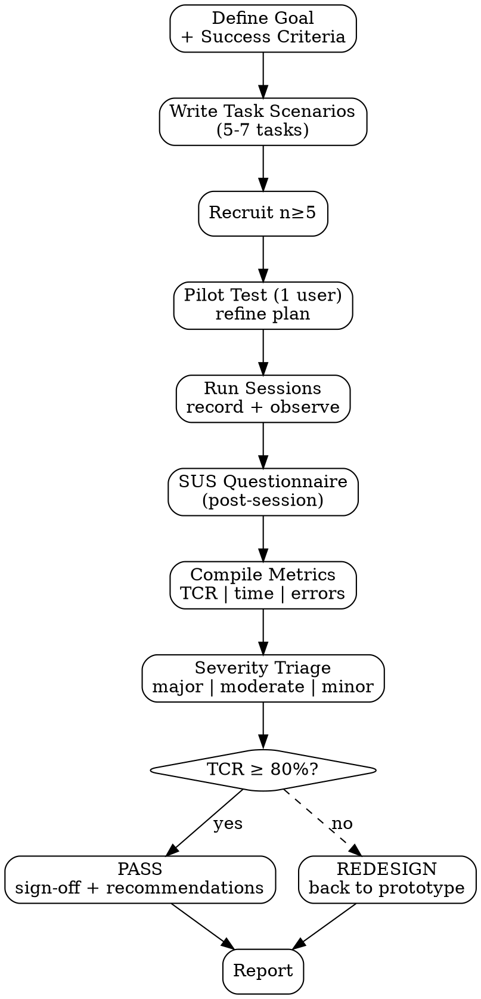

# Usability Testing

End-to-end usability testing — dari **planning** (scenarios, success criteria) → **execution** (moderated/unmoderated) → **scoring** (TCR, time-on-task, SUS). Tujuan: validate bahwa design yang akan ship benar-benar usable.

<HARD-GATE>
Task Completion Rate (TCR) ≥ 80% WAJIB tercapai sebelum PRD lock untuk feature critical-path.
TCR < 80% WAJIB trigger redesign iteration; tidak boleh shipped dengan exception tanpa CPO override + risk acknowledgment.
Sample size minimum: 5 partisipan untuk identify 80%+ usability issues (Nielsen rule); 8-12 untuk reliable scoring.
Success criteria per task WAJIB pre-defined dan measurable (binary completion + time threshold).
Setiap session WAJIB recorded (atau detailed observation notes kalau tidak rec) — claim usability tanpa evidence = anekdot.
SUS questionnaire WAJIB administered post-session untuk benchmark perceived usability vs industry baseline.
Moderator bias awareness: moderator gak boleh hint, lead, atau react to user struggle (silent observation).
</HARD-GATE>

## When to use

- Pre-PRD lock — quality gate untuk feature critical-path
- Pre-shipping — final validation post-build, pre-rollout
- Post-launch validation — measure actual vs expected usability
- Benchmark study — periodic test untuk track usability evolution

## When NOT to use

- Discovery phase — gunakan `ux-research` (qualitative interview) dulu
- A/B test analysis — quantitative eval = `data-report-generator`
- Heuristic-only review — gunakan `competitor-ux-analysis` (Nielsen) tanpa real users

## Three Modes

### Moderated (default for critical features)

- Researcher present saat user test
- Pros: bisa probe, observe context
- Cons: high cost, biased by moderator presence
- Cocok untuk: complex flows, novel patterns

### Unmoderated remote

- User self-test pakai tool (Maze, UserTesting, dll.)
- Pros: scalable, cheap, fast
- Cons: gak bisa probe, dropout-rate tinggi
- Cocok untuk: simple flows, large sample, benchmarking

### Guerilla / hallway

- Quick test dengan colleagues atau random users di kafe/lobby
- Pros: super fast, cheap
- Cons: low confidence, biased sample
- Cocok untuk: very early prototype, sanity check

## Required Inputs

- Prototype atau working build (link, link to staging, atau Figma interactive)
- Target user segment (description + recruitment criteria)
- Test mode (moderated / unmoderated / guerilla)
- Sample size target (min 5)

## Output

3 documents per test cycle:

1. `outputs/YYYY-MM-DD-usability-plan-{feature}.md` — test plan (pre-test)
2. `outputs/YYYY-MM-DD-usability-session-{feature}-{P_id}.md` — per-session notes (during test)
3. `outputs/YYYY-MM-DD-usability-report-{feature}.md` — final scored report (post-test)

## Checklist

You MUST create a TodoWrite task for each item and complete them in order:

### Phase A — Planning

1. **Define Test Goal** — apa hypothesis yang dites?
2. **Define Success Criteria** — per task, what does "completed" mean (binary + time)
3. **Write Task Scenarios** — concrete, realistic, max 5-7 tasks per session
4. **Recruit Participants** — match target segment, n ≥ 5 (preferred 8-12)
5. **Prepare Test Environment** — prototype/build ready, recording tool, NDA jika diperlukan
6. **Pilot Test** — 1 participant untuk validate plan, refine

### Phase B — Execution

7. **Brief Participant** — context + consent + think-aloud instruction
8. **Run Tasks** — moderator silent observation, time + completion + error tracking
9. **Post-task Probes** — open-ended questions per task (kalau moderated)
10. **Administer SUS** — 10 standard questions

### Phase C — Reporting

11. **Compile Per-task Metrics** — TCR, avg time, error count, drop-off point
12. **Calculate SUS Score** — standardized 0-100 score
13. **Identify Severity Issues** — major / moderate / minor + frequency
14. **Generate Recommendations** — design changes ranked by impact
15. **[HUMAN GATE — UX Lead + PM]** — sign-off TCR ≥ 80% atau approve redesign cycle
16. **Output Report** — `outputs/YYYY-MM-DD-usability-report-{feature}.md`

## Process Flow



## Detailed Instructions

### Phase A — Planning

#### Step 1 — Define Test Goal

Specific, measurable. Connect ke product hypothesis (kalau dari `hypothesis-generator`):

❌ "Test usability checkout"
✅ "Validate bahwa one-click checkout button dapat dipakai 80%+ returning users dalam <30s tanpa moderator hint."

#### Step 2 — Define Success Criteria

Per task, criteria WAJIB:
- **Completion**: binary (yes/no) — apa exactly menentukan task selesai
- **Time**: threshold — diatas N seconds = considered struggling
- **Error**: threshold — N+ wrong clicks/taps = considered struggling

Format:
```yaml
task_1_apply_discount:
  goal: "Apply 10% discount code to cart"
  completion: "Discount line shown in cart summary with -10% reflected"
  time_threshold: 45s
  error_threshold: 2 wrong taps
  severity_if_failed: major  # blocks PRD lock
```

#### Step 3 — Task Scenarios

Format — concrete, story-driven:

> **Task 2:** Bayangin kamu baru aja masukin 3 item ke keranjang dan ingat ada kode promo yang kamu dapat dari email (kode: `SAVE10`). Apply kode itu ke order kamu sebelum checkout final.

Hindari leading language: "Click pada tombol Apply Discount"  — itu menjawab pertanyaan, bukan tes.

#### Step 4 — Recruit

Criteria:
- Match target segment dari PRD
- Mix of new/returning users sesuai feature scope
- Avoid: friends/colleagues (bias), tech-savvy if target normal users
- Compensate (incentive Rp 100k - Rp 500k or equivalent), document di report

#### Step 5 — Prepare Environment

- Prototype/build link → tested in advance, all flows working
- Recording: screen + audio (consent first)
- Browser tab default-cleared, no plugins yang interfere
- Backup plan kalau staging down

#### Step 6 — Pilot Test

1 participant. Validate:
- Tasks make sense (gak ambiguous)
- Time threshold realistic
- Recording works
- Refine plan before scale

### Phase B — Execution

#### Step 7 — Brief Participant

```
Halo [Name], terima kasih bantu kita test. Sebentar lagi kamu akan coba beberapa task di [product].
Yang penting: ini bukan test KAMU — ini test produk. Kalau kamu struggle, itu masalah desain kita,
bukan kamu. Tolong "think aloud" — ngomong apa yang kamu pikirin selama task. Aku akan diam
mendengarkan, gak bantu kalau kamu stuck — itu yang aku perlu observe.

Mau coba mulai?
```

#### Step 8 — Run Tasks

Moderator notes per task:
- Start time
- Steps observed (where user clicked, what they said)
- End time + completion (yes/no/partial)
- Error count
- Notable verbatim quotes

Stay silent. Don't lead. Don't react to struggle.

#### Step 9 — Post-task Probes (moderated only)

```
- "Tadi saat [action], apa yang kamu pikirkan?"
- "Kalau kamu di rumah sendiri, apakah kamu akan menyelesaikan ini atau abandon?"
- "Apa yang membingungkan dari step itu?"
```

Open-ended, no leading.

#### Step 10 — SUS Questionnaire

10 standard questions, 1-5 scale:

```
1. I think that I would like to use this system frequently.
2. I found the system unnecessarily complex.
3. I thought the system was easy to use.
4. I think that I would need the support of a technical person to be able to use this system.
5. I found the various functions in this system were well integrated.
6. I thought there was too much inconsistency in this system.
7. I would imagine that most people would learn to use this system very quickly.
8. I found the system very cumbersome to use.
9. I felt very confident using the system.
10. I needed to learn a lot of things before I could get going with this system.
```

Scoring:
- Odd questions (1,3,5,7,9): score = (response - 1)
- Even questions (2,4,6,8,10): score = (5 - response)
- Sum × 2.5 = SUS score (0-100)

Industry benchmark: ≥68 = above average; ≥80 = excellent.

### Phase C — Reporting

#### Step 11 — Compile Metrics

```
| Task | TCR (%) | Avg time (s) | Median errors | Severity if failed |
|---|---|---|---|---|
| 1 — Find discount field | 78 | 52 | 1 | major |
| 2 — Apply discount code | 89 | 28 | 0 | major |
| 3 — Modify quantity | 100 | 12 | 0 | minor |
```

#### Step 12 — Calculate SUS

Per participant SUS score → average across all participants.

#### Step 13 — Severity Issues

| Severity | Definition | Action |
|---|---|---|
| **Major** | Blocks task completion atau causes giving up | Must-fix before lock |
| **Moderate** | Slows down significantly atau causes frustration | Should-fix in next iteration |
| **Minor** | Cosmetic atau preference issue | Backlog for polish |

Per issue: description + frequency (n participants) + severity + suggested fix.

#### Step 14 — Recommendations

Ranked by impact:

```
1. [MAJOR] Move discount field above primary CTA.
   - Rationale: 5/8 users couldn't find within 30s.
   - Estimated impact: TCR 78% → ~95%.
   - Effort: low (CSS change).
2. [MODERATE] Add inline validation feedback for discount code.
   - Rationale: 3/8 retried 2-3x before realizing code was case-sensitive.
   - Effort: medium (BE error response + FE handling).
```

#### Step 15 — [HUMAN GATE]

```bash
./scripts/notify.sh "Usability test [feature] complete: avg TCR=83%, SUS=72. Sign-off needed: UX Lead + PM."
```

TCR < 80% → cannot lock PRD. Trigger redesign iteration via task tag `redesign-needed`.

#### Step 16 — Output Report

```bash
./scripts/test-report.sh --feature "checkout-mobile-discount" \
  --participants 8 --mode moderated \
  --output outputs/$(date +%Y-%m-%d)-usability-report-checkout-mobile-discount.md
```

## Output Format

See `references/format.md`.

## Inter-Agent Handoff

| Direction | Trigger | Skill / Tool |
|---|---|---|
| **UX** ← **PM** | Pre-PRD lock validation | UX runs test, reports back to PM with TCR |
| **UX** → **PM** | TCR ≥ 80% | Sign-off, PM lock PRD |
| **UX** → **UX** | TCR < 80% | Redesign cycle via `prototype-generator` |
| **UX** → **EM** | Issue tied to performance | task tag `tech-debt` |
| **UX** → **Doc** | Issue resolvable via better in-product help | task tag `doc-gap` |

## Anti-Pattern

- ❌ Sample <5 — gak meet Nielsen threshold for issue identification
- ❌ Moderator hint / lead during session — invalidates data
- ❌ Skip SUS — perceived usability missing dari report
- ❌ Success criteria post-hoc — "succeeded" defined after seeing result
- ❌ TCR <80% di-rationalize ("but qualitatively users seemed fine") — that's the bias
- ❌ No recording, no detailed notes — claim tanpa evidence
- ❌ Scenarios leading ("click on Apply Discount") — bukan test, jawaban
- ❌ Skip pilot — discover plan flaws on actual subjects, wasted sessions
