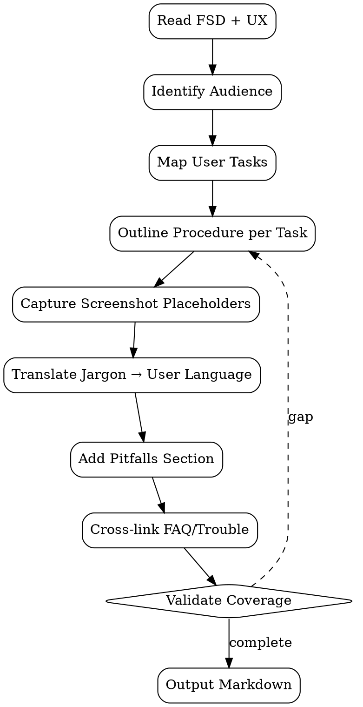

# User Guide Generator

Generate **task-oriented user guide** dari FSD + UX flow. Tujuan: end-user bisa selesaikan task tanpa baca reference doc; bukan re-statement FSD.

<HARD-GATE>
Setiap user guide WAJIB task-oriented (verb-first headings: "How to add discount", bukan "Discount Module").
Setiap procedure WAJIB step-numbered + screenshot placeholder + Expected outcome per step.
Pitfalls / Common mistakes section WAJIB ada — preempt support tickets.
JANGAN copy-paste FSD content — translate ke user language (no internal jargon, no class names).
JANGAN skip prerequisite section — assume zero context dari user.
Cross-link ke FAQ + Troubleshooting WAJIB di footer.
Screenshot WAJIB include URL/breadcrumb context — user tidak lost.
Versioning: header WAJIB cite version + date — doc rot prevention.
</HARD-GATE>

## When to use

- Feature baru shipped — accompany release
- Major UX change pada existing feature — update guide
- Stakeholder request "how do I..." > 3x — promote ad-hoc answer ke guide
- Pre-UAT — give stakeholder structured walk-through

## When NOT to use

- API documentation untuk developer — itu doc-writer's `api-doc-generator` (separate)
- Internal runbook untuk ops — itu `troubleshooting-guide` atau ops-runbook
- Marketing landing copy — separate domain (PM/marketing)

## Required Inputs

- **FSD path** — `outputs/{date}-fsd-{feature}.md`
- **UX flow / mockup** — Figma link atau `outputs/{date}-design-{feature}.md`
- **Stack hint** — Odoo / web / mobile (untuk navigation language)
- **Audience persona** — end-user role (sales / accountant / admin) untuk tone

## Output

`outputs/{date}-user-guide-{feature}.md` — Markdown publishable to KB or Google Docs (via `gdocs-export.sh`).

## User Guide Template

```markdown
# {Feature Name} — User Guide

**Version:** 1.0 | **Updated:** 2026-05-02 | **Audience:** Sales user

## What is this for

> 1-2 sentences plain language. WHY not WHAT.

Add discount lines to sale orders so you can offer percentage or fixed-amount promotions to customers, with audit trail.

## Before you start

**You'll need:**
- Access group: Sales / User
- An existing draft sale order (state = Draft)
- The discount code from your manager (e.g., `PROMO10`)

**This will not work if:** the order is already confirmed.

## Steps

### 1. Open the order

1.1. From main menu → **Sales** → **Orders** → **Quotations**
1.2. Click the order you want to discount.

✓ You should see the order in **Draft** state at the top-right.

[screenshot: sales-quotation-list.png]

### 2. Add the discount line

2.1. Scroll to **Order Lines** tab.
2.2. Click **Add a line** → **Discount**.
2.3. Enter the **Code** (e.g., `PROMO10`) and **Percent** (e.g., `10`).

[screenshot: discount-line-form.png]

✓ The line appears with a negative amount.

### 3. Save and verify

3.1. Click **Save**.
3.2. Check the **Total** at the bottom — it should reflect the discount.

✓ Done. The order is ready to confirm.

## Common mistakes

| Mistake | What to do |
|---|---|
| "Cannot modify confirmed order" error | Discount must be added before confirming. Cancel + redraft if already confirmed. |
| Discount > 100% rejected | Maximum is 100. Use a fixed-amount discount line for higher values. |
| Discount line doesn't show in PDF | Refresh the report. If still missing, contact admin (template config). |

## Related

- See also: [Cancel a confirmed order](./cancel-order.md)
- FAQ: [Discount FAQ](./faq-discount.md)
- Trouble: [Discount troubleshooting](./troubleshooting-discount.md)

## Feedback

Found unclear or incorrect step? Open a doc bug: <link>
```

## Checklist

You MUST create a TodoWrite task for each item and complete them in order:

1. **Read FSD + UX Flow** — extract user actions
2. **Identify Audience** — persona + role + permission
3. **Map User Tasks** — verb-first list (Add / Cancel / Approve / Configure)
4. **Outline Procedure per Task** — steps + expected outcomes
5. **Capture Screenshot Placeholders** — note breadcrumb + URL
6. **Translate Jargon** — internal class/field name → user-facing label
7. **Add Pitfalls Section** — common mistakes + remediation
8. **Cross-link** — FAQ + Troubleshooting + related guides
9. **Validate Coverage** — every user-facing FSD AC has procedure
10. **Output Markdown** — `outputs/{date}-user-guide-{slug}.md`
11. **Optional Export** — `gdocs-export.sh` to Google Docs

## Process Flow



## Anti-Pattern

- ❌ Reference-style ("the discount module supports...") — not task-oriented
- ❌ Jargon ("trigger compute method") — user doesn't speak code
- ❌ Skip prerequisite — assumes context user lacks
- ❌ No expected outcome per step — user can't verify progress
- ❌ Generic screenshot ("here's the screen") — no context
- ❌ Walls of text — break into numbered steps
- ❌ Missing version/date header — doc rot invisible
- ❌ No pitfalls section — generates support tickets

## Inter-Agent Handoff

| Direction | Trigger | Skill / Tool |
|---|---|---|
| **Doc** ← **EM** | FSD frozen | author user guide |
| **Doc** ← **UX** | Mockup approved | extract screen flow |
| **Doc** → `faq-generator` | Common questions emerge | dispatch FAQ entries |
| **Doc** → `troubleshooting-guide` | Pitfalls grow | dispatch trouble entries |
| **Doc** → **PM** | Guide drafted | review tone + completeness |
