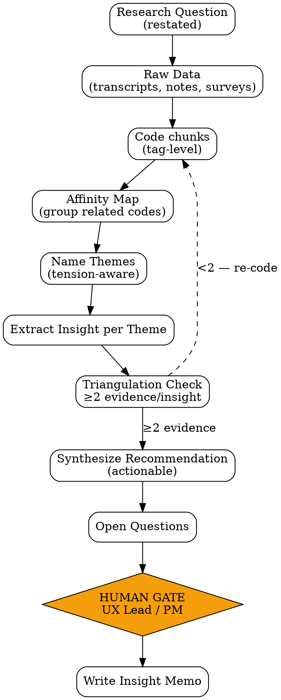

# UX Research

Qualitative user research synthesis — extract insight dari raw user interview, observation session, atau open-ended survey. Output: **insight memo** yang ditulis untuk konsumsi product/design team, bukan transkrip mentah.

<HARD-GATE>
Setiap insight WAJIB punya minimal 2 supporting data points (quote, observation, atau metric). Single anecdote = anekdot, bukan insight.
Quote WAJIB attributed (participant ID atau anonymized handle) — bukan paraphrasing.
Theme grouping WAJIB explicit affinity rationale — kenapa quote-quote ini di-group bareng.
Recommendation HARUS actionable: connect ke design decision, hypothesis, atau test-able assumption.
Sample size minimum: 5 participants untuk qualitative theme saturation. Kalau <5, flag confidence rendah.
Jangan campur observation (apa yang user lakukan) dengan interpretation (apa artinya) di section yang sama.
</HARD-GATE>

## When to use

- Selesai user interview round (5-12 peserta), butuh sintesis
- Recording session perlu diolah jadi insight (transkrip ada, tapi raw)
- Open-ended survey response perlu di-cluster
- Behavioral observation (session recording, heatmap) butuh narrative
- PA Monitor temukan anomaly behavioral, butuh kualitatif untuk explain "kenapa"

## When NOT to use

- Market sizing / competitor pricing — itu `market-research` (PM)
- Quantitative A/B test analysis — itu `data-report-generator` (Data Analyst)
- Bug repro from support ticket — itu `bug-report` (QA)

## Input expected

- Interview recordings/transcripts (path atau link)
- Atau: research notes raw
- Atau: open-text survey export (CSV/JSON)
- Atau: session recording observations
- Plus: research question yang menjadi tujuan riset

## Output

`outputs/YYYY-MM-DD-ux-insights-{topic}.md` dengan struktur:

1. Executive Summary (5-7 bullets)
2. Research Question + Method
3. Participants (anonymized profile + count)
4. Themes (grouped findings dengan supporting data)
5. Hierarchical Insights (theme → insight → implication)
6. Recommendations (connect to design action)
7. Open Questions (apa yang belum bisa dijawab, butuh follow-up riset)

## Checklist

You MUST create a TodoWrite task for each item and complete them in order:

1. **Restate Research Question** — pastikan jelas sebelum mulai sintesis
2. **Code Raw Data** — assign tag/code per chunk (line-level untuk transkrip, observation-level untuk session)
3. **Build Affinity Map** — group code yang related (semantik atau topic)
4. **Name Themes** — beri nama yang mengandung tension atau perilaku, bukan kategori generik
5. **Extract Insight per Theme** — apa pola perilaku/motivasi/pain di balik group
6. **Validate Triangulation** — minimum 2 supporting evidence per insight
7. **Synthesize Recommendations** — actionable, link ke design decision atau next research
8. **Document Open Questions** — apa yang belum bisa dijawab dari data ini
9. **[HUMAN GATE — UX Lead atau PM]** — review draft sebelum dispatch ke design
10. **Output Document** — `outputs/YYYY-MM-DD-ux-insights-{topic}.md`

## Process Flow



## Detailed Instructions

### Step 1 — Restate Research Question

Format yang bagus:
> "Bagaimana new user di mobile menyelesaikan first-time checkout, dan apa yang membuat mereka abandon di step 3?"

Tidak bagus:
> "User mobile UX research" — terlalu broad.

### Step 2 — Code Raw Data

Per chunk (kalimat di transkrip, atau 1 observation point):
- Assign tag pendek (e.g. `pricing-confusion`, `button-not-found`, `mistrust-payment`)
- Tag bisa muncul di banyak peserta — itu yang akan jadi theme

Tools:
- Manual coding di spreadsheet
- Atau script:
```bash
./scripts/code-data.sh --input transcripts/ --output coded.json
```

### Step 3 — Build Affinity Map

Group code yang related. Visually atau via clustering. Goal: emerging themes yang gak pre-defined.

Affinity rationale per group: jelaskan kenapa code-code ini bareng. Hindari category generic seperti "UX issues" — terlalu broad.

### Step 4 — Name Themes

Theme nama yang baik mengandung **tension** atau **specific behavior**:

| Theme nama bagus | Theme nama buruk |
|---|---|
| "Users want speed but distrust auto-fill" | "User experience" |
| "Discount field discoverable only after frustration" | "Discount UX" |
| "Mobile users default to deletion before exploration" | "Mobile interactions" |

### Step 5 — Extract Insight per Theme

Per theme, jawab:
- **What:** Pola perilaku spesifik
- **Why:** Motivasi atau pain di balik
- **Implication:** Apa artinya untuk design

Contoh:
> **Theme:** "Discount field discoverable only after frustration"
> **What:** 7 dari 9 peserta scroll 2-3x sebelum menemukan field discount
> **Why:** Visual hierarchy menempatkan discount di bawah CTA primer; field tidak terkesan critical karena warna muted
> **Implication:** Either elevate discount di hierarchy, atau remove jika utility rendah

### Step 6 — Triangulation

Per insight, minimum 2 supporting evidence:
- Quote 1 (P3): "Saya cari diskon di mana, tapi tombol bayar udah keduluan."
- Quote 2 (P7): "Ribet, baru lihat field discount setelah scroll dua kali."
- Observation: 6/9 sessions show >5s delay before finding discount field

Single quote → bukan insight, sekedar anekdot.

### Step 7 — Recommendations

| Recommendation type | Format |
|---|---|
| **Design action** | "Move discount field above CTA, increase contrast — see prototype X" |
| **Test hypothesis** | "Hypothesize: discoverable discount → +5% conversion. Test via A/B" |
| **Further research** | "Need 5 more interviews dengan returning users untuk validate" |
| **Stop / kill** | "Discount feature adoption <10% di sample — consider deprecation" |

### Step 8 — Open Questions

Document apa yang belum bisa dijawab. Sample size kecil = banyak open questions. Itu OK — flag explicit:

> "Tidak cukup data untuk menjawab apakah B2B user behavior berbeda dari B2C. Butuh dedicated round dengan 5 B2B participants."

### Step 9 — [HUMAN GATE]

```bash
./scripts/notify.sh "UX insights [topic] siap review. Sample n=8, 4 themes, 5 recommendations."
```

UX Lead atau PM owner sign-off sebelum dispatch ke design.

### Step 10 — Output Document

```bash
./scripts/synthesize.sh --topic "checkout-mobile-discount" \
  --question "Bagaimana new user mobile menyelesaikan first checkout?" \
  --participants 9 \
  --output outputs/$(date +%Y-%m-%d)-ux-insights-checkout-mobile-discount.md
```

## Output Format

See `references/format.md` for canonical schema.

## Inter-Agent Handoff

| Direction | Trigger | Skill / Tool |
|---|---|---|
| **UX** → **PM** | Insight memvalidasi/membatalkan PRD assumption | feedback ke PM via task comment |
| **UX** → **PM** | Recommendation = "test hypothesis" | `hypothesis-generator` |
| **UX** → **UX** | Recommendation = "redesign component" | `design-brief-generator` |
| **UX** → **EM** | Recommendation menyentuh tech feasibility | task tag `needs-feasibility-review` |
| **UX** ← **PA** | Anomaly butuh "kenapa" | PA dispatches request, UX run focused interview |

## Anti-Pattern

- ❌ Recap interview verbatim tanpa sintesis — itu transkrip, bukan insight memo
- ❌ Theme generic seperti "User Experience" / "Pain Points" — tidak actionable
- ❌ Single-quote insight — anekdot, bukan pattern
- ❌ Recommendation "improve UX" tanpa specific action
- ❌ Mix observation + interpretation di section yang sama — bikin reviewer susah audit
- ❌ Skip Open Questions — sample qualitative selalu punya gap, jujur acknowledge
- ❌ Sample size <5 tanpa flag confidence — bisa misleading downstream
- ❌ Output panjang > 5 halaman — sintesis = compression, kalau panjang berarti belum di-distill
