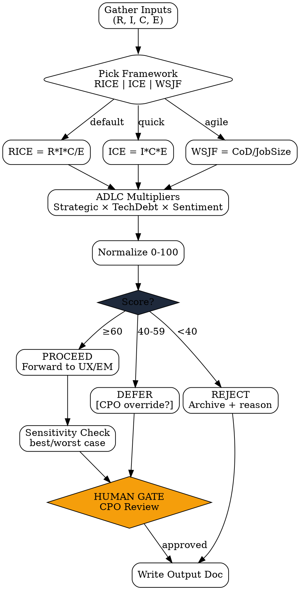

# Value Score Calculator

Skill yang menghitung **Value Score composite (0-100)** untuk fitur/initiative — wajib jadi output di setiap PRD dan re-score periodic dari PA Monitor. Mendukung 3 framework dasar (RICE, ICE, WSJF) di-enhance dengan **ADLC-specific multipliers** untuk konteks strategis perusahaan.

<HARD-GATE>
Jangan lock PRD tanpa Value Score eksplisit.
Value Score < 40 = REJECT, kembalikan ke discovery untuk re-frame atau drop.
40 ≤ Score < 60 = DEFER, butuh CPO override eksplisit untuk lanjut.
Setiap komponen (R, I, C, E) HARUS punya justifikasi data di output — bukan gut feeling.
PA re-score yang turun >20 poin dari baseline = trigger `re-discovery-trigger` skill ke PM.
</HARD-GATE>

## When to use

- PM Discovery step 6 (PRD output): hitung Value Score sebagai field mandatory
- PA Monitor periodic re-score fitur live setiap quarter
- PA Monitor anomaly response: re-score ulang saat metric drift terdeteksi
- Stakeholder minta backlog prioritization comparative

## When NOT to use

- Fitur yang sudah locked & shipped — gunakan `pa-metrics-report` untuk monitoring
- Estimasi effort engineering detail — gunakan `effort-estimator` (EM #3)
- Discovery awal tanpa data reach/impact — selesaikan `market-research` + `hypothesis-generator` dulu

## Checklist

You MUST create a TodoWrite task for each item and complete them in order:

1. **Gather Inputs** — Reach, Impact, Confidence, Effort dari hasil riset (cite sumber)
2. **Compute Base Score** — pilih framework (RICE/ICE/WSJF), hitung skor mentah
3. **Apply ADLC Multipliers** — strategic alignment × tech debt × user sentiment
4. **Normalize to 0-100** — composite score dengan rule mapping yang jelas
5. **Determine Recommendation** — PROCEED (≥60) / DEFER (40-59) / REJECT (<40)
6. **Sensitivity Check** — minimal 2 alternative scenarios (best/worst case)
7. **[HUMAN GATE — CPO]** — kirim ringkasan via `notify.sh`, tunggu approval (skip kalau PA re-score routine)
8. **Output Document** — tulis ke `outputs/YYYY-MM-DD-value-score-{slug}.md`

## Process Flow



## Detailed Instructions

### Step 1 — Gather Inputs

Setiap input HARUS punya 1+ sumber data eksplisit (link ke task, dashboard, riset doc).

| Input | Definisi | Sumber data umum |
|---|---|---|
| **Reach (R)** | Jumlah user terdampak per quarter | analytics, helpdesk ticket count, segment size |
| **Impact (I)** | Skala 1-5 (1=minor, 3=moderate, 5=massive) | user research, NPS, retention impact |
| **Confidence (C)** | % keyakinan estimasi (data-backed vs hypothesis) | sample size, riset depth |
| **Effort (E)** | Person-weeks total (FE + BE + QA + design) | EM/SWE pre-estimate, historical similar work |

**Anti-pattern**: Confidence > 80% tanpa quantitative riset = inflated. Default cap di 70% kalau cuma qualitative interview.

### Step 2 — Compute Base Score

**RICE** (default untuk PM Discovery):
```
RICE = (Reach × Impact × Confidence) / Effort
```
Contoh: R=5000 users, I=3, C=0.7 (70%), E=4 weeks
→ RICE = (5000 × 3 × 0.7) / 4 = **2625**

**ICE** (quick scoring untuk re-score atau backlog grooming):
```
ICE = Impact × Confidence × Ease
```
Skala 1-10 per komponen. Output 0-1000.

**WSJF** (untuk agile/SAFe context):
```
WSJF = (User-Business Value + Time Criticality + Risk Reduction) / Job Size
```

### Step 3 — Apply ADLC Multipliers

| Multiplier | Range | Bagaimana menentukan |
|---|---|---|
| **Strategic Alignment** | 0.8 - 1.2 | Apakah align dengan company OKR Q ini? align langsung=1.2, neutral=1.0, distract=0.8 |
| **Tech Debt Reduction** | 0.9 - 1.1 | Mengurangi tech debt=1.1, neutral=1.0, menambah debt=0.9 |
| **User Sentiment** | 0.8 - 1.2 | Berdasar NPS/CSAT trend untuk segment terdampak |

```
Multiplied = Base × Strategic × TechDebt × Sentiment
```

### Step 4 — Normalize to 0-100

Mapping berdasarkan empirical historical data perusahaan (default conservative):

| RICE Multiplied | Normalized |
|---|---|
| 0 - 500 | 0-20 |
| 500 - 1500 | 20-40 |
| 1500 - 3000 | 40-60 |
| 3000 - 6000 | 60-80 |
| 6000+ | 80-100 |

### Step 5 — Recommendation

| Score | Rec | Action |
|---|---|---|
| ≥ 60 | **PROCEED** | Lanjut ke UX/EM via `discovery-handoff-package` |
| 40 - 59 | **DEFER** | CPO review wajib; mungkin revisit di quarter berikut |
| < 40 | **REJECT** | Archive dengan rationale; jangan dispatch downstream |

### Step 6 — Sensitivity Check

Wajib 2 skenario alternatif:
- **Optimistic**: assumptions di best case (Reach +30%, Confidence +15%, Effort -20%)
- **Pessimistic**: assumptions di worst case (Reach -30%, Confidence -15%, Effort +30%)

Kalau Score di pessimistic case turun di bawah 40 → flag **HIGH RISK** di output, ke `[HUMAN GATE]` walaupun base case ≥ 60.

### Step 7 — [HUMAN GATE — CPO]

```bash
./scripts/notify.sh "Value Score [Feature]: base=72, pessimistic=38 — needs CPO review"
```

Tunggu approval. Skip step ini kalau routine PA re-score (bukan new feature decision).

### Step 8 — Output Document

Use included script:
```bash
./scripts/score.sh --feature "search-autocomplete" \
 --reach 5000 --impact 3 --confidence 0.7 --effort 4 \
 --strategic 1.1 --techdebt 1.0 --sentiment 1.05 \
 --output outputs/$(date +%Y-%m-%d)-value-score-search-autocomplete.md
```

## Output Format

See `references/format.md` for the canonical output schema. Key sections:
- Summary block (feature, score, recommendation)
- Inputs table with sources
- Calculation breakdown
- Sensitivity scenarios
- Recommendation rationale
- Sign-off section (CPO name, date)

## Inter-Agent Handoff

| Direction | Trigger | Skill / Tool |
|---|---|---|
| **PM Discovery** ↔ self | Step 6 PRD output | embed Value Score block in PRD |
| **PM Discovery** → **UX/EM** | PROCEED rec | `discovery-handoff-package` skill |
| **PA Monitor** → **PM Discovery** | Re-score drop > 20 pts | `re-discovery-trigger` skill |
| **PA Monitor** → archive | REJECT after re-score | task tag `archived` |

## Anti-Pattern

- ❌ "Strategic alignment = 1.2" tanpa cite OKR/quarter — placeholder bukan justifikasi
- ❌ Skip sensitivity check karena "base case strong" — pessimistic case yang menyembunyikan risk
- ❌ Confidence 90%+ dari interview qualitative saja — cap di 70%
- ❌ Reach pakai TAM (total addressable) bukan segment yang benar-benar terdampak this quarter
- ❌ Override threshold tanpa CPO sign-off — bukan keputusan PM unilateral
- ❌ Re-score PA tanpa flag perubahan input — kalau cuma metric drift bukan asumsi yang berubah, langsung trigger re-discovery, jangan re-score sama input
